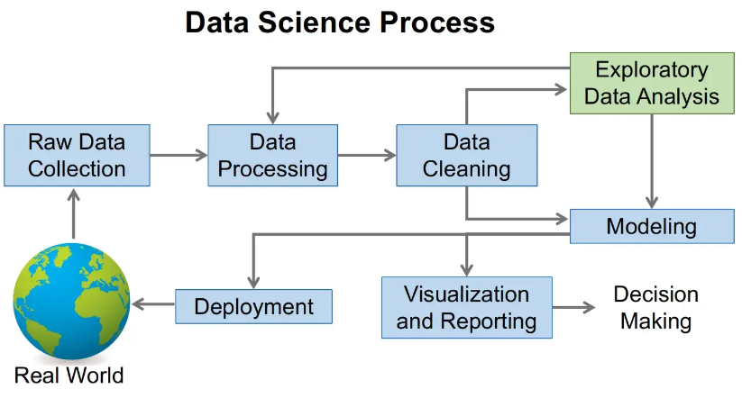

🌟 Hit star button to save this repo in your profile

# About Us

The information on this Github is part of the materials for the subject High Performance Data Processing (SECP3133). This folder contains general Exploratory Data Analysis (EDA) information as well as EDA case studies using Malaysian datasets. This case study was created by a [Bachelor of Computer Science (Data Engineering)](https://comp.utm.my/bachelor-of-computer-science-data-engineering/), Universiti Teknologi Malaysia student. 

# Exploratory Data Analysis
Exploratory Data Analysis (EDA) is a crucial step in the data analysis process that involves examining and summarizing a dataset to understand its characteristics, identify patterns, and gain insights into the data. EDA is typically performed before more advanced statistical and machine learning techniques are applied and helps in forming hypotheses, selecting appropriate modeling approaches, and ensuring data quality. Here are some key components and techniques used in EDA:

Exploratory Data Analysis (EDA) is a crucial step in the data analysis process that involves examining and summarizing a dataset to understand its characteristics, identify patterns, and gain insights into the data. EDA is typically performed before more advanced statistical and machine learning techniques are applied and helps in forming hypotheses, selecting appropriate modeling approaches, and ensuring data quality. Here are some key components and techniques used in EDA:

1. **Data Summary:** Begin by understanding the basic information about the dataset, such as the number of rows and columns, data types, missing values, and summary statistics (mean, median, standard deviation, etc.).

2. **Data Visualization:** Visualizing data through plots and charts can provide a clearer understanding of its distribution and patterns. Common types of visualizations include histograms, box plots, scatter plots, and bar charts.

3. **Data Distribution:** Analyze the distribution of variables to determine whether they follow normal, uniform, or other types of distributions. This can impact the choice of statistical tests and modeling techniques.

4. **Correlation Analysis:** Explore the relationships between variables using correlation matrices, scatter plots, and other correlation measures. This helps identify potential dependencies and multicollinearity.

5. **Outlier Detection:** Identify and handle outliers in the data. Outliers can significantly affect statistical measures and model performance.

6. **Categorical Variables:** Examine the distribution of categorical variables through frequency tables, bar plots, and pie charts. This helps understand the composition of categorical data.

7. **Data Transformation:** Apply transformations (e.g., log transformation, standardization) to make the data more suitable for analysis, especially if it doesn't meet assumptions of statistical methods.

8. **Feature Engineering:** Create new variables or features that might be more informative or relevant for the analysis. This could involve aggregating, combining, or extracting information from existing variables.

9. **Missing Data Handling:** Deal with missing data, either by imputing missing values or excluding incomplete records. The choice of method depends on the nature of the data and the problem at hand.

10. **Hypothesis Testing:** If relevant, perform hypothesis tests to determine whether observed differences or relationships in the data are statistically significant.

11. **Data Transformation:** Consider scaling or encoding categorical variables for modeling. This can include one-hot encoding, label encoding, or other techniques.

12. **Dimensionality Reduction:** Use techniques like Principal Component Analysis (PCA) or t-Distributed Stochastic Neighbor Embedding (t-SNE) to reduce the dimensionality of the data while preserving important information.

13. **Time Series Analysis:** For time series data, analyze trends, seasonality, and autocorrelation patterns. Techniques like autocorrelation plots and decomposition can be helpful.

14. **Geospatial Analysis:** When dealing with geographic data, use maps, geospatial plots, and spatial statistics to understand spatial patterns and relationships.

15. **Text Analysis:** If the dataset contains text data, perform text mining and sentiment analysis to extract insights from the textual content.

EDA is an iterative process, and the specific techniques and tools used can vary depending on the nature of the data and the objectives of the analysis. It plays a crucial role in gaining an initial understanding of the data, guiding subsequent analysis, and making informed decisions about the next steps in a data science or analytical project.

## Why is EDA so important in data science?

✅️ The main purpose of EDA is to help you look at the data before making any assumptions. In addition to better understanding the patterns in the data or detecting unusual events, it also helps you find interesting relationships between variables.

✅️ Data scientists can use exploratory analysis to ensure that the results they produce are valid and relevant to desired business outcomes and goals.

✅️ EDA also helps stakeholders by verifying that they are asking the right questions. 

✅️ EDA can help to answer questions about standard deviations, categorical variables, and confidence intervals.

✅️ After the exploratory analysis is completed and the predictions are determined, its features can be used for more complex data analysis or modeling, including machine learning.

  

## Python
👉 Python is a popular programming language for data science and has several libraries and tools that are commonly used for EDA such as:

1. [Pandas](./materials/pandas.md): a library for data manipulation and analysis.
2. [Numpy](./materials/numpy.md): a library for numerical computing in Python.
3. [Scikit-learn](./materials/scikit.md): Scikit-learn is a machine learning library, but it also includes tools for data preprocessing, feature selection, and dimensionality reduction, which are essential for EDA.
4. [Matplotlib](./materials/matplotlib.md): a plotting library for creating visualizations.
5. [Seaborn](./materials/seaborn.md): a library based on matplotlib for creating visualizations with a higher-level interface.
6. [Plotly](./materials/plotly.md): an interactive data visualization library.

In EDA, you might perform tasks such as cleaning the data, handling missing values, transforming variables, generating summary statistics, creating visualizations (e.g. histograms, scatter plots, box plots), and identifying outliers. All of these tasks can be done using the above libraries in Python.

## 📖 Notes
### Basic Concept
* [developers.google: Good Data Analysis](https://developers.google.com/machine-learning/guides/good-data-analysis)
* [Datascience using Python: Exploratory_Data_Analysis](https://github.com/drshahizan/Python_EDA/blob/main/images/Datascience_using_Python_EDA.pdf)
* [Towardsdatascience: What is Exploratory Data Analysis?](https://towardsdatascience.com/exploratory-data-analysis-8fc1cb20fd15)
* [Wikipedia: Exploratory data analysis](https://en.wikipedia.org/wiki/Exploratory_data_analysis)
* [r4ds: Exploratory Data Analysis](https://r4ds.had.co.nz/exploratory-data-analysis.html)
* [careerfoundry:What Is Exploratory Data Analysis?](https://careerfoundry.com/en/blog/data-analytics/exploratory-data-analysis/)
* [How To Conduct Exploratory Data Analysis in 6 Steps](https://www.indeed.com/career-advice/career-development/how-to-conduct-exploratory-data-analysis)
* [A Five-Step Guide for Conducting Exploratory Data Analysis](https://shopify.engineering/conducting-exploratory-data-analysis)
* [I asked ChatGPT to do Exploratory Data Analysis with Visualizations](https://youtu.be/787VOGoqBzk)

### Code & Practice
* [simplilearn: What is Exploratory Data Analysis? Steps and Market Analysis](https://www.simplilearn.com/tutorials/data-analytics-tutorial/exploratory-data-analysis)
* [Exploratory Data Analysis (EDA): Types, Tools, Process](https://www.knowledgehut.com/blog/data-science/eda-data-science)
* [projectpro: Exploratory Data Analysis in Python-Stop, Drop and Explore](https://www.projectpro.io/article/exploratory-data-analysis-in-python-stop-drop-and-explore/427)
* [medium.com: 10 Things to do when conducting your Exploratory Data Analysis (EDA)](https://medium.com/data-folks-indonesia/10-things-to-do-when-conducting-your-exploratory-data-analysis-eda-7e3b2dfbf812)
* [towardsdatascience.com: An Extensive Step by Step Guide to Exploratory Data Analysis](https://towardsdatascience.com/an-extensive-guide-to-exploratory-data-analysis-ddd99a03199e)
* [EDA - Exploratory Data Analysis: Using Python Functions](https://www.digitalocean.com/community/tutorials/exploratory-data-analysis-python)
* [Step-by-Step Exploratory Data Analysis (EDA) using Python](https://www.analyticsvidhya.com/blog/2022/07/step-by-step-exploratory-data-analysis-eda-using-python/)

### Videos
* [Exploratory Data Analysis Tutorial | What Is EDA | How EDA Works | EDA In Python | Intellipaat](https://www.youtube.com/watch?v=oS12x4GjLjM)
* [Live Day 1-Live Session On EDA And Feature Engineering- Zomato Dataset](https://www.youtube.com/watch?v=F-X82zhIfBo&t=91s)
* [Live Day 2-Live Session On EDA And Feature Engineering- Black Friday Dataset](https://www.youtube.com/watch?v=cGez1q4iOFU)
* [Live Day 3-Live Session On EDA And Feature Engineering- Flight Price Prediction Dataset](https://www.youtube.com/watch?v=v5dqavbyE-I)
* [Step By Step Process In EDA And Feature Engineering In Data Science Projects](https://www.youtube.com/watch?v=xhB-dmKmzRk)
* [Exploratory Data Analysis(EDA) of Titanic dataset](https://www.youtube.com/watch?v=Ea_KAcdv1vs)
* [Exploratory Data Analysis (EDA) Using Python | Python Data Analysis | Python Training | Edureka](https://www.youtube.com/watch?v=-o3AxdVcUtQ)
* [Exploratory Data Analysis with Pandas Python](https://www.youtube.com/watch?v=xi0vhXFPegw)
* [How to Do Data Exploration (step-by-step tutorial on real-life dataset)](https://www.youtube.com/watch?v=OY4eQrekQvs)

### Kaggle: Notebook
* [Exploratory Data Analysis (Step by Step)](https://www.kaggle.com/code/prakharrathi25/exploratory-data-analysis-step-by-step)
* [A Simple Tutorial on Exploratory Data Analysis](https://www.kaggle.com/code/spscientist/a-simple-tutorial-on-exploratory-data-analysis)
* [Intro to Exploratory data analysis (EDA) in Python](https://www.kaggle.com/code/imoore/intro-to-exploratory-data-analysis-eda-in-python)
* [Topic 1. Exploratory Data Analysis with Pandas](https://www.kaggle.com/code/kashnitsky/topic-1-exploratory-data-analysis-with-pandas)
* [Detailed exploratory data analysis with python](https://www.kaggle.com/code/ekami66/detailed-exploratory-data-analysis-with-python)
* [EDA using Python Pandas](https://www.kaggle.com/code/olgaberezovsky/eda-using-python-pandas)
* [Pandas: EDA of Cars Dataset](https://www.kaggle.com/code/danishasif/pandas-eda-of-cars-dataset)
* [Step-by-step Data Preprocessing & EDA](https://www.kaggle.com/code/agrawaladitya/step-by-step-data-preprocessing-eda)

### Github

| No. | Repository Name | Description |
|-----|-----------------|-------------|
| 1   | [PacktPublishing/Hands on Exploratory Data analysis with Python](https://github.com/PacktPublishing/Hands-on-Exploratory-Data-Analysis-with-Python) | This repository is likely associated with a book or course from Packt Publishing, focusing on hands-on exploratory data analysis with Python. It may contain code examples and materials for learning EDA. |
| 2   | [code4kunal/eda-python-examples](https://github.com/code4kunal/eda-python-examples) | This repository likely contains Python examples and code snippets for exploratory data analysis (EDA). It may serve as a resource for those looking to learn EDA techniques with Python. |
| 3   | [SouRitra01/Exploratory-Data-Analysis-EDA-in-Banking-Using-Python](https://github.com/SouRitra01/Exploratory-Data-Analysis-EDA-in-Banking-Python-Project-) | This repository appears to be focused on conducting exploratory data analysis (EDA) in the context of banking using Python. It may contain datasets and code for EDA in the banking domain. |
| 4   | [sandipanpaul21/EDA-in-Python](https://github.com/sandipanpaul21/EDA-in-Python) | This repository is likely dedicated to exploratory data analysis (EDA) in Python. It may contain Python scripts, Jupyter notebooks, and related materials for EDA projects. |
| 5   | [vharivinay/python-eda-viz](https://github.com/vharivinay/python-eda-viz) | This repository may be focused on Python-based exploratory data analysis and data visualization. It could provide code and examples for creating data visualizations during EDA. |
| 6   | [demonpratapdemon/Exploratory-Data-Analysis-EDA-and-PreProcessing](https://github.com/demonpratapdemon/Exploratory-Data-Analysis-EDA-and-PreProcessing) | This repository seems to cover both exploratory data analysis (EDA) and data preprocessing in Python. It may contain code and resources for these data preparation tasks. |
| 7   | [PacktPublishing/Python-for-Data-Analysis-step-by-step-with-projects-](https://github.com/PacktPublishing/Python-for-Data-Analysis-step-by-step-with-projects-/blob/main/Solution_practice_exercise%2B(eda).ipynb) | This repository is likely associated with a book or course from Packt Publishing, focusing on Python for data analysis with step-by-step projects. It may include code and project materials. |
| 8   | [sandyy2505/Cardio Good Fitness Project](https://github.com/sandyy2505/EDA) | This repository may contain code and data related to a fitness project, possibly involving data analysis and visualization in the context of cardio fitness. |
| 9   | [ajaymache/Data analysis of used car database](https://github.com/ajaymache/data-analysis-using-python) | This repository is likely focused on data analysis of a used car database. It may provide Python code and data for analyzing and exploring information related to used cars. |

## 📖 Lab
| No | Dataset | Colab |  GitHub |
| ----- | ----- | ------ | ------ | 
| 1 | Boston |  |  |
| 2 | Car Features and MSRP |  |  |
| 3 | Housing Dataset |  |  |
| 4 | United Nations Development Corporation |  |  |

## 🌟 [Case Study: Exploratory Data Analysis](./materials/case-study.md)
The provided list comprises a collection of case studies, each with a title and accessibility information on platforms like Colab and GitHub. These case studies likely involve data analysis and exploration. For instance, "404 Error" may involve exploring property-related data in Kuala Lumpur, while "Alrite" could be centered around the exportation of plantation products in Sarawak. "BEFE" appears to focus on COVID-19 clusters in Malaysia, "Boboiboy" on property listings in Kuala Lumpur, and "COLBY" on the results of the 14th General Election in Malaysia. "FANTOM" likely tracks daily recorded COVID-19 cases at the state level, "HAHA" pertains to foreign direct investment in Malaysia, and "HD" may involve land usage analysis in Tampin for 2021. Other case studies cover topics such as elections, healthcare, real estate, population, and more, providing a diverse range of data exploration possibilities.

## Automated EDA Tools
EDA is a vital but time-consuming task in a data project. Here are 10 open-source tools that generate an EDA report in seconds.

| Library | Description | Web | Github |
| ------------- | :------------- | :-------------: | :-------------: |
| SweetViz | - In-depth EDA report in two lines of code.  - Covers information about missing values, data statistics, etc.  - Creates a variety of data visualizations.  - Integrates with Jupyter Notebook.|[🌐](https://pypi.org/project/sweetviz/) | [:octocat:](https://github.com/fbdesignpro/sweetviz) |
| Pandas-Profiling | - Generate a high-level EDA report of your data in no time. - Covers info about missing values, data statistics, correlation etc. - Produces data alerts. - Plots data feature interactions. |[🌐](https://pypi.org/project/pandas-profiling/) | [:octocat:](https://github.com/ydataai/pandas-profiling) |
| DataPrep | - Supports Pandas and Dask DataFrames. - Interactive Visualizations. - 10x Faster than Pandas based tools. - Covers info about missing values, data statistics, correlation etc. - Plots data feature interactions. |[🌐](https://dataprep.ai/) | [:octocat:](https://github.com/sfu-db/dataprep) |
| AutoViz | - Supports CSV, TXT, and JSON. - Interactive Bokeh charts. - Covers info about missing values, data statistics, correlation etc. - Presents data cleaning suggestions. |[🌐](https://pypi.org/project/autoviz) | [:octocat:](https://github.com/AutoViML/AutoViz) |
| D-Tale | - Runs common Pandas operation with no-code. - Exports code of analysis. - Covers info about missing values, data statistics, correlation etc. - Highlights duplicates, outliers, etc. - Integrates with Jupyter Notebook. |[🌐](https://pypi.org/project/dtale/) | [:octocat:](https://github.com/man-group/dtale) |
| dabl | - Primarily provides visualizations. - Covers wide range of plots: Scatter pair plots. Histograms.  - Target distribution.|[🌐](https://pypi.org/project/dabl) | [:octocat:](https://github.com/dabl/dabl) |
| QuickDA | - Get overview report of dataset. - Covers info about missing values, data statistics, correlation etc. - Produces data alerts. - Plots data feature interactions. |[🌐](https://pypi.org/project/quickda) | [:octocat:](https://github.com/sid-the-coder/QuickDA) |
| Datatile | - Extends Pandas describe(). - Provides column stats: column type count, missing, column datatype. - Mostly statistical information. |[🌐](https://pypi.org/project/datatile/) | [:octocat:](https://github.com/polyaxon/datatile) |
| Lux | - Provides visualization recommendations. - Supports EDA on a subset of columns. - Integrates with Jupyter Notebook. - Exports code of analysis.|[🌐](https://lux-api.readthedocs.io/en/latest/#:~:text=Lux%20is%20a%20Python%20library,what%20they%20are%20looking%20for.) | [:octocat:](https://github.com/lux-org/lux) |
| ExploriPy | - Performs statistical testing. - Column type-wise distribution: Continuous, Categorical - Covers info about missing values, data statistics, correlation etc. |[🌐](https://pypi.org/project/ExploriPy/) | [:octocat:](https://github.com/exploripy/exploripy) |

## [Big Data EDA](./materials/big-data.md)
**Big Data** refers to the vast and complex datasets that exceed the capabilities of traditional data processing tools. It is characterized by the three **V's**: **volume** (large amounts of data), **velocity** (rapid data generation), and **variety** (different data types). **Exploratory Data Analysis (EDA)**, on the other hand, is a data analysis approach that involves summarizing, visualizing, and understanding the key characteristics of a dataset to uncover insights and patterns. In the context of **Big Data**, **EDA** plays a crucial role in making the data more manageable by identifying relevant subsets, trends, and anomalies, enabling data scientists to extract meaningful information and inform decision-making processes.

## Contribution 🛠️
Please create an [Issue](https://github.com/drshahizan/Python_EDA/issues) for any improvements, suggestions or errors in the content.

You can also contact me using [Linkedin](https://www.linkedin.com/in/drshahizan/) for any other queries or feedback.

