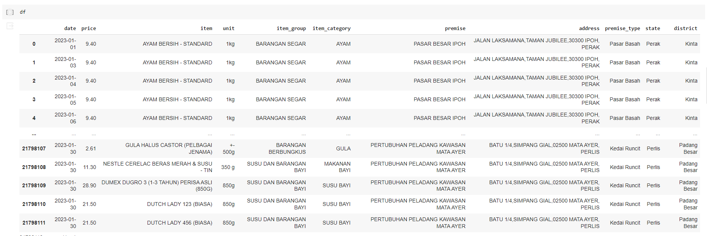
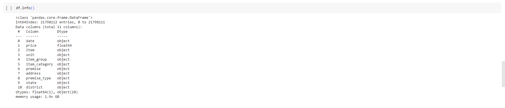
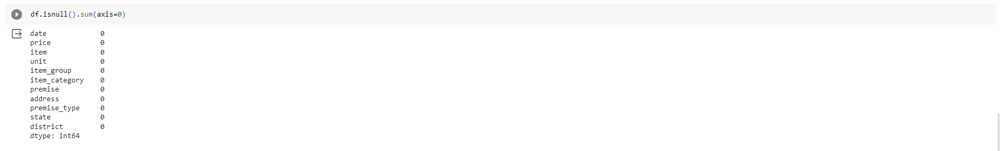
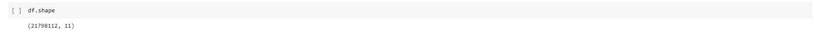
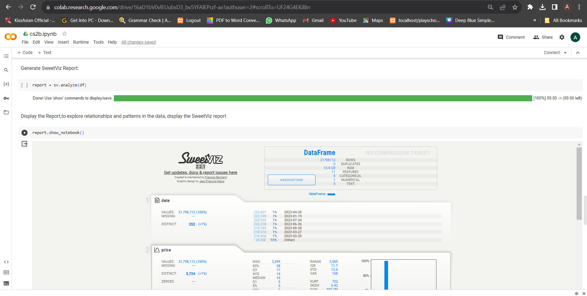
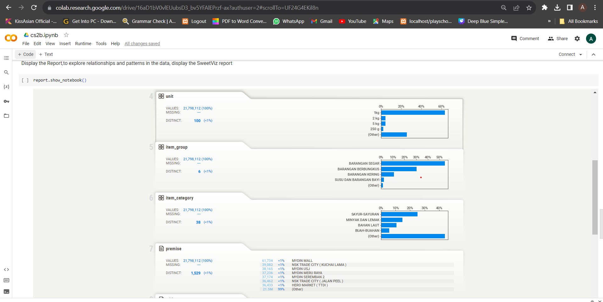
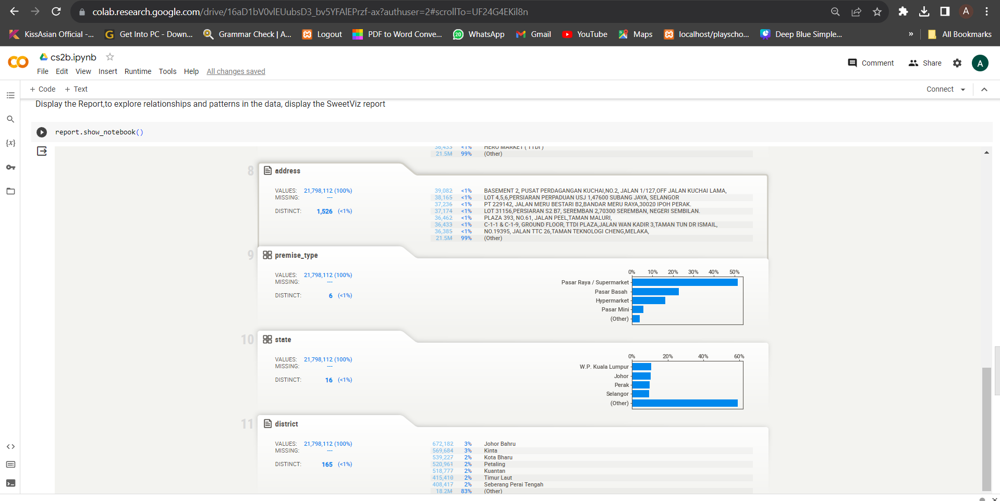

|    Name           |           Matric Number       |                      
|-------------------|-------------------------------|
|ALIEYA ZAWANIE BINTI A ZAINI |A21EC0156|
|NG ZI XING   | A21EC0213    |
|MOHAMAD AZRI HADIF BIN MOHAMMAD RIZAL|A21EC0054     |
|IZZAT HAQEEMI BIN HAIRUDIN |A21EC0033  |

---

# Case Study 2B: Exploratory Data Analysis using Automated EDA Tools (SweetViz)

## Step 1: Selecting Automated EDA Tool
SweetViz is a Python library in which exploratory data analysis (EDA) may be automated, speeding up and simplifying the process of producing insights and visualisations without requiring manual configuration. It offers a wide-ranging EDA report that helps analysts and data scientists analyse their datasets in great detail.

Install SweetViz by running this code below

```
pip install sweetviz
```


## Step 2: Select a Malaysia dataset
### Consumer Price Catcher 2023/1 - 2023/9

**Malaysian Dataset:**
The Department of Statistics Malaysia (openDOSM) provided the dataset for PriceCatcher, a mobile app created by the Ministry of Domestic Trade and Cost of Living (formerly KPDNHEP), covering the period from January 2022 to October 2023. This source guarantees the authenticity and dependability of the data. With an incredible record of over 2 million prices collected each month, this dataset consists of verified pricing data that is collected daily by the workers.

## Data Source
This project is centred around exploring a dataset obtained from the Consumer Prices: PriceCatcher session at https://open.dosm.gov.my/data-catalogue. The dataset consists of three primary tables: an item lookup table, a premise lookup table, and pricing data spanning from January 2022 to October 2023. To begin, the goal is to focus on the dataset specifically from January 2023 to October 2023 for analysis.

## Purpose and Goals
The primary aim of this project is to thoroughly investigate and understand the factors influencing item pricing in Malaysia. The methodology involves initially conducting basic exploratory data analysis to gather insights and identify deeper questions that subsequent sections will address.

The analysis aims to extract meaningful insights from the dataset by employing various statistical techniques, enabling the discovery of relationships, trends, and dependencies within the data. This process will include diverse visualization techniques, hypothesis testing, correlation analysis, regression models, and other statistical methodologies to better comprehend the complexities of item pricing in Malaysia.


## Downloading the Dataset

### Links of Dataset 
The dataset can be downloaded from https://drive.google.com/file/d/1-6jBhXqAKTa3_2SUxo5lnhLcaMYD4Wkv/view
The dataset is also uploaded to Github. In this project, we will link the dataset from Github.


## Step 3: Perform data preparation & cleaning
- Load the dataset into a data frame using Pandas
- Explore the number of rows & columns, ranges of values etc.
- Handle missing, incorrect and invalid data


The data was zipped and has been uploaded into the colaboratory.The uploaded data has been clean with no null and empty values.

Import neccesary files

```
import pandas as pd
import sweetviz as sv

from google.colab import drive
drive.mount('/content/drive')

import zipfile

# Define the path to the ZIP file
zip_file_path = '/content/drive/My Drive/Colab Notebooks/DATASET/data.zip'

# Define the extraction directory
extraction_path = '/content/drive/My Drive/Colab Notebooks/DATASET'

# Extract the ZIP file to the extraction directory
with zipfile.ZipFile(zip_file_path, 'r') as zip_ref:
    zip_ref.extractall(extraction_path)

df = pd.read_csv('/content/drive/My Drive/Colab Notebooks/DATASET/data.zip',compression='zip' ,index_col=0)

```

To see first few rpws
```
df.head()
```
<p align="center">
    
</p>

To see the rows
```
df
```
<p align="center">
    
</p>


To see all the info data types of our table columns, we run
```
df.info()
```
<p align="center">
    
</p>

Checking the NaN values
```
df.isnull().sum(axis=0)
```
<p align="center">
    
</p>

To see Number of row and column
```
df.shape
```
<p align="center">
    
</p>
---

## Step 4: Implementation Of Automated EDA Tools
First we assign a new variable to generate our SweetViz report
```
report = sv.analyze(df)
```

Display the Report,to explore relationships and patterns in the data, display the SweetViz report
```
report.show_notebook()
```

Generate the SweetViz report on Goggle Colaboration, we can go to the files on the google colab
<p align="center">
    
</p>

Visualization of the data
<p align="center">
    
</p>
<p align="center">
    
</p>
<p align="center">
    
</p>


Association of the data
<p align="center">
    
</p>

## Step 5: Pros And Cons Of Pandas Profiling

**Pros of SweetViz:**
1.   Easy to use : As with just a few lines of codes it cangenerate a comprehensive report
2.  Automated Insights:  SweetViz's automated method saves both time and effort.
3. Great Visualizations: Histograms, bar charts, and scatter plots(when applicable) are some of the visualisations provided.
4. Automated Insights: Generate insights and visualization which is very helpful for a complex dataset.


**Cons of SweetViz:**
1.   Limited Customization: SweetViz's emphasis on automation may restrict the ability to customise.
2.   Resource Intensive: Might be not the best tool for handling extremely larga dataset.

---

## Step 6: Conclusion <br>
Conclude your case study by summarizing the key findings and insights from your analysis.
Provide recommendations or insights on when each tool may be more suitable or preferable based on the specific needs of EDA projects.

## Step 7: References <br>
1.   https://www.analyticsvidhya.com/blog/2021/01/making-exploratory-data-analysis-sweeter-with-sweetviz-2-0/
2.  https://analyticsindiamag.com/step-by-step-guide-to-data-analysis-using-sweetviz/
