# Malaysian COVID-19 datasets (Cases, deaths and Vaccinations)<a href="https://www.utm.my" target="_parent"></a>

**COVID-19** is a novel coronavirus that emerged in late 2019 and has since caused a global pandemic that has affected millions of people and disrupted many aspects of life. As of November 6, 2023, there have been over 32 million confirmed cases and over 1.2 million deaths worldwide due to COVID-19.

However, the situation varies widely across different countries and regions, depending on their vaccination rates, testing capacities, health systems, and public health measures.

In this report, we will examine the trend of the vaccines administered and the number of cases and deaths over time in Malaysia, one of the countries that has been severely hit by the pandemic.


|    Name           |           Matric Number       |                      
|-------------------|-------------------------------|
|Muhammad Fikri Bin Sharunazim    | A21EC0075       |
|Muhammad Farhan Bin Ibrahim|        A21EC0072      |
|Muhammad Adam Fahmi Bin Mohd Taufiq |A21EC0061|
|Mikhail Bin Yassin |A21EC0053                      |

---
#Overview
## Malaysian COVID-19 Dataset

The **Malaysian COVID-19 dataset** provides comprehensive information related to the COVID-19 pandemic in Malaysia. It covers various aspects, including daily recorded cases, clusters, testing data, healthcare facility utilization, deaths, and vaccination statistics. Specifically, the dataset includes the following key components:

1. **Cases**: Daily recorded COVID-19 cases at both the country and state levels.
2. **Clusters**: Exhaustive list of announced clusters with relevant epidemiological data points.
3. **Tests**: Daily tests (note: not necessarily unique individuals) categorized by type at both country and state levels.
4. **Healthcare**: Information on patient flow to and from COVID-19 Quarantine and Treatment Centers (PKRC), hospitals, and ICU bed capacity and utilization.
5. **Deaths**: Daily deaths due to COVID-19 at both country and state levels.
6. **Vaccinations**: Daily and cumulative vaccination data, including dose type, brand, and coverage at country, state, district, and demographic levels.

## Data Source

The dataset is sourced from the **Ministry of Health Malaysia (MoH-Malaysia)**. It is maintained and updated by various entities, including CPRC, CPRC Hospital System, MKAK, and MySejahtera.


## Purpose and Goals

The primary objective of analyzing this dataset is to gain insights into the COVID-19 situation in Malaysia.

## Tools and Techniques

To explore the dataset, you can use the following tools and techniques:

- **Python Libraries**: Pandas, NumPy, and Matplotlib/Seaborn for data manipulation, exploration, and visualization.
- **Jupyter Notebooks & Google Colab**: To document analyses, visualize data, and share insights.
- **Github**: For documentation purposes.

---


##Data Dictionary
### Cases

- `date`: yyyy-mm-dd format; data correct as of 1200hrs on that date

- `state`: name of state (present in state file, but not country file)

- `cases_new`: cases reported in the 24h since the last report

- `cases_import`: imported cases reported in the 24h since the last report

- `cases_active`: Covid+ individuals who have not recovered or died

-  `cases_recovered` recovered cases reported in the 24h since the last report

- `cases_cluster`: number of cases attributable to clusters; the difference
between `cases_new` and the sum of cases attributable to clusters is the number of sporadic cases

### Death
- `date`: yyyy-mm-dd format; data correct as of 1200hrs on that date

- `state`: name of state (present in state file, but not country file)

- `deaths_new`: deaths due to COVID-19 based on **date reported to public**

- `deaths_bid`: deaths due to COVID-19 which were brought-in dead based on **date reported to public** (perfect subset of `deaths_new`)

- `deaths_new_dod`: deaths due to COVID-19 based on **date of death**

- `deaths_bid_dod`: deaths due to COVID-19 which were brought-in dead based on **date of death** (perfect subset of `deaths_new_dod`)

- `deaths_pvax`: number of partially-vaccinated individuals who died due to COVID-19 based on **date of death** (perfect subset of `deaths_new_dod`), where "partially vaccinated" is defined as receiving at least 1 dose of a 2-dose vaccine at least 1 day prior to testing positive, or receiving the Cansino vaccine between 1-27 days before testing positive.

- `deaths_fvax`: number of fully-vaccinated who died due to COVID-19 based on **date of death** (perfect subset of `deaths_new_dod`), where "fully vaccinated" is defined as receiving the 2nd dose of a 2-dose vaccine at least 14 days prior to testing positive, or receiving the Cansino vaccine at least 28 days before testing positive.

- `deaths_tat`: median days between date of death and date of report for all deaths reported on the day

## Vaccination
- `date`: yyyy-mm-dd format; data correct as of 2359hrs on that date

- `daily_partial` : number of individuals who received the first dose of a two-dose protocol

- `daily_partial_adol`: subset (already included) of daily_partial, but for individuals aged 12-17 only

- `aily_partial_child`: subset (already included) of daily_partial, but for individuals aged 5-11 only

- `daily_full`: number of individuals who completed their original protocol (whether the 2nd dose of a two-dose protocol, or a single-dose protocol)

- `daily_full_adol`: subset (already included) of daily_full, but for individuals aged 12-17 only

- `daily_full_child`: subset (already included) of daily_full, but for individuals aged 5-11 only

- `daily_booster`: number of individuals who received one dose beyond the original protocol

- `daily`: total doses administered

- `cumul_x`: cumulative doses falling into category x, where x is one of the daily categories

- `brandX`: denotes the number of 1st, 2nd, or 3rd doses administered for that

- `brand`; note that cansino2 is omitted as it is a single-dose protocol

- `pendingX`: number of records with an indeterminate brand, usually due to errors synchronising with the Vaccine Management System (VMS) blockchain


## Preparing the Dataset

All of the sets are available in the Official Minister of Health Malaysia (MoH-Malaysia) Github page.

###Links to Datasets
Cases by State: https://raw.githubusercontent.com/MoH-Malaysia/covid19-public/main/epidemic/cases_state.csv  
Death by State: https://raw.githubusercontent.com/MoH-Malaysia/covid19-public/main/epidemic/deaths_state.csv  
Vaccination by State: https://raw.githubusercontent.com/MoH-Malaysia/covid19-public/main/vaccination/vax_state.csv

Let's begin by reading the dataset from Github, and assign the datasets to a variable each.


```python
cases = pd.read_csv(' https://raw.githubusercontent.com/MoH-Malaysia/covid19-public/main/epidemic/cases_state.csv') #Cases
death = pd.read_csv('https://raw.githubusercontent.com/MoH-Malaysia/covid19-public/main/epidemic/deaths_state.csv') #Death
vax = pd.read_csv('https://raw.githubusercontent.com/MoH-Malaysia/covid19-public/main/vaccination/vax_state.csv')   #Vaccination
```

## Data Preparation and Cleaning

Before using the dataset for any analysis or application, it is necessary to perform some data preparation and cleaning steps to ensure that the data is accurate, complete, consistent, and relevant. Data preparation and cleaning steps involve transforming the raw data into a suitable format for further processing and analysis. Some of the common data preparation and cleaning steps we going to cover are:

- Loading the data into a data frame: A data frame is a tabular structure that stores data in rows and columns. It allows us to manipulate and access the data easily using various methods and functions.

- Handling missing values: Missing values are those values that are not available or null in the data. They can affect the quality and reliability of the analysis if not handled properly.

- Merging datasets: Merging datasets the three datasets;  **cases_state.csv, deaths_state.csv and vax_state.csv**.

-  Explore the number of rows & columns, ranges of values etc.


```python
import pandas as pd
import matplotlib
import matplotlib.pyplot as plt
import matplotlib.dates as mdates
import seaborn as sns
%matplotlib inline
```


```python
cases
```


  <div id="df-4fb282da-011a-488d-be8a-4eded997678c" class="colab-df-container">
    <div>
<style scoped>
    .dataframe tbody tr th:only-of-type {
        vertical-align: middle;
    }

    .dataframe tbody tr th {
        vertical-align: top;
    }

    .dataframe thead th {
        text-align: right;
    }
</style>
<table border="1" class="dataframe">
  <thead>
    <tr style="text-align: right;">
      <th></th>
      <th>date</th>
      <th>state</th>
      <th>cases_new</th>
      <th>cases_import</th>
      <th>cases_recovered</th>
      <th>cases_active</th>
      <th>cases_cluster</th>
      <th>cases_unvax</th>
      <th>cases_pvax</th>
      <th>cases_fvax</th>
      <th>...</th>
      <th>cases_0_4</th>
      <th>cases_5_11</th>
      <th>cases_12_17</th>
      <th>cases_18_29</th>
      <th>cases_30_39</th>
      <th>cases_40_49</th>
      <th>cases_50_59</th>
      <th>cases_60_69</th>
      <th>cases_70_79</th>
      <th>cases_80</th>
    </tr>
  </thead>
  <tbody>
    <tr>
      <th>0</th>
      <td>2020-01-25</td>
      <td>Johor</td>
      <td>4</td>
      <td>4</td>
      <td>0</td>
      <td>4</td>
      <td>0</td>
      <td>4</td>
      <td>0</td>
      <td>0</td>
      <td>...</td>
      <td>0</td>
      <td>0</td>
      <td>0</td>
      <td>0</td>
      <td>0</td>
      <td>1</td>
      <td>0</td>
      <td>0</td>
      <td>0</td>
      <td>0</td>
    </tr>
    <tr>
      <th>1</th>
      <td>2020-01-25</td>
      <td>Kedah</td>
      <td>0</td>
      <td>0</td>
      <td>0</td>
      <td>0</td>
      <td>0</td>
      <td>0</td>
      <td>0</td>
      <td>0</td>
      <td>...</td>
      <td>0</td>
      <td>0</td>
      <td>0</td>
      <td>0</td>
      <td>0</td>
      <td>0</td>
      <td>0</td>
      <td>0</td>
      <td>0</td>
      <td>0</td>
    </tr>
    <tr>
      <th>2</th>
      <td>2020-01-25</td>
      <td>Kelantan</td>
      <td>0</td>
      <td>0</td>
      <td>0</td>
      <td>0</td>
      <td>0</td>
      <td>0</td>
      <td>0</td>
      <td>0</td>
      <td>...</td>
      <td>0</td>
      <td>0</td>
      <td>0</td>
      <td>0</td>
      <td>0</td>
      <td>0</td>
      <td>0</td>
      <td>0</td>
      <td>0</td>
      <td>0</td>
    </tr>
    <tr>
      <th>3</th>
      <td>2020-01-25</td>
      <td>Melaka</td>
      <td>0</td>
      <td>0</td>
      <td>0</td>
      <td>0</td>
      <td>0</td>
      <td>0</td>
      <td>0</td>
      <td>0</td>
      <td>...</td>
      <td>0</td>
      <td>0</td>
      <td>0</td>
      <td>0</td>
      <td>0</td>
      <td>0</td>
      <td>0</td>
      <td>0</td>
      <td>0</td>
      <td>0</td>
    </tr>
    <tr>
      <th>4</th>
      <td>2020-01-25</td>
      <td>Negeri Sembilan</td>
      <td>0</td>
      <td>0</td>
      <td>0</td>
      <td>0</td>
      <td>0</td>
      <td>0</td>
      <td>0</td>
      <td>0</td>
      <td>...</td>
      <td>0</td>
      <td>0</td>
      <td>0</td>
      <td>0</td>
      <td>0</td>
      <td>0</td>
      <td>0</td>
      <td>0</td>
      <td>0</td>
      <td>0</td>
    </tr>
    <tr>
      <th>...</th>
      <td>...</td>
      <td>...</td>
      <td>...</td>
      <td>...</td>
      <td>...</td>
      <td>...</td>
      <td>...</td>
      <td>...</td>
      <td>...</td>
      <td>...</td>
      <td>...</td>
      <td>...</td>
      <td>...</td>
      <td>...</td>
      <td>...</td>
      <td>...</td>
      <td>...</td>
      <td>...</td>
      <td>...</td>
      <td>...</td>
      <td>...</td>
    </tr>
    <tr>
      <th>22075</th>
      <td>2023-11-04</td>
      <td>Selangor</td>
      <td>89</td>
      <td>0</td>
      <td>256</td>
      <td>1074</td>
      <td>0</td>
      <td>10</td>
      <td>1</td>
      <td>10</td>
      <td>...</td>
      <td>2</td>
      <td>1</td>
      <td>4</td>
      <td>18</td>
      <td>27</td>
      <td>14</td>
      <td>9</td>
      <td>5</td>
      <td>3</td>
      <td>6</td>
    </tr>
    <tr>
      <th>22076</th>
      <td>2023-11-04</td>
      <td>Terengganu</td>
      <td>0</td>
      <td>0</td>
      <td>0</td>
      <td>337</td>
      <td>0</td>
      <td>0</td>
      <td>0</td>
      <td>0</td>
      <td>...</td>
      <td>0</td>
      <td>0</td>
      <td>0</td>
      <td>0</td>
      <td>0</td>
      <td>0</td>
      <td>0</td>
      <td>0</td>
      <td>0</td>
      <td>0</td>
    </tr>
    <tr>
      <th>22077</th>
      <td>2023-11-04</td>
      <td>W.P. Kuala Lumpur</td>
      <td>53</td>
      <td>0</td>
      <td>153</td>
      <td>1385</td>
      <td>0</td>
      <td>2</td>
      <td>0</td>
      <td>3</td>
      <td>...</td>
      <td>0</td>
      <td>1</td>
      <td>0</td>
      <td>14</td>
      <td>18</td>
      <td>8</td>
      <td>4</td>
      <td>3</td>
      <td>3</td>
      <td>2</td>
    </tr>
    <tr>
      <th>22078</th>
      <td>2023-11-04</td>
      <td>W.P. Labuan</td>
      <td>1</td>
      <td>0</td>
      <td>4</td>
      <td>37</td>
      <td>0</td>
      <td>1</td>
      <td>0</td>
      <td>0</td>
      <td>...</td>
      <td>0</td>
      <td>1</td>
      <td>0</td>
      <td>0</td>
      <td>0</td>
      <td>0</td>
      <td>0</td>
      <td>0</td>
      <td>0</td>
      <td>0</td>
    </tr>
    <tr>
      <th>22079</th>
      <td>2023-11-04</td>
      <td>W.P. Putrajaya</td>
      <td>8</td>
      <td>0</td>
      <td>20</td>
      <td>326</td>
      <td>0</td>
      <td>1</td>
      <td>0</td>
      <td>3</td>
      <td>...</td>
      <td>0</td>
      <td>0</td>
      <td>0</td>
      <td>3</td>
      <td>1</td>
      <td>3</td>
      <td>0</td>
      <td>1</td>
      <td>0</td>
      <td>0</td>
    </tr>
  </tbody>
</table>
<p>22080 rows × 25 columns</p>
</div>
    <div class="colab-df-buttons">

  <div class="colab-df-container">
    <button class="colab-df-convert" onclick="convertToInteractive('df-4fb282da-011a-488d-be8a-4eded997678c')"
            title="Convert this dataframe to an interactive table."
            style="display:none;">

  <svg xmlns="http://www.w3.org/2000/svg" height="24px" viewBox="0 -960 960 960">
    <path d="M120-120v-720h720v720H120Zm60-500h600v-160H180v160Zm220 220h160v-160H400v160Zm0 220h160v-160H400v160ZM180-400h160v-160H180v160Zm440 0h160v-160H620v160ZM180-180h160v-160H180v160Zm440 0h160v-160H620v160Z"/>
  </svg>
    </button>

  <style>
    .colab-df-container {
      display:flex;
      gap: 12px;
    }

    .colab-df-convert {
      background-color: #E8F0FE;
      border: none;
      border-radius: 50%;
      cursor: pointer;
      display: none;
      fill: #1967D2;
      height: 32px;
      padding: 0 0 0 0;
      width: 32px;
    }

    .colab-df-convert:hover {
      background-color: #E2EBFA;
      box-shadow: 0px 1px 2px rgba(60, 64, 67, 0.3), 0px 1px 3px 1px rgba(60, 64, 67, 0.15);
      fill: #174EA6;
    }

    .colab-df-buttons div {
      margin-bottom: 4px;
    }

    [theme=dark] .colab-df-convert {
      background-color: #3B4455;
      fill: #D2E3FC;
    }

    [theme=dark] .colab-df-convert:hover {
      background-color: #434B5C;
      box-shadow: 0px 1px 3px 1px rgba(0, 0, 0, 0.15);
      filter: drop-shadow(0px 1px 2px rgba(0, 0, 0, 0.3));
      fill: #FFFFFF;
    }
  </style>

    <script>
      const buttonEl =
        document.querySelector('#df-4fb282da-011a-488d-be8a-4eded997678c button.colab-df-convert');
      buttonEl.style.display =
        google.colab.kernel.accessAllowed ? 'block' : 'none';

      async function convertToInteractive(key) {
        const element = document.querySelector('#df-4fb282da-011a-488d-be8a-4eded997678c');
        const dataTable =
          await google.colab.kernel.invokeFunction('convertToInteractive',
                                                    [key], {});
        if (!dataTable) return;

        const docLinkHtml = 'Like what you see? Visit the ' +
          '<a target="_blank" href=https://colab.research.google.com/notebooks/data_table.ipynb>data table notebook</a>'
          + ' to learn more about interactive tables.';
        element.innerHTML = '';
        dataTable['output_type'] = 'display_data';
        await google.colab.output.renderOutput(dataTable, element);
        const docLink = document.createElement('div');
        docLink.innerHTML = docLinkHtml;
        element.appendChild(docLink);
      }
    </script>
  </div>


<div id="df-a91e0fbc-d824-47e6-b4a2-71e7dc8753a6">
  <button class="colab-df-quickchart" onclick="quickchart('df-a91e0fbc-d824-47e6-b4a2-71e7dc8753a6')"
            title="Suggest charts"
            style="display:none;">

<svg xmlns="http://www.w3.org/2000/svg" height="24px"viewBox="0 0 24 24"
     width="24px">
    <g>
        <path d="M19 3H5c-1.1 0-2 .9-2 2v14c0 1.1.9 2 2 2h14c1.1 0 2-.9 2-2V5c0-1.1-.9-2-2-2zM9 17H7v-7h2v7zm4 0h-2V7h2v10zm4 0h-2v-4h2v4z"/>
    </g>
</svg>
  </button>

<style>
  .colab-df-quickchart {
      --bg-color: #E8F0FE;
      --fill-color: #1967D2;
      --hover-bg-color: #E2EBFA;
      --hover-fill-color: #174EA6;
      --disabled-fill-color: #AAA;
      --disabled-bg-color: #DDD;
  }

  [theme=dark] .colab-df-quickchart {
      --bg-color: #3B4455;
      --fill-color: #D2E3FC;
      --hover-bg-color: #434B5C;
      --hover-fill-color: #FFFFFF;
      --disabled-bg-color: #3B4455;
      --disabled-fill-color: #666;
  }

  .colab-df-quickchart {
    background-color: var(--bg-color);
    border: none;
    border-radius: 50%;
    cursor: pointer;
    display: none;
    fill: var(--fill-color);
    height: 32px;
    padding: 0;
    width: 32px;
  }

  .colab-df-quickchart:hover {
    background-color: var(--hover-bg-color);
    box-shadow: 0 1px 2px rgba(60, 64, 67, 0.3), 0 1px 3px 1px rgba(60, 64, 67, 0.15);
    fill: var(--button-hover-fill-color);
  }

  .colab-df-quickchart-complete:disabled,
  .colab-df-quickchart-complete:disabled:hover {
    background-color: var(--disabled-bg-color);
    fill: var(--disabled-fill-color);
    box-shadow: none;
  }

  .colab-df-spinner {
    border: 2px solid var(--fill-color);
    border-color: transparent;
    border-bottom-color: var(--fill-color);
    animation:
      spin 1s steps(1) infinite;
  }

  @keyframes spin {
    0% {
      border-color: transparent;
      border-bottom-color: var(--fill-color);
      border-left-color: var(--fill-color);
    }
    20% {
      border-color: transparent;
      border-left-color: var(--fill-color);
      border-top-color: var(--fill-color);
    }
    30% {
      border-color: transparent;
      border-left-color: var(--fill-color);
      border-top-color: var(--fill-color);
      border-right-color: var(--fill-color);
    }
    40% {
      border-color: transparent;
      border-right-color: var(--fill-color);
      border-top-color: var(--fill-color);
    }
    60% {
      border-color: transparent;
      border-right-color: var(--fill-color);
    }
    80% {
      border-color: transparent;
      border-right-color: var(--fill-color);
      border-bottom-color: var(--fill-color);
    }
    90% {
      border-color: transparent;
      border-bottom-color: var(--fill-color);
    }
  }
</style>

  <script>
    async function quickchart(key) {
      const quickchartButtonEl =
        document.querySelector('#' + key + ' button');
      quickchartButtonEl.disabled = true;  // To prevent multiple clicks.
      quickchartButtonEl.classList.add('colab-df-spinner');
      try {
        const charts = await google.colab.kernel.invokeFunction(
            'suggestCharts', [key], {});
      } catch (error) {
        console.error('Error during call to suggestCharts:', error);
      }
      quickchartButtonEl.classList.remove('colab-df-spinner');
      quickchartButtonEl.classList.add('colab-df-quickchart-complete');
    }
    (() => {
      let quickchartButtonEl =
        document.querySelector('#df-a91e0fbc-d824-47e6-b4a2-71e7dc8753a6 button');
      quickchartButtonEl.style.display =
        google.colab.kernel.accessAllowed ? 'block' : 'none';
    })();
  </script>
</div>
    </div>
  </div>


```python
death
```


  <div id="df-c73d4902-16e4-43d4-b19c-d09723686df6" class="colab-df-container">
    <div>
<style scoped>
    .dataframe tbody tr th:only-of-type {
        vertical-align: middle;
    }

    .dataframe tbody tr th {
        vertical-align: top;
    }

    .dataframe thead th {
        text-align: right;
    }
</style>
<table border="1" class="dataframe">
  <thead>
    <tr style="text-align: right;">
      <th></th>
      <th>date</th>
      <th>state</th>
      <th>deaths_new</th>
      <th>deaths_bid</th>
      <th>deaths_new_dod</th>
      <th>deaths_bid_dod</th>
      <th>deaths_unvax</th>
      <th>deaths_pvax</th>
      <th>deaths_fvax</th>
      <th>deaths_boost</th>
      <th>deaths_tat</th>
    </tr>
  </thead>
  <tbody>
    <tr>
      <th>0</th>
      <td>2020-03-17</td>
      <td>Johor</td>
      <td>1</td>
      <td>0</td>
      <td>1</td>
      <td>0</td>
      <td>1</td>
      <td>0</td>
      <td>0</td>
      <td>0</td>
      <td>0</td>
    </tr>
    <tr>
      <th>1</th>
      <td>2020-03-17</td>
      <td>Kedah</td>
      <td>0</td>
      <td>0</td>
      <td>0</td>
      <td>0</td>
      <td>0</td>
      <td>0</td>
      <td>0</td>
      <td>0</td>
      <td>0</td>
    </tr>
    <tr>
      <th>2</th>
      <td>2020-03-17</td>
      <td>Kelantan</td>
      <td>0</td>
      <td>0</td>
      <td>0</td>
      <td>0</td>
      <td>0</td>
      <td>0</td>
      <td>0</td>
      <td>0</td>
      <td>0</td>
    </tr>
    <tr>
      <th>3</th>
      <td>2020-03-17</td>
      <td>Melaka</td>
      <td>0</td>
      <td>0</td>
      <td>0</td>
      <td>0</td>
      <td>0</td>
      <td>0</td>
      <td>0</td>
      <td>0</td>
      <td>0</td>
    </tr>
    <tr>
      <th>4</th>
      <td>2020-03-17</td>
      <td>Negeri Sembilan</td>
      <td>0</td>
      <td>0</td>
      <td>0</td>
      <td>0</td>
      <td>0</td>
      <td>0</td>
      <td>0</td>
      <td>0</td>
      <td>0</td>
    </tr>
    <tr>
      <th>...</th>
      <td>...</td>
      <td>...</td>
      <td>...</td>
      <td>...</td>
      <td>...</td>
      <td>...</td>
      <td>...</td>
      <td>...</td>
      <td>...</td>
      <td>...</td>
      <td>...</td>
    </tr>
    <tr>
      <th>21243</th>
      <td>2023-11-04</td>
      <td>Selangor</td>
      <td>0</td>
      <td>0</td>
      <td>0</td>
      <td>0</td>
      <td>0</td>
      <td>0</td>
      <td>0</td>
      <td>0</td>
      <td>0</td>
    </tr>
    <tr>
      <th>21244</th>
      <td>2023-11-04</td>
      <td>Terengganu</td>
      <td>0</td>
      <td>0</td>
      <td>0</td>
      <td>0</td>
      <td>0</td>
      <td>0</td>
      <td>0</td>
      <td>0</td>
      <td>0</td>
    </tr>
    <tr>
      <th>21245</th>
      <td>2023-11-04</td>
      <td>W.P. Kuala Lumpur</td>
      <td>0</td>
      <td>0</td>
      <td>0</td>
      <td>0</td>
      <td>0</td>
      <td>0</td>
      <td>0</td>
      <td>0</td>
      <td>0</td>
    </tr>
    <tr>
      <th>21246</th>
      <td>2023-11-04</td>
      <td>W.P. Labuan</td>
      <td>0</td>
      <td>0</td>
      <td>0</td>
      <td>0</td>
      <td>0</td>
      <td>0</td>
      <td>0</td>
      <td>0</td>
      <td>0</td>
    </tr>
    <tr>
      <th>21247</th>
      <td>2023-11-04</td>
      <td>W.P. Putrajaya</td>
      <td>0</td>
      <td>0</td>
      <td>0</td>
      <td>0</td>
      <td>0</td>
      <td>0</td>
      <td>0</td>
      <td>0</td>
      <td>0</td>
    </tr>
  </tbody>
</table>
<p>21248 rows × 11 columns</p>
</div>
    <div class="colab-df-buttons">

  <div class="colab-df-container">
    <button class="colab-df-convert" onclick="convertToInteractive('df-c73d4902-16e4-43d4-b19c-d09723686df6')"
            title="Convert this dataframe to an interactive table."
            style="display:none;">

  <svg xmlns="http://www.w3.org/2000/svg" height="24px" viewBox="0 -960 960 960">
    <path d="M120-120v-720h720v720H120Zm60-500h600v-160H180v160Zm220 220h160v-160H400v160Zm0 220h160v-160H400v160ZM180-400h160v-160H180v160Zm440 0h160v-160H620v160ZM180-180h160v-160H180v160Zm440 0h160v-160H620v160Z"/>
  </svg>
    </button>

  <style>
    .colab-df-container {
      display:flex;
      gap: 12px;
    }

    .colab-df-convert {
      background-color: #E8F0FE;
      border: none;
      border-radius: 50%;
      cursor: pointer;
      display: none;
      fill: #1967D2;
      height: 32px;
      padding: 0 0 0 0;
      width: 32px;
    }

    .colab-df-convert:hover {
      background-color: #E2EBFA;
      box-shadow: 0px 1px 2px rgba(60, 64, 67, 0.3), 0px 1px 3px 1px rgba(60, 64, 67, 0.15);
      fill: #174EA6;
    }

    .colab-df-buttons div {
      margin-bottom: 4px;
    }

    [theme=dark] .colab-df-convert {
      background-color: #3B4455;
      fill: #D2E3FC;
    }

    [theme=dark] .colab-df-convert:hover {
      background-color: #434B5C;
      box-shadow: 0px 1px 3px 1px rgba(0, 0, 0, 0.15);
      filter: drop-shadow(0px 1px 2px rgba(0, 0, 0, 0.3));
      fill: #FFFFFF;
    }
  </style>

    <script>
      const buttonEl =
        document.querySelector('#df-c73d4902-16e4-43d4-b19c-d09723686df6 button.colab-df-convert');
      buttonEl.style.display =
        google.colab.kernel.accessAllowed ? 'block' : 'none';

      async function convertToInteractive(key) {
        const element = document.querySelector('#df-c73d4902-16e4-43d4-b19c-d09723686df6');
        const dataTable =
          await google.colab.kernel.invokeFunction('convertToInteractive',
                                                    [key], {});
        if (!dataTable) return;

        const docLinkHtml = 'Like what you see? Visit the ' +
          '<a target="_blank" href=https://colab.research.google.com/notebooks/data_table.ipynb>data table notebook</a>'
          + ' to learn more about interactive tables.';
        element.innerHTML = '';
        dataTable['output_type'] = 'display_data';
        await google.colab.output.renderOutput(dataTable, element);
        const docLink = document.createElement('div');
        docLink.innerHTML = docLinkHtml;
        element.appendChild(docLink);
      }
    </script>
  </div>


<div id="df-917c286a-2647-4098-b7dc-84930f17a7fb">
  <button class="colab-df-quickchart" onclick="quickchart('df-917c286a-2647-4098-b7dc-84930f17a7fb')"
            title="Suggest charts"
            style="display:none;">

<svg xmlns="http://www.w3.org/2000/svg" height="24px"viewBox="0 0 24 24"
     width="24px">
    <g>
        <path d="M19 3H5c-1.1 0-2 .9-2 2v14c0 1.1.9 2 2 2h14c1.1 0 2-.9 2-2V5c0-1.1-.9-2-2-2zM9 17H7v-7h2v7zm4 0h-2V7h2v10zm4 0h-2v-4h2v4z"/>
    </g>
</svg>
  </button>

<style>
  .colab-df-quickchart {
      --bg-color: #E8F0FE;
      --fill-color: #1967D2;
      --hover-bg-color: #E2EBFA;
      --hover-fill-color: #174EA6;
      --disabled-fill-color: #AAA;
      --disabled-bg-color: #DDD;
  }

  [theme=dark] .colab-df-quickchart {
      --bg-color: #3B4455;
      --fill-color: #D2E3FC;
      --hover-bg-color: #434B5C;
      --hover-fill-color: #FFFFFF;
      --disabled-bg-color: #3B4455;
      --disabled-fill-color: #666;
  }

  .colab-df-quickchart {
    background-color: var(--bg-color);
    border: none;
    border-radius: 50%;
    cursor: pointer;
    display: none;
    fill: var(--fill-color);
    height: 32px;
    padding: 0;
    width: 32px;
  }

  .colab-df-quickchart:hover {
    background-color: var(--hover-bg-color);
    box-shadow: 0 1px 2px rgba(60, 64, 67, 0.3), 0 1px 3px 1px rgba(60, 64, 67, 0.15);
    fill: var(--button-hover-fill-color);
  }

  .colab-df-quickchart-complete:disabled,
  .colab-df-quickchart-complete:disabled:hover {
    background-color: var(--disabled-bg-color);
    fill: var(--disabled-fill-color);
    box-shadow: none;
  }

  .colab-df-spinner {
    border: 2px solid var(--fill-color);
    border-color: transparent;
    border-bottom-color: var(--fill-color);
    animation:
      spin 1s steps(1) infinite;
  }

  @keyframes spin {
    0% {
      border-color: transparent;
      border-bottom-color: var(--fill-color);
      border-left-color: var(--fill-color);
    }
    20% {
      border-color: transparent;
      border-left-color: var(--fill-color);
      border-top-color: var(--fill-color);
    }
    30% {
      border-color: transparent;
      border-left-color: var(--fill-color);
      border-top-color: var(--fill-color);
      border-right-color: var(--fill-color);
    }
    40% {
      border-color: transparent;
      border-right-color: var(--fill-color);
      border-top-color: var(--fill-color);
    }
    60% {
      border-color: transparent;
      border-right-color: var(--fill-color);
    }
    80% {
      border-color: transparent;
      border-right-color: var(--fill-color);
      border-bottom-color: var(--fill-color);
    }
    90% {
      border-color: transparent;
      border-bottom-color: var(--fill-color);
    }
  }
</style>

  <script>
    async function quickchart(key) {
      const quickchartButtonEl =
        document.querySelector('#' + key + ' button');
      quickchartButtonEl.disabled = true;  // To prevent multiple clicks.
      quickchartButtonEl.classList.add('colab-df-spinner');
      try {
        const charts = await google.colab.kernel.invokeFunction(
            'suggestCharts', [key], {});
      } catch (error) {
        console.error('Error during call to suggestCharts:', error);
      }
      quickchartButtonEl.classList.remove('colab-df-spinner');
      quickchartButtonEl.classList.add('colab-df-quickchart-complete');
    }
    (() => {
      let quickchartButtonEl =
        document.querySelector('#df-917c286a-2647-4098-b7dc-84930f17a7fb button');
      quickchartButtonEl.style.display =
        google.colab.kernel.accessAllowed ? 'block' : 'none';
    })();
  </script>
</div>
    </div>
  </div>


```python
vax
```


  <div id="df-f1bc8094-f229-45b3-87d2-e88e7bf6d81d" class="colab-df-container">
    <div>
<style scoped>
    .dataframe tbody tr th:only-of-type {
        vertical-align: middle;
    }

    .dataframe tbody tr th {
        vertical-align: top;
    }

    .dataframe thead th {
        text-align: right;
    }
</style>
<table border="1" class="dataframe">
  <thead>
    <tr style="text-align: right;">
      <th></th>
      <th>date</th>
      <th>state</th>
      <th>daily_partial</th>
      <th>daily_full</th>
      <th>daily_booster</th>
      <th>daily_booster2</th>
      <th>daily</th>
      <th>daily_partial_adol</th>
      <th>daily_full_adol</th>
      <th>daily_booster_adol</th>
      <th>...</th>
      <th>sinopharm2</th>
      <th>sinopharm3</th>
      <th>sinopharm4</th>
      <th>cansino</th>
      <th>cansino3</th>
      <th>cansino4</th>
      <th>pending1</th>
      <th>pending2</th>
      <th>pending3</th>
      <th>pending4</th>
    </tr>
  </thead>
  <tbody>
    <tr>
      <th>0</th>
      <td>2021-02-24</td>
      <td>Johor</td>
      <td>2</td>
      <td>0</td>
      <td>0</td>
      <td>0</td>
      <td>2</td>
      <td>0</td>
      <td>0</td>
      <td>0</td>
      <td>...</td>
      <td>0</td>
      <td>0</td>
      <td>0</td>
      <td>0</td>
      <td>0</td>
      <td>0</td>
      <td>0</td>
      <td>0</td>
      <td>0</td>
      <td>0</td>
    </tr>
    <tr>
      <th>1</th>
      <td>2021-02-24</td>
      <td>Kedah</td>
      <td>0</td>
      <td>0</td>
      <td>0</td>
      <td>0</td>
      <td>0</td>
      <td>0</td>
      <td>0</td>
      <td>0</td>
      <td>...</td>
      <td>0</td>
      <td>0</td>
      <td>0</td>
      <td>0</td>
      <td>0</td>
      <td>0</td>
      <td>0</td>
      <td>0</td>
      <td>0</td>
      <td>0</td>
    </tr>
    <tr>
      <th>2</th>
      <td>2021-02-24</td>
      <td>Kelantan</td>
      <td>1</td>
      <td>0</td>
      <td>0</td>
      <td>0</td>
      <td>1</td>
      <td>0</td>
      <td>0</td>
      <td>0</td>
      <td>...</td>
      <td>0</td>
      <td>0</td>
      <td>0</td>
      <td>0</td>
      <td>0</td>
      <td>0</td>
      <td>0</td>
      <td>0</td>
      <td>0</td>
      <td>0</td>
    </tr>
    <tr>
      <th>3</th>
      <td>2021-02-24</td>
      <td>Melaka</td>
      <td>0</td>
      <td>0</td>
      <td>0</td>
      <td>0</td>
      <td>0</td>
      <td>0</td>
      <td>0</td>
      <td>0</td>
      <td>...</td>
      <td>0</td>
      <td>0</td>
      <td>0</td>
      <td>0</td>
      <td>0</td>
      <td>0</td>
      <td>0</td>
      <td>0</td>
      <td>0</td>
      <td>0</td>
    </tr>
    <tr>
      <th>4</th>
      <td>2021-02-24</td>
      <td>Negeri Sembilan</td>
      <td>0</td>
      <td>0</td>
      <td>0</td>
      <td>0</td>
      <td>0</td>
      <td>0</td>
      <td>0</td>
      <td>0</td>
      <td>...</td>
      <td>0</td>
      <td>0</td>
      <td>0</td>
      <td>0</td>
      <td>0</td>
      <td>0</td>
      <td>0</td>
      <td>0</td>
      <td>0</td>
      <td>0</td>
    </tr>
    <tr>
      <th>...</th>
      <td>...</td>
      <td>...</td>
      <td>...</td>
      <td>...</td>
      <td>...</td>
      <td>...</td>
      <td>...</td>
      <td>...</td>
      <td>...</td>
      <td>...</td>
      <td>...</td>
      <td>...</td>
      <td>...</td>
      <td>...</td>
      <td>...</td>
      <td>...</td>
      <td>...</td>
      <td>...</td>
      <td>...</td>
      <td>...</td>
      <td>...</td>
    </tr>
    <tr>
      <th>15835</th>
      <td>2023-11-10</td>
      <td>Selangor</td>
      <td>0</td>
      <td>0</td>
      <td>2</td>
      <td>0</td>
      <td>2</td>
      <td>0</td>
      <td>0</td>
      <td>0</td>
      <td>...</td>
      <td>0</td>
      <td>0</td>
      <td>0</td>
      <td>0</td>
      <td>0</td>
      <td>0</td>
      <td>0</td>
      <td>0</td>
      <td>0</td>
      <td>0</td>
    </tr>
    <tr>
      <th>15836</th>
      <td>2023-11-10</td>
      <td>Terengganu</td>
      <td>0</td>
      <td>0</td>
      <td>1</td>
      <td>0</td>
      <td>1</td>
      <td>0</td>
      <td>0</td>
      <td>0</td>
      <td>...</td>
      <td>0</td>
      <td>0</td>
      <td>0</td>
      <td>0</td>
      <td>0</td>
      <td>0</td>
      <td>0</td>
      <td>0</td>
      <td>0</td>
      <td>0</td>
    </tr>
    <tr>
      <th>15837</th>
      <td>2023-11-10</td>
      <td>W.P. Kuala Lumpur</td>
      <td>0</td>
      <td>0</td>
      <td>4</td>
      <td>4</td>
      <td>8</td>
      <td>0</td>
      <td>0</td>
      <td>0</td>
      <td>...</td>
      <td>0</td>
      <td>0</td>
      <td>0</td>
      <td>0</td>
      <td>0</td>
      <td>0</td>
      <td>0</td>
      <td>0</td>
      <td>0</td>
      <td>0</td>
    </tr>
    <tr>
      <th>15838</th>
      <td>2023-11-10</td>
      <td>W.P. Labuan</td>
      <td>0</td>
      <td>0</td>
      <td>0</td>
      <td>0</td>
      <td>0</td>
      <td>0</td>
      <td>0</td>
      <td>0</td>
      <td>...</td>
      <td>0</td>
      <td>0</td>
      <td>0</td>
      <td>0</td>
      <td>0</td>
      <td>0</td>
      <td>0</td>
      <td>0</td>
      <td>0</td>
      <td>0</td>
    </tr>
    <tr>
      <th>15839</th>
      <td>2023-11-10</td>
      <td>W.P. Putrajaya</td>
      <td>0</td>
      <td>0</td>
      <td>0</td>
      <td>0</td>
      <td>0</td>
      <td>0</td>
      <td>0</td>
      <td>0</td>
      <td>...</td>
      <td>0</td>
      <td>0</td>
      <td>0</td>
      <td>0</td>
      <td>0</td>
      <td>0</td>
      <td>0</td>
      <td>0</td>
      <td>0</td>
      <td>0</td>
    </tr>
  </tbody>
</table>
<p>15840 rows × 51 columns</p>
</div>
    <div class="colab-df-buttons">

  <div class="colab-df-container">
    <button class="colab-df-convert" onclick="convertToInteractive('df-f1bc8094-f229-45b3-87d2-e88e7bf6d81d')"
            title="Convert this dataframe to an interactive table."
            style="display:none;">

  <svg xmlns="http://www.w3.org/2000/svg" height="24px" viewBox="0 -960 960 960">
    <path d="M120-120v-720h720v720H120Zm60-500h600v-160H180v160Zm220 220h160v-160H400v160Zm0 220h160v-160H400v160ZM180-400h160v-160H180v160Zm440 0h160v-160H620v160ZM180-180h160v-160H180v160Zm440 0h160v-160H620v160Z"/>
  </svg>
    </button>

  <style>
    .colab-df-container {
      display:flex;
      gap: 12px;
    }

    .colab-df-convert {
      background-color: #E8F0FE;
      border: none;
      border-radius: 50%;
      cursor: pointer;
      display: none;
      fill: #1967D2;
      height: 32px;
      padding: 0 0 0 0;
      width: 32px;
    }

    .colab-df-convert:hover {
      background-color: #E2EBFA;
      box-shadow: 0px 1px 2px rgba(60, 64, 67, 0.3), 0px 1px 3px 1px rgba(60, 64, 67, 0.15);
      fill: #174EA6;
    }

    .colab-df-buttons div {
      margin-bottom: 4px;
    }

    [theme=dark] .colab-df-convert {
      background-color: #3B4455;
      fill: #D2E3FC;
    }

    [theme=dark] .colab-df-convert:hover {
      background-color: #434B5C;
      box-shadow: 0px 1px 3px 1px rgba(0, 0, 0, 0.15);
      filter: drop-shadow(0px 1px 2px rgba(0, 0, 0, 0.3));
      fill: #FFFFFF;
    }
  </style>

    <script>
      const buttonEl =
        document.querySelector('#df-f1bc8094-f229-45b3-87d2-e88e7bf6d81d button.colab-df-convert');
      buttonEl.style.display =
        google.colab.kernel.accessAllowed ? 'block' : 'none';

      async function convertToInteractive(key) {
        const element = document.querySelector('#df-f1bc8094-f229-45b3-87d2-e88e7bf6d81d');
        const dataTable =
          await google.colab.kernel.invokeFunction('convertToInteractive',
                                                    [key], {});
        if (!dataTable) return;

        const docLinkHtml = 'Like what you see? Visit the ' +
          '<a target="_blank" href=https://colab.research.google.com/notebooks/data_table.ipynb>data table notebook</a>'
          + ' to learn more about interactive tables.';
        element.innerHTML = '';
        dataTable['output_type'] = 'display_data';
        await google.colab.output.renderOutput(dataTable, element);
        const docLink = document.createElement('div');
        docLink.innerHTML = docLinkHtml;
        element.appendChild(docLink);
      }
    </script>
  </div>


<div id="df-212ff0da-61f6-4f2e-97ce-3aea453b5194">
  <button class="colab-df-quickchart" onclick="quickchart('df-212ff0da-61f6-4f2e-97ce-3aea453b5194')"
            title="Suggest charts"
            style="display:none;">

<svg xmlns="http://www.w3.org/2000/svg" height="24px"viewBox="0 0 24 24"
     width="24px">
    <g>
        <path d="M19 3H5c-1.1 0-2 .9-2 2v14c0 1.1.9 2 2 2h14c1.1 0 2-.9 2-2V5c0-1.1-.9-2-2-2zM9 17H7v-7h2v7zm4 0h-2V7h2v10zm4 0h-2v-4h2v4z"/>
    </g>
</svg>
  </button>

<style>
  .colab-df-quickchart {
      --bg-color: #E8F0FE;
      --fill-color: #1967D2;
      --hover-bg-color: #E2EBFA;
      --hover-fill-color: #174EA6;
      --disabled-fill-color: #AAA;
      --disabled-bg-color: #DDD;
  }

  [theme=dark] .colab-df-quickchart {
      --bg-color: #3B4455;
      --fill-color: #D2E3FC;
      --hover-bg-color: #434B5C;
      --hover-fill-color: #FFFFFF;
      --disabled-bg-color: #3B4455;
      --disabled-fill-color: #666;
  }

  .colab-df-quickchart {
    background-color: var(--bg-color);
    border: none;
    border-radius: 50%;
    cursor: pointer;
    display: none;
    fill: var(--fill-color);
    height: 32px;
    padding: 0;
    width: 32px;
  }

  .colab-df-quickchart:hover {
    background-color: var(--hover-bg-color);
    box-shadow: 0 1px 2px rgba(60, 64, 67, 0.3), 0 1px 3px 1px rgba(60, 64, 67, 0.15);
    fill: var(--button-hover-fill-color);
  }

  .colab-df-quickchart-complete:disabled,
  .colab-df-quickchart-complete:disabled:hover {
    background-color: var(--disabled-bg-color);
    fill: var(--disabled-fill-color);
    box-shadow: none;
  }

  .colab-df-spinner {
    border: 2px solid var(--fill-color);
    border-color: transparent;
    border-bottom-color: var(--fill-color);
    animation:
      spin 1s steps(1) infinite;
  }

  @keyframes spin {
    0% {
      border-color: transparent;
      border-bottom-color: var(--fill-color);
      border-left-color: var(--fill-color);
    }
    20% {
      border-color: transparent;
      border-left-color: var(--fill-color);
      border-top-color: var(--fill-color);
    }
    30% {
      border-color: transparent;
      border-left-color: var(--fill-color);
      border-top-color: var(--fill-color);
      border-right-color: var(--fill-color);
    }
    40% {
      border-color: transparent;
      border-right-color: var(--fill-color);
      border-top-color: var(--fill-color);
    }
    60% {
      border-color: transparent;
      border-right-color: var(--fill-color);
    }
    80% {
      border-color: transparent;
      border-right-color: var(--fill-color);
      border-bottom-color: var(--fill-color);
    }
    90% {
      border-color: transparent;
      border-bottom-color: var(--fill-color);
    }
  }
</style>

  <script>
    async function quickchart(key) {
      const quickchartButtonEl =
        document.querySelector('#' + key + ' button');
      quickchartButtonEl.disabled = true;  // To prevent multiple clicks.
      quickchartButtonEl.classList.add('colab-df-spinner');
      try {
        const charts = await google.colab.kernel.invokeFunction(
            'suggestCharts', [key], {});
      } catch (error) {
        console.error('Error during call to suggestCharts:', error);
      }
      quickchartButtonEl.classList.remove('colab-df-spinner');
      quickchartButtonEl.classList.add('colab-df-quickchart-complete');
    }
    (() => {
      let quickchartButtonEl =
        document.querySelector('#df-212ff0da-61f6-4f2e-97ce-3aea453b5194 button');
      quickchartButtonEl.style.display =
        google.colab.kernel.accessAllowed ? 'block' : 'none';
    })();
  </script>
</div>
    </div>
  </div>


Merging the three datasets using **Inner Join**


```python
df = cases.merge(death,on=['date','state']).merge(vax,on=['date','state'])
df_row, df_cols = df.shape
```


```python
print(f'Total Columns: {df_cols}')
```

    Total Columns: 83
    

Setting up the **Index** of the column "Date"


```python
df.set_index('date', inplace=True)
```


```python
df
```


  <div id="df-92527923-40ef-46f4-a671-f1cd24291432" class="colab-df-container">
    <div>
<style scoped>
    .dataframe tbody tr th:only-of-type {
        vertical-align: middle;
    }

    .dataframe tbody tr th {
        vertical-align: top;
    }

    .dataframe thead th {
        text-align: right;
    }
</style>
<table border="1" class="dataframe">
  <thead>
    <tr style="text-align: right;">
      <th></th>
      <th>state</th>
      <th>cases_new</th>
      <th>cases_import</th>
      <th>cases_recovered</th>
      <th>cases_active</th>
      <th>cases_cluster</th>
      <th>cases_unvax</th>
      <th>cases_pvax</th>
      <th>cases_fvax</th>
      <th>cases_boost</th>
      <th>...</th>
      <th>sinopharm2</th>
      <th>sinopharm3</th>
      <th>sinopharm4</th>
      <th>cansino</th>
      <th>cansino3</th>
      <th>cansino4</th>
      <th>pending1</th>
      <th>pending2</th>
      <th>pending3</th>
      <th>pending4</th>
    </tr>
    <tr>
      <th>date</th>
      <th></th>
      <th></th>
      <th></th>
      <th></th>
      <th></th>
      <th></th>
      <th></th>
      <th></th>
      <th></th>
      <th></th>
      <th></th>
      <th></th>
      <th></th>
      <th></th>
      <th></th>
      <th></th>
      <th></th>
      <th></th>
      <th></th>
      <th></th>
      <th></th>
    </tr>
  </thead>
  <tbody>
    <tr>
      <th>2021-02-24</th>
      <td>Johor</td>
      <td>318</td>
      <td>0</td>
      <td>518</td>
      <td>6165</td>
      <td>189</td>
      <td>318</td>
      <td>0</td>
      <td>0</td>
      <td>0</td>
      <td>...</td>
      <td>0</td>
      <td>0</td>
      <td>0</td>
      <td>0</td>
      <td>0</td>
      <td>0</td>
      <td>0</td>
      <td>0</td>
      <td>0</td>
      <td>0</td>
    </tr>
    <tr>
      <th>2021-02-24</th>
      <td>Kedah</td>
      <td>17</td>
      <td>0</td>
      <td>187</td>
      <td>579</td>
      <td>4</td>
      <td>17</td>
      <td>0</td>
      <td>0</td>
      <td>0</td>
      <td>...</td>
      <td>0</td>
      <td>0</td>
      <td>0</td>
      <td>0</td>
      <td>0</td>
      <td>0</td>
      <td>0</td>
      <td>0</td>
      <td>0</td>
      <td>0</td>
    </tr>
    <tr>
      <th>2021-02-24</th>
      <td>Kelantan</td>
      <td>53</td>
      <td>0</td>
      <td>100</td>
      <td>698</td>
      <td>26</td>
      <td>53</td>
      <td>0</td>
      <td>0</td>
      <td>0</td>
      <td>...</td>
      <td>0</td>
      <td>0</td>
      <td>0</td>
      <td>0</td>
      <td>0</td>
      <td>0</td>
      <td>0</td>
      <td>0</td>
      <td>0</td>
      <td>0</td>
    </tr>
    <tr>
      <th>2021-02-24</th>
      <td>Melaka</td>
      <td>26</td>
      <td>0</td>
      <td>37</td>
      <td>365</td>
      <td>21</td>
      <td>26</td>
      <td>0</td>
      <td>0</td>
      <td>0</td>
      <td>...</td>
      <td>0</td>
      <td>0</td>
      <td>0</td>
      <td>0</td>
      <td>0</td>
      <td>0</td>
      <td>0</td>
      <td>0</td>
      <td>0</td>
      <td>0</td>
    </tr>
    <tr>
      <th>2021-02-24</th>
      <td>Negeri Sembilan</td>
      <td>1392</td>
      <td>0</td>
      <td>119</td>
      <td>2210</td>
      <td>1358</td>
      <td>1392</td>
      <td>0</td>
      <td>0</td>
      <td>0</td>
      <td>...</td>
      <td>0</td>
      <td>0</td>
      <td>0</td>
      <td>0</td>
      <td>0</td>
      <td>0</td>
      <td>0</td>
      <td>0</td>
      <td>0</td>
      <td>0</td>
    </tr>
    <tr>
      <th>...</th>
      <td>...</td>
      <td>...</td>
      <td>...</td>
      <td>...</td>
      <td>...</td>
      <td>...</td>
      <td>...</td>
      <td>...</td>
      <td>...</td>
      <td>...</td>
      <td>...</td>
      <td>...</td>
      <td>...</td>
      <td>...</td>
      <td>...</td>
      <td>...</td>
      <td>...</td>
      <td>...</td>
      <td>...</td>
      <td>...</td>
      <td>...</td>
    </tr>
    <tr>
      <th>2023-11-04</th>
      <td>Selangor</td>
      <td>89</td>
      <td>0</td>
      <td>256</td>
      <td>1074</td>
      <td>0</td>
      <td>10</td>
      <td>1</td>
      <td>10</td>
      <td>68</td>
      <td>...</td>
      <td>0</td>
      <td>0</td>
      <td>0</td>
      <td>0</td>
      <td>0</td>
      <td>0</td>
      <td>0</td>
      <td>0</td>
      <td>0</td>
      <td>0</td>
    </tr>
    <tr>
      <th>2023-11-04</th>
      <td>Terengganu</td>
      <td>0</td>
      <td>0</td>
      <td>0</td>
      <td>337</td>
      <td>0</td>
      <td>0</td>
      <td>0</td>
      <td>0</td>
      <td>0</td>
      <td>...</td>
      <td>0</td>
      <td>0</td>
      <td>0</td>
      <td>0</td>
      <td>0</td>
      <td>0</td>
      <td>0</td>
      <td>0</td>
      <td>0</td>
      <td>0</td>
    </tr>
    <tr>
      <th>2023-11-04</th>
      <td>W.P. Kuala Lumpur</td>
      <td>53</td>
      <td>0</td>
      <td>153</td>
      <td>1385</td>
      <td>0</td>
      <td>2</td>
      <td>0</td>
      <td>3</td>
      <td>48</td>
      <td>...</td>
      <td>0</td>
      <td>0</td>
      <td>0</td>
      <td>0</td>
      <td>0</td>
      <td>0</td>
      <td>0</td>
      <td>0</td>
      <td>0</td>
      <td>0</td>
    </tr>
    <tr>
      <th>2023-11-04</th>
      <td>W.P. Labuan</td>
      <td>1</td>
      <td>0</td>
      <td>4</td>
      <td>37</td>
      <td>0</td>
      <td>1</td>
      <td>0</td>
      <td>0</td>
      <td>0</td>
      <td>...</td>
      <td>0</td>
      <td>0</td>
      <td>0</td>
      <td>0</td>
      <td>0</td>
      <td>0</td>
      <td>0</td>
      <td>0</td>
      <td>0</td>
      <td>0</td>
    </tr>
    <tr>
      <th>2023-11-04</th>
      <td>W.P. Putrajaya</td>
      <td>8</td>
      <td>0</td>
      <td>20</td>
      <td>326</td>
      <td>0</td>
      <td>1</td>
      <td>0</td>
      <td>3</td>
      <td>4</td>
      <td>...</td>
      <td>0</td>
      <td>0</td>
      <td>0</td>
      <td>0</td>
      <td>0</td>
      <td>0</td>
      <td>0</td>
      <td>0</td>
      <td>0</td>
      <td>0</td>
    </tr>
  </tbody>
</table>
<p>15744 rows × 82 columns</p>
</div>
    <div class="colab-df-buttons">

  <div class="colab-df-container">
    <button class="colab-df-convert" onclick="convertToInteractive('df-92527923-40ef-46f4-a671-f1cd24291432')"
            title="Convert this dataframe to an interactive table."
            style="display:none;">

  <svg xmlns="http://www.w3.org/2000/svg" height="24px" viewBox="0 -960 960 960">
    <path d="M120-120v-720h720v720H120Zm60-500h600v-160H180v160Zm220 220h160v-160H400v160Zm0 220h160v-160H400v160ZM180-400h160v-160H180v160Zm440 0h160v-160H620v160ZM180-180h160v-160H180v160Zm440 0h160v-160H620v160Z"/>
  </svg>
    </button>

  <style>
    .colab-df-container {
      display:flex;
      gap: 12px;
    }

    .colab-df-convert {
      background-color: #E8F0FE;
      border: none;
      border-radius: 50%;
      cursor: pointer;
      display: none;
      fill: #1967D2;
      height: 32px;
      padding: 0 0 0 0;
      width: 32px;
    }

    .colab-df-convert:hover {
      background-color: #E2EBFA;
      box-shadow: 0px 1px 2px rgba(60, 64, 67, 0.3), 0px 1px 3px 1px rgba(60, 64, 67, 0.15);
      fill: #174EA6;
    }

    .colab-df-buttons div {
      margin-bottom: 4px;
    }

    [theme=dark] .colab-df-convert {
      background-color: #3B4455;
      fill: #D2E3FC;
    }

    [theme=dark] .colab-df-convert:hover {
      background-color: #434B5C;
      box-shadow: 0px 1px 3px 1px rgba(0, 0, 0, 0.15);
      filter: drop-shadow(0px 1px 2px rgba(0, 0, 0, 0.3));
      fill: #FFFFFF;
    }
  </style>

    <script>
      const buttonEl =
        document.querySelector('#df-92527923-40ef-46f4-a671-f1cd24291432 button.colab-df-convert');
      buttonEl.style.display =
        google.colab.kernel.accessAllowed ? 'block' : 'none';

      async function convertToInteractive(key) {
        const element = document.querySelector('#df-92527923-40ef-46f4-a671-f1cd24291432');
        const dataTable =
          await google.colab.kernel.invokeFunction('convertToInteractive',
                                                    [key], {});
        if (!dataTable) return;

        const docLinkHtml = 'Like what you see? Visit the ' +
          '<a target="_blank" href=https://colab.research.google.com/notebooks/data_table.ipynb>data table notebook</a>'
          + ' to learn more about interactive tables.';
        element.innerHTML = '';
        dataTable['output_type'] = 'display_data';
        await google.colab.output.renderOutput(dataTable, element);
        const docLink = document.createElement('div');
        docLink.innerHTML = docLinkHtml;
        element.appendChild(docLink);
      }
    </script>
  </div>


<div id="df-0093dcff-3736-486c-b261-4fd4fba7d70a">
  <button class="colab-df-quickchart" onclick="quickchart('df-0093dcff-3736-486c-b261-4fd4fba7d70a')"
            title="Suggest charts"
            style="display:none;">

<svg xmlns="http://www.w3.org/2000/svg" height="24px"viewBox="0 0 24 24"
     width="24px">
    <g>
        <path d="M19 3H5c-1.1 0-2 .9-2 2v14c0 1.1.9 2 2 2h14c1.1 0 2-.9 2-2V5c0-1.1-.9-2-2-2zM9 17H7v-7h2v7zm4 0h-2V7h2v10zm4 0h-2v-4h2v4z"/>
    </g>
</svg>
  </button>

<style>
  .colab-df-quickchart {
      --bg-color: #E8F0FE;
      --fill-color: #1967D2;
      --hover-bg-color: #E2EBFA;
      --hover-fill-color: #174EA6;
      --disabled-fill-color: #AAA;
      --disabled-bg-color: #DDD;
  }

  [theme=dark] .colab-df-quickchart {
      --bg-color: #3B4455;
      --fill-color: #D2E3FC;
      --hover-bg-color: #434B5C;
      --hover-fill-color: #FFFFFF;
      --disabled-bg-color: #3B4455;
      --disabled-fill-color: #666;
  }

  .colab-df-quickchart {
    background-color: var(--bg-color);
    border: none;
    border-radius: 50%;
    cursor: pointer;
    display: none;
    fill: var(--fill-color);
    height: 32px;
    padding: 0;
    width: 32px;
  }

  .colab-df-quickchart:hover {
    background-color: var(--hover-bg-color);
    box-shadow: 0 1px 2px rgba(60, 64, 67, 0.3), 0 1px 3px 1px rgba(60, 64, 67, 0.15);
    fill: var(--button-hover-fill-color);
  }

  .colab-df-quickchart-complete:disabled,
  .colab-df-quickchart-complete:disabled:hover {
    background-color: var(--disabled-bg-color);
    fill: var(--disabled-fill-color);
    box-shadow: none;
  }

  .colab-df-spinner {
    border: 2px solid var(--fill-color);
    border-color: transparent;
    border-bottom-color: var(--fill-color);
    animation:
      spin 1s steps(1) infinite;
  }

  @keyframes spin {
    0% {
      border-color: transparent;
      border-bottom-color: var(--fill-color);
      border-left-color: var(--fill-color);
    }
    20% {
      border-color: transparent;
      border-left-color: var(--fill-color);
      border-top-color: var(--fill-color);
    }
    30% {
      border-color: transparent;
      border-left-color: var(--fill-color);
      border-top-color: var(--fill-color);
      border-right-color: var(--fill-color);
    }
    40% {
      border-color: transparent;
      border-right-color: var(--fill-color);
      border-top-color: var(--fill-color);
    }
    60% {
      border-color: transparent;
      border-right-color: var(--fill-color);
    }
    80% {
      border-color: transparent;
      border-right-color: var(--fill-color);
      border-bottom-color: var(--fill-color);
    }
    90% {
      border-color: transparent;
      border-bottom-color: var(--fill-color);
    }
  }
</style>

  <script>
    async function quickchart(key) {
      const quickchartButtonEl =
        document.querySelector('#' + key + ' button');
      quickchartButtonEl.disabled = true;  // To prevent multiple clicks.
      quickchartButtonEl.classList.add('colab-df-spinner');
      try {
        const charts = await google.colab.kernel.invokeFunction(
            'suggestCharts', [key], {});
      } catch (error) {
        console.error('Error during call to suggestCharts:', error);
      }
      quickchartButtonEl.classList.remove('colab-df-spinner');
      quickchartButtonEl.classList.add('colab-df-quickchart-complete');
    }
    (() => {
      let quickchartButtonEl =
        document.querySelector('#df-0093dcff-3736-486c-b261-4fd4fba7d70a button');
      quickchartButtonEl.style.display =
        google.colab.kernel.accessAllowed ? 'block' : 'none';
    })();
  </script>
</div>
    </div>
  </div>


Checking if there are any NaN of Null values in the combined dataset, using isna().


```python
pd.options.display.max_rows = 83    #setting up 83 columns to be display (not truncated output)
df.isna().sum() #checking the sum of any NaN / Null Values of column
```


    state                   0
    cases_new               0
    cases_import            0
    cases_recovered         0
    cases_active            0
    cases_cluster           0
    cases_unvax             0
    cases_pvax              0
    cases_fvax              0
    cases_boost             0
    cases_child             0
    cases_adolescent        0
    cases_adult             0
    cases_elderly           0
    cases_0_4               0
    cases_5_11              0
    cases_12_17             0
    cases_18_29             0
    cases_30_39             0
    cases_40_49             0
    cases_50_59             0
    cases_60_69             0
    cases_70_79             0
    cases_80                0
    deaths_new              0
    deaths_bid              0
    deaths_new_dod          0
    deaths_bid_dod          0
    deaths_unvax            0
    deaths_pvax             0
    deaths_fvax             0
    deaths_boost            0
    deaths_tat              0
    daily_partial           0
    daily_full              0
    daily_booster           0
    daily_booster2          0
    daily                   0
    daily_partial_adol      0
    daily_full_adol         0
    daily_booster_adol      0
    daily_booster2_adol     0
    daily_partial_child     0
    daily_full_child        0
    daily_booster_child     0
    daily_booster2_child    0
    cumul_partial           0
    cumul_full              0
    cumul_booster           0
    cumul_booster2          0
    cumul                   0
    cumul_partial_adol      0
    cumul_full_adol         0
    cumul_booster_adol      0
    cumul_booster2_adol     0
    cumul_partial_child     0
    cumul_full_child        0
    cumul_booster_child     0
    cumul_booster2_child    0
    pfizer1                 0
    pfizer2                 0
    pfizer3                 0
    pfizer4                 0
    sinovac1                0
    sinovac2                0
    sinovac3                0
    sinovac4                0
    astra1                  0
    astra2                  0
    astra3                  0
    astra4                  0
    sinopharm1              0
    sinopharm2              0
    sinopharm3              0
    sinopharm4              0
    cansino                 0
    cansino3                0
    cansino4                0
    pending1                0
    pending2                0
    pending3                0
    pending4                0
    dtype: int64


## Exploratory Analysis and Visualization

---

Let's begin by importing`matplotlib.pyplot` and `seaborn`.


```python
sns.set_style('darkgrid')
matplotlib.rcParams['font.size'] = 14
matplotlib.rcParams['figure.figsize'] = (9, 5)
matplotlib.rcParams['figure.facecolor'] = '#00000000'
```


```python
grouped_df = df.groupby('state')['cases_new'].sum().reset_index()

# Create a horizontal bar plot using grouped_df
grouped_df.plot(kind='barh', x='state', y='cases_new', color='skyblue')

# Set labels and title
plt.xlabel('Total Cases')
plt.ylabel('State')
plt.title('Horizontal Bar Plot Grouped by State')
# Show the plot
plt.show()
```


    
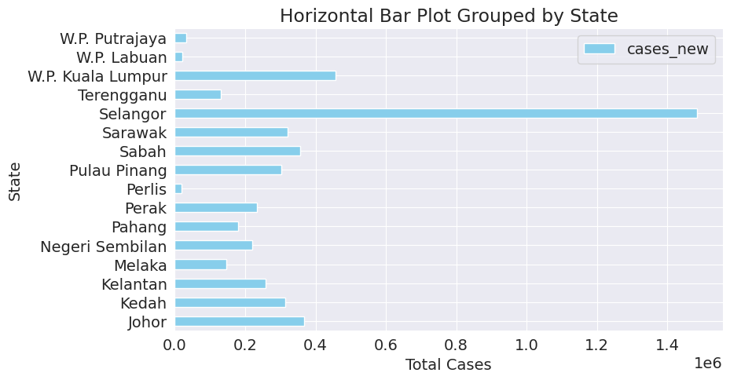
    


```python
grouped_df
```


  <div id="df-56ba3123-3273-475f-aac0-2c388e394761" class="colab-df-container">
    <div>
<style scoped>
    .dataframe tbody tr th:only-of-type {
        vertical-align: middle;
    }

    .dataframe tbody tr th {
        vertical-align: top;
    }

    .dataframe thead th {
        text-align: right;
    }
</style>
<table border="1" class="dataframe">
  <thead>
    <tr style="text-align: right;">
      <th></th>
      <th>state</th>
      <th>cases_new</th>
    </tr>
  </thead>
  <tbody>
    <tr>
      <th>0</th>
      <td>Johor</td>
      <td>366556</td>
    </tr>
    <tr>
      <th>1</th>
      <td>Kedah</td>
      <td>314688</td>
    </tr>
    <tr>
      <th>2</th>
      <td>Kelantan</td>
      <td>258785</td>
    </tr>
    <tr>
      <th>3</th>
      <td>Melaka</td>
      <td>146003</td>
    </tr>
    <tr>
      <th>4</th>
      <td>Negeri Sembilan</td>
      <td>220226</td>
    </tr>
    <tr>
      <th>5</th>
      <td>Pahang</td>
      <td>180956</td>
    </tr>
    <tr>
      <th>6</th>
      <td>Perak</td>
      <td>233770</td>
    </tr>
    <tr>
      <th>7</th>
      <td>Perlis</td>
      <td>19349</td>
    </tr>
    <tr>
      <th>8</th>
      <td>Pulau Pinang</td>
      <td>301932</td>
    </tr>
    <tr>
      <th>9</th>
      <td>Sabah</td>
      <td>355924</td>
    </tr>
    <tr>
      <th>10</th>
      <td>Sarawak</td>
      <td>319865</td>
    </tr>
    <tr>
      <th>11</th>
      <td>Selangor</td>
      <td>1483309</td>
    </tr>
    <tr>
      <th>12</th>
      <td>Terengganu</td>
      <td>131744</td>
    </tr>
    <tr>
      <th>13</th>
      <td>W.P. Kuala Lumpur</td>
      <td>456807</td>
    </tr>
    <tr>
      <th>14</th>
      <td>W.P. Labuan</td>
      <td>21061</td>
    </tr>
    <tr>
      <th>15</th>
      <td>W.P. Putrajaya</td>
      <td>33627</td>
    </tr>
  </tbody>
</table>
</div>
    <div class="colab-df-buttons">

  <div class="colab-df-container">
    <button class="colab-df-convert" onclick="convertToInteractive('df-56ba3123-3273-475f-aac0-2c388e394761')"
            title="Convert this dataframe to an interactive table."
            style="display:none;">

  <svg xmlns="http://www.w3.org/2000/svg" height="24px" viewBox="0 -960 960 960">
    <path d="M120-120v-720h720v720H120Zm60-500h600v-160H180v160Zm220 220h160v-160H400v160Zm0 220h160v-160H400v160ZM180-400h160v-160H180v160Zm440 0h160v-160H620v160ZM180-180h160v-160H180v160Zm440 0h160v-160H620v160Z"/>
  </svg>
    </button>

  <style>
    .colab-df-container {
      display:flex;
      gap: 12px;
    }

    .colab-df-convert {
      background-color: #E8F0FE;
      border: none;
      border-radius: 50%;
      cursor: pointer;
      display: none;
      fill: #1967D2;
      height: 32px;
      padding: 0 0 0 0;
      width: 32px;
    }

    .colab-df-convert:hover {
      background-color: #E2EBFA;
      box-shadow: 0px 1px 2px rgba(60, 64, 67, 0.3), 0px 1px 3px 1px rgba(60, 64, 67, 0.15);
      fill: #174EA6;
    }

    .colab-df-buttons div {
      margin-bottom: 4px;
    }

    [theme=dark] .colab-df-convert {
      background-color: #3B4455;
      fill: #D2E3FC;
    }

    [theme=dark] .colab-df-convert:hover {
      background-color: #434B5C;
      box-shadow: 0px 1px 3px 1px rgba(0, 0, 0, 0.15);
      filter: drop-shadow(0px 1px 2px rgba(0, 0, 0, 0.3));
      fill: #FFFFFF;
    }
  </style>

    <script>
      const buttonEl =
        document.querySelector('#df-56ba3123-3273-475f-aac0-2c388e394761 button.colab-df-convert');
      buttonEl.style.display =
        google.colab.kernel.accessAllowed ? 'block' : 'none';

      async function convertToInteractive(key) {
        const element = document.querySelector('#df-56ba3123-3273-475f-aac0-2c388e394761');
        const dataTable =
          await google.colab.kernel.invokeFunction('convertToInteractive',
                                                    [key], {});
        if (!dataTable) return;

        const docLinkHtml = 'Like what you see? Visit the ' +
          '<a target="_blank" href=https://colab.research.google.com/notebooks/data_table.ipynb>data table notebook</a>'
          + ' to learn more about interactive tables.';
        element.innerHTML = '';
        dataTable['output_type'] = 'display_data';
        await google.colab.output.renderOutput(dataTable, element);
        const docLink = document.createElement('div');
        docLink.innerHTML = docLinkHtml;
        element.appendChild(docLink);
      }
    </script>
  </div>


<div id="df-bbedd1c9-4565-4afb-aac2-efeb90663957">
  <button class="colab-df-quickchart" onclick="quickchart('df-bbedd1c9-4565-4afb-aac2-efeb90663957')"
            title="Suggest charts"
            style="display:none;">

<svg xmlns="http://www.w3.org/2000/svg" height="24px"viewBox="0 0 24 24"
     width="24px">
    <g>
        <path d="M19 3H5c-1.1 0-2 .9-2 2v14c0 1.1.9 2 2 2h14c1.1 0 2-.9 2-2V5c0-1.1-.9-2-2-2zM9 17H7v-7h2v7zm4 0h-2V7h2v10zm4 0h-2v-4h2v4z"/>
    </g>
</svg>
  </button>

<style>
  .colab-df-quickchart {
      --bg-color: #E8F0FE;
      --fill-color: #1967D2;
      --hover-bg-color: #E2EBFA;
      --hover-fill-color: #174EA6;
      --disabled-fill-color: #AAA;
      --disabled-bg-color: #DDD;
  }

  [theme=dark] .colab-df-quickchart {
      --bg-color: #3B4455;
      --fill-color: #D2E3FC;
      --hover-bg-color: #434B5C;
      --hover-fill-color: #FFFFFF;
      --disabled-bg-color: #3B4455;
      --disabled-fill-color: #666;
  }

  .colab-df-quickchart {
    background-color: var(--bg-color);
    border: none;
    border-radius: 50%;
    cursor: pointer;
    display: none;
    fill: var(--fill-color);
    height: 32px;
    padding: 0;
    width: 32px;
  }

  .colab-df-quickchart:hover {
    background-color: var(--hover-bg-color);
    box-shadow: 0 1px 2px rgba(60, 64, 67, 0.3), 0 1px 3px 1px rgba(60, 64, 67, 0.15);
    fill: var(--button-hover-fill-color);
  }

  .colab-df-quickchart-complete:disabled,
  .colab-df-quickchart-complete:disabled:hover {
    background-color: var(--disabled-bg-color);
    fill: var(--disabled-fill-color);
    box-shadow: none;
  }

  .colab-df-spinner {
    border: 2px solid var(--fill-color);
    border-color: transparent;
    border-bottom-color: var(--fill-color);
    animation:
      spin 1s steps(1) infinite;
  }

  @keyframes spin {
    0% {
      border-color: transparent;
      border-bottom-color: var(--fill-color);
      border-left-color: var(--fill-color);
    }
    20% {
      border-color: transparent;
      border-left-color: var(--fill-color);
      border-top-color: var(--fill-color);
    }
    30% {
      border-color: transparent;
      border-left-color: var(--fill-color);
      border-top-color: var(--fill-color);
      border-right-color: var(--fill-color);
    }
    40% {
      border-color: transparent;
      border-right-color: var(--fill-color);
      border-top-color: var(--fill-color);
    }
    60% {
      border-color: transparent;
      border-right-color: var(--fill-color);
    }
    80% {
      border-color: transparent;
      border-right-color: var(--fill-color);
      border-bottom-color: var(--fill-color);
    }
    90% {
      border-color: transparent;
      border-bottom-color: var(--fill-color);
    }
  }
</style>

  <script>
    async function quickchart(key) {
      const quickchartButtonEl =
        document.querySelector('#' + key + ' button');
      quickchartButtonEl.disabled = true;  // To prevent multiple clicks.
      quickchartButtonEl.classList.add('colab-df-spinner');
      try {
        const charts = await google.colab.kernel.invokeFunction(
            'suggestCharts', [key], {});
      } catch (error) {
        console.error('Error during call to suggestCharts:', error);
      }
      quickchartButtonEl.classList.remove('colab-df-spinner');
      quickchartButtonEl.classList.add('colab-df-quickchart-complete');
    }
    (() => {
      let quickchartButtonEl =
        document.querySelector('#df-bbedd1c9-4565-4afb-aac2-efeb90663957 button');
      quickchartButtonEl.style.display =
        google.colab.kernel.accessAllowed ? 'block' : 'none';
    })();
  </script>
</div>
    </div>
  </div>


```python
df.info()
```

    <class 'pandas.core.frame.DataFrame'>
    Index: 15744 entries, 2021-02-24 to 2023-11-04
    Data columns (total 82 columns):
     #   Column                Non-Null Count  Dtype 
    ---  ------                --------------  ----- 
     0   state                 15744 non-null  object
     1   cases_new             15744 non-null  int64 
     2   cases_import          15744 non-null  int64 
     3   cases_recovered       15744 non-null  int64 
     4   cases_active          15744 non-null  int64 
     5   cases_cluster         15744 non-null  int64 
     6   cases_unvax           15744 non-null  int64 
     7   cases_pvax            15744 non-null  int64 
     8   cases_fvax            15744 non-null  int64 
     9   cases_boost           15744 non-null  int64 
     10  cases_child           15744 non-null  int64 
     11  cases_adolescent      15744 non-null  int64 
     12  cases_adult           15744 non-null  int64 
     13  cases_elderly         15744 non-null  int64 
     14  cases_0_4             15744 non-null  int64 
     15  cases_5_11            15744 non-null  int64 
     16  cases_12_17           15744 non-null  int64 
     17  cases_18_29           15744 non-null  int64 
     18  cases_30_39           15744 non-null  int64 
     19  cases_40_49           15744 non-null  int64 
     20  cases_50_59           15744 non-null  int64 
     21  cases_60_69           15744 non-null  int64 
     22  cases_70_79           15744 non-null  int64 
     23  cases_80              15744 non-null  int64 
     24  deaths_new            15744 non-null  int64 
     25  deaths_bid            15744 non-null  int64 
     26  deaths_new_dod        15744 non-null  int64 
     27  deaths_bid_dod        15744 non-null  int64 
     28  deaths_unvax          15744 non-null  int64 
     29  deaths_pvax           15744 non-null  int64 
     30  deaths_fvax           15744 non-null  int64 
     31  deaths_boost          15744 non-null  int64 
     32  deaths_tat            15744 non-null  int64 
     33  daily_partial         15744 non-null  int64 
     34  daily_full            15744 non-null  int64 
     35  daily_booster         15744 non-null  int64 
     36  daily_booster2        15744 non-null  int64 
     37  daily                 15744 non-null  int64 
     38  daily_partial_adol    15744 non-null  int64 
     39  daily_full_adol       15744 non-null  int64 
     40  daily_booster_adol    15744 non-null  int64 
     41  daily_booster2_adol   15744 non-null  int64 
     42  daily_partial_child   15744 non-null  int64 
     43  daily_full_child      15744 non-null  int64 
     44  daily_booster_child   15744 non-null  int64 
     45  daily_booster2_child  15744 non-null  int64 
     46  cumul_partial         15744 non-null  int64 
     47  cumul_full            15744 non-null  int64 
     48  cumul_booster         15744 non-null  int64 
     49  cumul_booster2        15744 non-null  int64 
     50  cumul                 15744 non-null  int64 
     51  cumul_partial_adol    15744 non-null  int64 
     52  cumul_full_adol       15744 non-null  int64 
     53  cumul_booster_adol    15744 non-null  int64 
     54  cumul_booster2_adol   15744 non-null  int64 
     55  cumul_partial_child   15744 non-null  int64 
     56  cumul_full_child      15744 non-null  int64 
     57  cumul_booster_child   15744 non-null  int64 
     58  cumul_booster2_child  15744 non-null  int64 
     59  pfizer1               15744 non-null  int64 
     60  pfizer2               15744 non-null  int64 
     61  pfizer3               15744 non-null  int64 
     62  pfizer4               15744 non-null  int64 
     63  sinovac1              15744 non-null  int64 
     64  sinovac2              15744 non-null  int64 
     65  sinovac3              15744 non-null  int64 
     66  sinovac4              15744 non-null  int64 
     67  astra1                15744 non-null  int64 
     68  astra2                15744 non-null  int64 
     69  astra3                15744 non-null  int64 
     70  astra4                15744 non-null  int64 
     71  sinopharm1            15744 non-null  int64 
     72  sinopharm2            15744 non-null  int64 
     73  sinopharm3            15744 non-null  int64 
     74  sinopharm4            15744 non-null  int64 
     75  cansino               15744 non-null  int64 
     76  cansino3              15744 non-null  int64 
     77  cansino4              15744 non-null  int64 
     78  pending1              15744 non-null  int64 
     79  pending2              15744 non-null  int64 
     80  pending3              15744 non-null  int64 
     81  pending4              15744 non-null  int64 
    dtypes: int64(81), object(1)
    memory usage: 10.0+ MB
    


```python
# Convert the index to datetime
df.index = pd.to_datetime(df.index.get_level_values(0))

# Filter data for the 'cases_new' column
cases_new_data = df['cases_new']

# Group by month and sum the values
monthly_cases = cases_new_data.resample('M').sum()

# Plotting
plt.figure(figsize=(20, 10))
plt.plot(monthly_cases.index, monthly_cases.values, marker='o', linestyle='-', color='b')

# Set x-axis ticks to show every month
plt.gca().xaxis.set_major_locator(mdates.MonthLocator())
plt.gca().xaxis.set_major_formatter(mdates.DateFormatter('%b %Y'))

# Add text labels on each data point
for i, value in enumerate(monthly_cases.values):
    plt.text(monthly_cases.index[i], value, str(value), ha='center', va='bottom')

plt.title('Monthly New Cases Over Time')
plt.xlabel('Month')
plt.ylabel('Number of New Cases')
plt.xticks(rotation=45)  #Rotate x-axis labels for better visibility
plt.grid(True)
plt.show()
```


    

    


```python
# Convert the index to datetime if it is not already
df.index = pd.to_datetime(df.index.get_level_values(0))

# Filter data for the 'cases_new' column
cases_new_data = df['cases_new']

# Group by month and sum the values
monthly_cases = cases_new_data.resample('M').sum()

# Plotting
plt.figure(figsize=(20, 10))
plt.plot(monthly_cases.index, monthly_cases.values, marker='o', linestyle='-', color='b')

# Set x-axis ticks to show every month
plt.gca().xaxis.set_major_locator(mdates.MonthLocator())
plt.gca().xaxis.set_major_formatter(mdates.DateFormatter('%b %Y'))

# Add text labels on each data point
for i, value in enumerate(monthly_cases.values):
    plt.text(monthly_cases.index[i], value, str(value), ha='center', va='bottom')

plt.title('Monthly New Cases Over Time')
plt.xlabel('Month')
plt.ylabel('Number of New Cases')
plt.xticks(rotation=45)  #Rotate x-axis labels for better visibility
plt.grid(True)
plt.show()

```


    

    


>The graph shows the number of monthly new cases over time. The x-axis represents month and the y-axis represents number of new cases. Based on the graph above, we can see that the number of monthly Covid-19 cases in 2021 is incline from February 2021 to September 2021. From September 2021, the trend declined until February 2022. However, there has been a sharp rise in February 2022 until April 2022. Then, the trend declined until November 2023. The highest number of monthly cases is in April 2022 with 759183 records.  


```python
# Convert the index to datetime if it is not already
df.index = pd.to_datetime(df.index.get_level_values(0))

# Filter data for the 'deaths_new' column
deaths_new_data = df['deaths_new']

# Group by month and sum the values
monthly_deaths = deaths_new_data.resample('M').sum()

# Plotting
plt.figure(figsize=(20, 10))
plt.plot(monthly_deaths.index, monthly_deaths.values, marker='o', linestyle='-', color='b')

# Set x-axis ticks to show every month
plt.gca().xaxis.set_major_locator(mdates.MonthLocator())
plt.gca().xaxis.set_major_formatter(mdates.DateFormatter('%b %Y'))

# Add text labels on each data point
for i, value in enumerate(monthly_deaths.values):
    plt.text(monthly_deaths.index[i], value, str(value), ha='center', va='bottom')

plt.title('Monthly New Deaths Over Time')
plt.xlabel('Month')
plt.ylabel('Number of New Deaths')
plt.xticks(rotation=45)  #Rotate x-axis labels for better visibility
plt.grid(True)
plt.show()

```


    
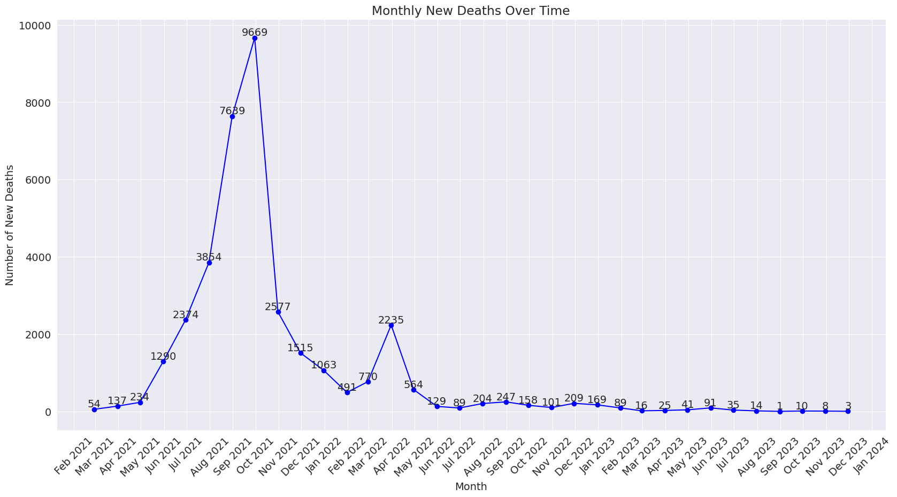
    


>The graph shows the number of monthly new deaths over time. The x-axis represents month and the y-axis represents number of new deaths. Based on the graph above, we can see that the number of monthly Covid-19 deaths in 2021 is incline from February 2021 to October 2021. From October 2021, the trend declined until November 2023. The highest number of monthly deaths is in October 2021 with 9669 records.


```python
df.index = pd.to_datetime(df.index.get_level_values(0))
cases_recovered_data = df['cases_recovered']
monthly_cases_recovered = cases_recovered_data.resample('M').sum()

plt.figure(figsize=(15, 10))
plt.scatter(monthly_cases_recovered.index, monthly_cases_recovered.values, color='b')

plt.gca().xaxis.set_major_locator(mdates.MonthLocator())
plt.gca().xaxis.set_major_formatter(mdates.DateFormatter('%b %Y'))

plt.xlabel('Month')
plt.ylabel('Cases Recovered')
plt.title('Scatter Plot of Monthly Cases Recovered')
plt.xticks(rotation=45)
plt.show()
```


    
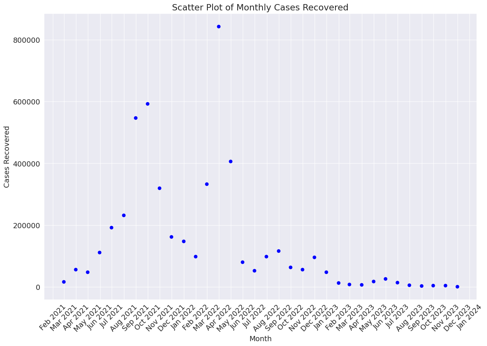
    


```python
df.index = pd.to_datetime(df.index.get_level_values(0))
age_group_cols = ['cases_child', 'cases_adolescent', 'cases_adult', 'cases_elderly']
colors = ['red', 'green', 'blue', 'purple']  # Specify colors for each age group
monthly_cases_age_groups = df[age_group_cols].resample('M').sum()

fig, axes = plt.subplots(nrows=len(age_group_cols), figsize=(20, 15), sharex=True)

for ax, col, color in zip(axes, age_group_cols, colors):
    ax.fill_between(monthly_cases_age_groups.index, monthly_cases_age_groups[col], label=col.split('_')[1], color=color)
    ax.set_title(f'Cases in {col.split("_")[1]}')
    ax.set_ylabel('Number of Cases')
    ax.legend()

    # Adding text labels
    for date, value in zip(monthly_cases_age_groups.index, monthly_cases_age_groups[col]):
        ax.text(date, value, f'{value:.0f}', ha='center', va='bottom', color='black')

plt.xlabel('Date')
plt.xticks(rotation=45)
plt.gca().xaxis.set_major_locator(mdates.MonthLocator())
plt.gca().xaxis.set_major_formatter(mdates.DateFormatter('%b %Y'))

plt.tight_layout()
plt.show()
```


    
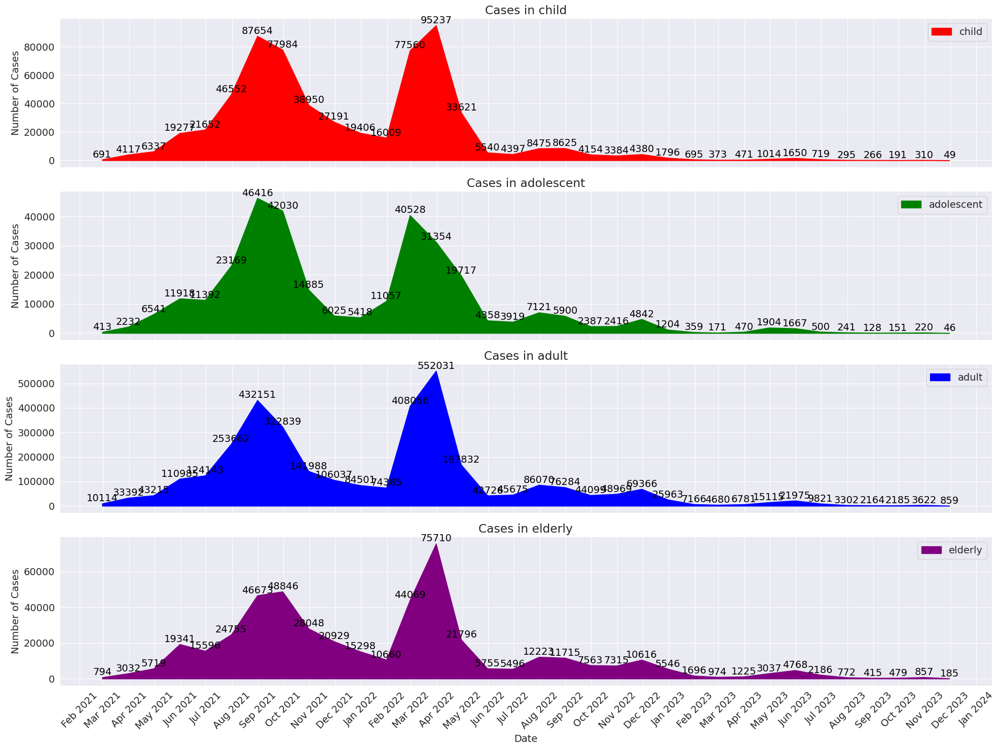
    


```python
df
```


  <div id="df-db0d6dc4-07a7-4479-be28-b14514187128" class="colab-df-container">
    <div>
<style scoped>
    .dataframe tbody tr th:only-of-type {
        vertical-align: middle;
    }

    .dataframe tbody tr th {
        vertical-align: top;
    }

    .dataframe thead th {
        text-align: right;
    }
</style>
<table border="1" class="dataframe">
  <thead>
    <tr style="text-align: right;">
      <th></th>
      <th>state</th>
      <th>cases_new</th>
      <th>cases_import</th>
      <th>cases_recovered</th>
      <th>cases_active</th>
      <th>cases_cluster</th>
      <th>cases_unvax</th>
      <th>cases_pvax</th>
      <th>cases_fvax</th>
      <th>cases_boost</th>
      <th>...</th>
      <th>sinopharm2</th>
      <th>sinopharm3</th>
      <th>sinopharm4</th>
      <th>cansino</th>
      <th>cansino3</th>
      <th>cansino4</th>
      <th>pending1</th>
      <th>pending2</th>
      <th>pending3</th>
      <th>pending4</th>
    </tr>
    <tr>
      <th>date</th>
      <th></th>
      <th></th>
      <th></th>
      <th></th>
      <th></th>
      <th></th>
      <th></th>
      <th></th>
      <th></th>
      <th></th>
      <th></th>
      <th></th>
      <th></th>
      <th></th>
      <th></th>
      <th></th>
      <th></th>
      <th></th>
      <th></th>
      <th></th>
      <th></th>
    </tr>
  </thead>
  <tbody>
    <tr>
      <th>2021-02-24</th>
      <td>Johor</td>
      <td>318</td>
      <td>0</td>
      <td>518</td>
      <td>6165</td>
      <td>189</td>
      <td>318</td>
      <td>0</td>
      <td>0</td>
      <td>0</td>
      <td>...</td>
      <td>0</td>
      <td>0</td>
      <td>0</td>
      <td>0</td>
      <td>0</td>
      <td>0</td>
      <td>0</td>
      <td>0</td>
      <td>0</td>
      <td>0</td>
    </tr>
    <tr>
      <th>2021-02-24</th>
      <td>Kedah</td>
      <td>17</td>
      <td>0</td>
      <td>187</td>
      <td>579</td>
      <td>4</td>
      <td>17</td>
      <td>0</td>
      <td>0</td>
      <td>0</td>
      <td>...</td>
      <td>0</td>
      <td>0</td>
      <td>0</td>
      <td>0</td>
      <td>0</td>
      <td>0</td>
      <td>0</td>
      <td>0</td>
      <td>0</td>
      <td>0</td>
    </tr>
    <tr>
      <th>2021-02-24</th>
      <td>Kelantan</td>
      <td>53</td>
      <td>0</td>
      <td>100</td>
      <td>698</td>
      <td>26</td>
      <td>53</td>
      <td>0</td>
      <td>0</td>
      <td>0</td>
      <td>...</td>
      <td>0</td>
      <td>0</td>
      <td>0</td>
      <td>0</td>
      <td>0</td>
      <td>0</td>
      <td>0</td>
      <td>0</td>
      <td>0</td>
      <td>0</td>
    </tr>
    <tr>
      <th>2021-02-24</th>
      <td>Melaka</td>
      <td>26</td>
      <td>0</td>
      <td>37</td>
      <td>365</td>
      <td>21</td>
      <td>26</td>
      <td>0</td>
      <td>0</td>
      <td>0</td>
      <td>...</td>
      <td>0</td>
      <td>0</td>
      <td>0</td>
      <td>0</td>
      <td>0</td>
      <td>0</td>
      <td>0</td>
      <td>0</td>
      <td>0</td>
      <td>0</td>
    </tr>
    <tr>
      <th>2021-02-24</th>
      <td>Negeri Sembilan</td>
      <td>1392</td>
      <td>0</td>
      <td>119</td>
      <td>2210</td>
      <td>1358</td>
      <td>1392</td>
      <td>0</td>
      <td>0</td>
      <td>0</td>
      <td>...</td>
      <td>0</td>
      <td>0</td>
      <td>0</td>
      <td>0</td>
      <td>0</td>
      <td>0</td>
      <td>0</td>
      <td>0</td>
      <td>0</td>
      <td>0</td>
    </tr>
    <tr>
      <th>...</th>
      <td>...</td>
      <td>...</td>
      <td>...</td>
      <td>...</td>
      <td>...</td>
      <td>...</td>
      <td>...</td>
      <td>...</td>
      <td>...</td>
      <td>...</td>
      <td>...</td>
      <td>...</td>
      <td>...</td>
      <td>...</td>
      <td>...</td>
      <td>...</td>
      <td>...</td>
      <td>...</td>
      <td>...</td>
      <td>...</td>
      <td>...</td>
    </tr>
    <tr>
      <th>2023-11-04</th>
      <td>Selangor</td>
      <td>89</td>
      <td>0</td>
      <td>256</td>
      <td>1074</td>
      <td>0</td>
      <td>10</td>
      <td>1</td>
      <td>10</td>
      <td>68</td>
      <td>...</td>
      <td>0</td>
      <td>0</td>
      <td>0</td>
      <td>0</td>
      <td>0</td>
      <td>0</td>
      <td>0</td>
      <td>0</td>
      <td>0</td>
      <td>0</td>
    </tr>
    <tr>
      <th>2023-11-04</th>
      <td>Terengganu</td>
      <td>0</td>
      <td>0</td>
      <td>0</td>
      <td>337</td>
      <td>0</td>
      <td>0</td>
      <td>0</td>
      <td>0</td>
      <td>0</td>
      <td>...</td>
      <td>0</td>
      <td>0</td>
      <td>0</td>
      <td>0</td>
      <td>0</td>
      <td>0</td>
      <td>0</td>
      <td>0</td>
      <td>0</td>
      <td>0</td>
    </tr>
    <tr>
      <th>2023-11-04</th>
      <td>W.P. Kuala Lumpur</td>
      <td>53</td>
      <td>0</td>
      <td>153</td>
      <td>1385</td>
      <td>0</td>
      <td>2</td>
      <td>0</td>
      <td>3</td>
      <td>48</td>
      <td>...</td>
      <td>0</td>
      <td>0</td>
      <td>0</td>
      <td>0</td>
      <td>0</td>
      <td>0</td>
      <td>0</td>
      <td>0</td>
      <td>0</td>
      <td>0</td>
    </tr>
    <tr>
      <th>2023-11-04</th>
      <td>W.P. Labuan</td>
      <td>1</td>
      <td>0</td>
      <td>4</td>
      <td>37</td>
      <td>0</td>
      <td>1</td>
      <td>0</td>
      <td>0</td>
      <td>0</td>
      <td>...</td>
      <td>0</td>
      <td>0</td>
      <td>0</td>
      <td>0</td>
      <td>0</td>
      <td>0</td>
      <td>0</td>
      <td>0</td>
      <td>0</td>
      <td>0</td>
    </tr>
    <tr>
      <th>2023-11-04</th>
      <td>W.P. Putrajaya</td>
      <td>8</td>
      <td>0</td>
      <td>20</td>
      <td>326</td>
      <td>0</td>
      <td>1</td>
      <td>0</td>
      <td>3</td>
      <td>4</td>
      <td>...</td>
      <td>0</td>
      <td>0</td>
      <td>0</td>
      <td>0</td>
      <td>0</td>
      <td>0</td>
      <td>0</td>
      <td>0</td>
      <td>0</td>
      <td>0</td>
    </tr>
  </tbody>
</table>
<p>15744 rows × 82 columns</p>
</div>
    <div class="colab-df-buttons">

  <div class="colab-df-container">
    <button class="colab-df-convert" onclick="convertToInteractive('df-db0d6dc4-07a7-4479-be28-b14514187128')"
            title="Convert this dataframe to an interactive table."
            style="display:none;">

  <svg xmlns="http://www.w3.org/2000/svg" height="24px" viewBox="0 -960 960 960">
    <path d="M120-120v-720h720v720H120Zm60-500h600v-160H180v160Zm220 220h160v-160H400v160Zm0 220h160v-160H400v160ZM180-400h160v-160H180v160Zm440 0h160v-160H620v160ZM180-180h160v-160H180v160Zm440 0h160v-160H620v160Z"/>
  </svg>
    </button>

  <style>
    .colab-df-container {
      display:flex;
      gap: 12px;
    }

    .colab-df-convert {
      background-color: #E8F0FE;
      border: none;
      border-radius: 50%;
      cursor: pointer;
      display: none;
      fill: #1967D2;
      height: 32px;
      padding: 0 0 0 0;
      width: 32px;
    }

    .colab-df-convert:hover {
      background-color: #E2EBFA;
      box-shadow: 0px 1px 2px rgba(60, 64, 67, 0.3), 0px 1px 3px 1px rgba(60, 64, 67, 0.15);
      fill: #174EA6;
    }

    .colab-df-buttons div {
      margin-bottom: 4px;
    }

    [theme=dark] .colab-df-convert {
      background-color: #3B4455;
      fill: #D2E3FC;
    }

    [theme=dark] .colab-df-convert:hover {
      background-color: #434B5C;
      box-shadow: 0px 1px 3px 1px rgba(0, 0, 0, 0.15);
      filter: drop-shadow(0px 1px 2px rgba(0, 0, 0, 0.3));
      fill: #FFFFFF;
    }
  </style>

    <script>
      const buttonEl =
        document.querySelector('#df-db0d6dc4-07a7-4479-be28-b14514187128 button.colab-df-convert');
      buttonEl.style.display =
        google.colab.kernel.accessAllowed ? 'block' : 'none';

      async function convertToInteractive(key) {
        const element = document.querySelector('#df-db0d6dc4-07a7-4479-be28-b14514187128');
        const dataTable =
          await google.colab.kernel.invokeFunction('convertToInteractive',
                                                    [key], {});
        if (!dataTable) return;

        const docLinkHtml = 'Like what you see? Visit the ' +
          '<a target="_blank" href=https://colab.research.google.com/notebooks/data_table.ipynb>data table notebook</a>'
          + ' to learn more about interactive tables.';
        element.innerHTML = '';
        dataTable['output_type'] = 'display_data';
        await google.colab.output.renderOutput(dataTable, element);
        const docLink = document.createElement('div');
        docLink.innerHTML = docLinkHtml;
        element.appendChild(docLink);
      }
    </script>
  </div>


<div id="df-fcbe8fdf-7e16-4f59-8fb8-f6fcda55bfab">
  <button class="colab-df-quickchart" onclick="quickchart('df-fcbe8fdf-7e16-4f59-8fb8-f6fcda55bfab')"
            title="Suggest charts"
            style="display:none;">

<svg xmlns="http://www.w3.org/2000/svg" height="24px"viewBox="0 0 24 24"
     width="24px">
    <g>
        <path d="M19 3H5c-1.1 0-2 .9-2 2v14c0 1.1.9 2 2 2h14c1.1 0 2-.9 2-2V5c0-1.1-.9-2-2-2zM9 17H7v-7h2v7zm4 0h-2V7h2v10zm4 0h-2v-4h2v4z"/>
    </g>
</svg>
  </button>

<style>
  .colab-df-quickchart {
      --bg-color: #E8F0FE;
      --fill-color: #1967D2;
      --hover-bg-color: #E2EBFA;
      --hover-fill-color: #174EA6;
      --disabled-fill-color: #AAA;
      --disabled-bg-color: #DDD;
  }

  [theme=dark] .colab-df-quickchart {
      --bg-color: #3B4455;
      --fill-color: #D2E3FC;
      --hover-bg-color: #434B5C;
      --hover-fill-color: #FFFFFF;
      --disabled-bg-color: #3B4455;
      --disabled-fill-color: #666;
  }

  .colab-df-quickchart {
    background-color: var(--bg-color);
    border: none;
    border-radius: 50%;
    cursor: pointer;
    display: none;
    fill: var(--fill-color);
    height: 32px;
    padding: 0;
    width: 32px;
  }

  .colab-df-quickchart:hover {
    background-color: var(--hover-bg-color);
    box-shadow: 0 1px 2px rgba(60, 64, 67, 0.3), 0 1px 3px 1px rgba(60, 64, 67, 0.15);
    fill: var(--button-hover-fill-color);
  }

  .colab-df-quickchart-complete:disabled,
  .colab-df-quickchart-complete:disabled:hover {
    background-color: var(--disabled-bg-color);
    fill: var(--disabled-fill-color);
    box-shadow: none;
  }

  .colab-df-spinner {
    border: 2px solid var(--fill-color);
    border-color: transparent;
    border-bottom-color: var(--fill-color);
    animation:
      spin 1s steps(1) infinite;
  }

  @keyframes spin {
    0% {
      border-color: transparent;
      border-bottom-color: var(--fill-color);
      border-left-color: var(--fill-color);
    }
    20% {
      border-color: transparent;
      border-left-color: var(--fill-color);
      border-top-color: var(--fill-color);
    }
    30% {
      border-color: transparent;
      border-left-color: var(--fill-color);
      border-top-color: var(--fill-color);
      border-right-color: var(--fill-color);
    }
    40% {
      border-color: transparent;
      border-right-color: var(--fill-color);
      border-top-color: var(--fill-color);
    }
    60% {
      border-color: transparent;
      border-right-color: var(--fill-color);
    }
    80% {
      border-color: transparent;
      border-right-color: var(--fill-color);
      border-bottom-color: var(--fill-color);
    }
    90% {
      border-color: transparent;
      border-bottom-color: var(--fill-color);
    }
  }
</style>

  <script>
    async function quickchart(key) {
      const quickchartButtonEl =
        document.querySelector('#' + key + ' button');
      quickchartButtonEl.disabled = true;  // To prevent multiple clicks.
      quickchartButtonEl.classList.add('colab-df-spinner');
      try {
        const charts = await google.colab.kernel.invokeFunction(
            'suggestCharts', [key], {});
      } catch (error) {
        console.error('Error during call to suggestCharts:', error);
      }
      quickchartButtonEl.classList.remove('colab-df-spinner');
      quickchartButtonEl.classList.add('colab-df-quickchart-complete');
    }
    (() => {
      let quickchartButtonEl =
        document.querySelector('#df-fcbe8fdf-7e16-4f59-8fb8-f6fcda55bfab button');
      quickchartButtonEl.style.display =
        google.colab.kernel.accessAllowed ? 'block' : 'none';
    })();
  </script>
</div>
    </div>
  </div>


## Asking and Answering Questions

The following questions are asked to gives us a better insight on what should our team focused for this project.


#### Q1: What is the overall trend of COVID-19 cases and deaths over time in Malaysia?


```python

# Convert 'date' column to datetime format
cases['date'] = pd.to_datetime(cases['date'])
death['date'] = pd.to_datetime(death['date'])

# Group by date and sum the cases and deaths
cases_over_time = cases.groupby('date')['cases_new'].sum()
deaths_over_time = death.groupby('date')['deaths_new'].sum()

# Plotting
plt.figure(figsize=(15, 10))
plt.plot(cases_over_time.index, cases_over_time, label='Cases')
plt.plot(deaths_over_time.index, deaths_over_time, label='Deaths')
plt.title('COVID-19 Cases and Deaths Over Time in Malaysia')
plt.xlabel('Date')
plt.ylabel('Count')
plt.legend()

# Format x-axis ticks to show only months
plt.gca().xaxis.set_major_locator(plt.MaxNLocator(prune='both'))
plt.gca().xaxis.set_major_formatter(plt.matplotlib.dates.DateFormatter('%b %Y'))

plt.show()
```


    
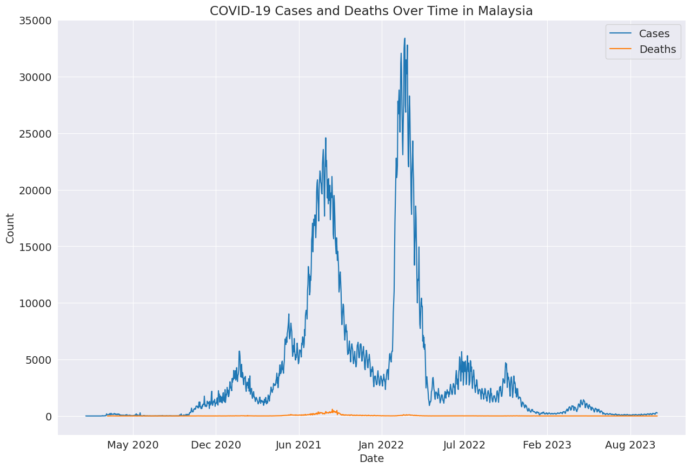
    


```python
print(f'Total Covid19 Cases: {cases_over_time.sum()}')
print(f'Total Covid19 Deaths: {deaths_over_time.sum()}')
```

    Total Covid19 Cases: 5132831
    Total Covid19 Deaths: 37186
    


```python
print(f'Total Cases over Death {round(((deaths_over_time.sum()/cases_over_time.sum())* 100),2)}% ')
```

    Total Cases over Death 0.72% 
    


```python
cases_by_month = cases.groupby([pd.to_datetime(cases.date).dt.year, cases.date.dt.month]).sum()

cases_by_month
```

    <ipython-input-143-244b9f0e5efe>:1: FutureWarning: The default value of numeric_only in DataFrameGroupBy.sum is deprecated. In a future version, numeric_only will default to False. Either specify numeric_only or select only columns which should be valid for the function.
      cases_by_month = cases.groupby([pd.to_datetime(cases.date).dt.year, cases.date.dt.month]).sum()
    


  <div id="df-8c270d56-cf81-480a-b3b5-06bdf3933c82" class="colab-df-container">
    <div>
<style scoped>
    .dataframe tbody tr th:only-of-type {
        vertical-align: middle;
    }

    .dataframe tbody tr th {
        vertical-align: top;
    }

    .dataframe thead th {
        text-align: right;
    }
</style>
<table border="1" class="dataframe">
  <thead>
    <tr style="text-align: right;">
      <th></th>
      <th></th>
      <th>cases_new</th>
      <th>cases_import</th>
      <th>cases_recovered</th>
      <th>cases_active</th>
      <th>cases_cluster</th>
      <th>cases_unvax</th>
      <th>cases_pvax</th>
      <th>cases_fvax</th>
      <th>cases_boost</th>
      <th>cases_child</th>
      <th>...</th>
      <th>cases_0_4</th>
      <th>cases_5_11</th>
      <th>cases_12_17</th>
      <th>cases_18_29</th>
      <th>cases_30_39</th>
      <th>cases_40_49</th>
      <th>cases_50_59</th>
      <th>cases_60_69</th>
      <th>cases_70_79</th>
      <th>cases_80</th>
    </tr>
    <tr>
      <th>date</th>
      <th>date</th>
      <th></th>
      <th></th>
      <th></th>
      <th></th>
      <th></th>
      <th></th>
      <th></th>
      <th></th>
      <th></th>
      <th></th>
      <th></th>
      <th></th>
      <th></th>
      <th></th>
      <th></th>
      <th></th>
      <th></th>
      <th></th>
      <th></th>
      <th></th>
      <th></th>
    </tr>
  </thead>
  <tbody>
    <tr>
      <th rowspan="12" valign="top">2020</th>
      <th>1</th>
      <td>8</td>
      <td>8</td>
      <td>0</td>
      <td>39</td>
      <td>0</td>
      <td>8</td>
      <td>0</td>
      <td>0</td>
      <td>0</td>
      <td>1</td>
      <td>...</td>
      <td>1</td>
      <td>0</td>
      <td>0</td>
      <td>0</td>
      <td>1</td>
      <td>2</td>
      <td>1</td>
      <td>0</td>
      <td>0</td>
      <td>0</td>
    </tr>
    <tr>
      <th>2</th>
      <td>17</td>
      <td>15</td>
      <td>22</td>
      <td>256</td>
      <td>0</td>
      <td>17</td>
      <td>0</td>
      <td>0</td>
      <td>0</td>
      <td>1</td>
      <td>...</td>
      <td>0</td>
      <td>1</td>
      <td>0</td>
      <td>1</td>
      <td>4</td>
      <td>5</td>
      <td>2</td>
      <td>3</td>
      <td>0</td>
      <td>1</td>
    </tr>
    <tr>
      <th>3</th>
      <td>2741</td>
      <td>276</td>
      <td>514</td>
      <td>23626</td>
      <td>1898</td>
      <td>2741</td>
      <td>0</td>
      <td>0</td>
      <td>0</td>
      <td>90</td>
      <td>...</td>
      <td>45</td>
      <td>45</td>
      <td>110</td>
      <td>638</td>
      <td>450</td>
      <td>368</td>
      <td>505</td>
      <td>380</td>
      <td>112</td>
      <td>29</td>
    </tr>
    <tr>
      <th>4</th>
      <td>3236</td>
      <td>512</td>
      <td>3634</td>
      <td>66282</td>
      <td>1666</td>
      <td>3236</td>
      <td>0</td>
      <td>0</td>
      <td>0</td>
      <td>168</td>
      <td>...</td>
      <td>55</td>
      <td>113</td>
      <td>242</td>
      <td>944</td>
      <td>516</td>
      <td>329</td>
      <td>373</td>
      <td>291</td>
      <td>79</td>
      <td>40</td>
    </tr>
    <tr>
      <th>5</th>
      <td>1817</td>
      <td>236</td>
      <td>2182</td>
      <td>43896</td>
      <td>427</td>
      <td>1817</td>
      <td>0</td>
      <td>0</td>
      <td>0</td>
      <td>27</td>
      <td>...</td>
      <td>15</td>
      <td>12</td>
      <td>76</td>
      <td>583</td>
      <td>405</td>
      <td>166</td>
      <td>88</td>
      <td>38</td>
      <td>17</td>
      <td>9</td>
    </tr>
    <tr>
      <th>6</th>
      <td>820</td>
      <td>143</td>
      <td>2001</td>
      <td>23866</td>
      <td>43</td>
      <td>820</td>
      <td>0</td>
      <td>0</td>
      <td>0</td>
      <td>40</td>
      <td>...</td>
      <td>20</td>
      <td>20</td>
      <td>66</td>
      <td>305</td>
      <td>185</td>
      <td>97</td>
      <td>43</td>
      <td>15</td>
      <td>4</td>
      <td>7</td>
    </tr>
    <tr>
      <th>7</th>
      <td>337</td>
      <td>142</td>
      <td>290</td>
      <td>3672</td>
      <td>38</td>
      <td>337</td>
      <td>0</td>
      <td>0</td>
      <td>0</td>
      <td>16</td>
      <td>...</td>
      <td>5</td>
      <td>11</td>
      <td>7</td>
      <td>81</td>
      <td>82</td>
      <td>57</td>
      <td>43</td>
      <td>22</td>
      <td>16</td>
      <td>8</td>
    </tr>
    <tr>
      <th>8</th>
      <td>364</td>
      <td>174</td>
      <td>410</td>
      <td>5802</td>
      <td>97</td>
      <td>364</td>
      <td>0</td>
      <td>0</td>
      <td>0</td>
      <td>38</td>
      <td>...</td>
      <td>17</td>
      <td>21</td>
      <td>17</td>
      <td>93</td>
      <td>86</td>
      <td>53</td>
      <td>41</td>
      <td>20</td>
      <td>12</td>
      <td>3</td>
    </tr>
    <tr>
      <th>9</th>
      <td>1884</td>
      <td>144</td>
      <td>913</td>
      <td>17356</td>
      <td>1488</td>
      <td>1884</td>
      <td>0</td>
      <td>0</td>
      <td>0</td>
      <td>137</td>
      <td>...</td>
      <td>49</td>
      <td>88</td>
      <td>112</td>
      <td>483</td>
      <td>493</td>
      <td>327</td>
      <td>172</td>
      <td>80</td>
      <td>31</td>
      <td>8</td>
    </tr>
    <tr>
      <th>10</th>
      <td>20324</td>
      <td>96</td>
      <td>11281</td>
      <td>191717</td>
      <td>9902</td>
      <td>20324</td>
      <td>0</td>
      <td>0</td>
      <td>0</td>
      <td>1826</td>
      <td>...</td>
      <td>695</td>
      <td>1131</td>
      <td>1148</td>
      <td>5022</td>
      <td>4755</td>
      <td>3100</td>
      <td>2152</td>
      <td>1092</td>
      <td>269</td>
      <td>100</td>
    </tr>
    <tr>
      <th>11</th>
      <td>34149</td>
      <td>151</td>
      <td>33511</td>
      <td>355532</td>
      <td>22042</td>
      <td>34149</td>
      <td>0</td>
      <td>0</td>
      <td>0</td>
      <td>2392</td>
      <td>...</td>
      <td>923</td>
      <td>1469</td>
      <td>1618</td>
      <td>11070</td>
      <td>8488</td>
      <td>4099</td>
      <td>2269</td>
      <td>1102</td>
      <td>320</td>
      <td>116</td>
    </tr>
    <tr>
      <th>12</th>
      <td>47313</td>
      <td>176</td>
      <td>34182</td>
      <td>471913</td>
      <td>28821</td>
      <td>47313</td>
      <td>0</td>
      <td>0</td>
      <td>0</td>
      <td>2704</td>
      <td>...</td>
      <td>1059</td>
      <td>1645</td>
      <td>1487</td>
      <td>16024</td>
      <td>13621</td>
      <td>5892</td>
      <td>2871</td>
      <td>1562</td>
      <td>481</td>
      <td>120</td>
    </tr>
    <tr>
      <th rowspan="12" valign="top">2021</th>
      <th>1</th>
      <td>101949</td>
      <td>202</td>
      <td>77108</td>
      <td>1072500</td>
      <td>35207</td>
      <td>101948</td>
      <td>1</td>
      <td>0</td>
      <td>0</td>
      <td>7791</td>
      <td>...</td>
      <td>3199</td>
      <td>4592</td>
      <td>4207</td>
      <td>30484</td>
      <td>26393</td>
      <td>13100</td>
      <td>8424</td>
      <td>4812</td>
      <td>1727</td>
      <td>555</td>
    </tr>
    <tr>
      <th>2</th>
      <td>85793</td>
      <td>127</td>
      <td>107368</td>
      <td>1182685</td>
      <td>39069</td>
      <td>85790</td>
      <td>3</td>
      <td>0</td>
      <td>0</td>
      <td>5024</td>
      <td>...</td>
      <td>2174</td>
      <td>2850</td>
      <td>2777</td>
      <td>28072</td>
      <td>22312</td>
      <td>10750</td>
      <td>6052</td>
      <td>3041</td>
      <td>1273</td>
      <td>548</td>
    </tr>
    <tr>
      <th>3</th>
      <td>44748</td>
      <td>235</td>
      <td>56207</td>
      <td>532340</td>
      <td>19595</td>
      <td>44419</td>
      <td>322</td>
      <td>7</td>
      <td>0</td>
      <td>4117</td>
      <td>...</td>
      <td>1508</td>
      <td>2609</td>
      <td>2232</td>
      <td>13168</td>
      <td>10653</td>
      <td>5901</td>
      <td>3670</td>
      <td>2005</td>
      <td>756</td>
      <td>271</td>
    </tr>
    <tr>
      <th>4</th>
      <td>63213</td>
      <td>388</td>
      <td>48356</td>
      <td>572595</td>
      <td>20620</td>
      <td>62520</td>
      <td>541</td>
      <td>152</td>
      <td>0</td>
      <td>6337</td>
      <td>...</td>
      <td>2177</td>
      <td>4160</td>
      <td>6541</td>
      <td>16309</td>
      <td>13024</td>
      <td>7949</td>
      <td>5933</td>
      <td>3785</td>
      <td>1501</td>
      <td>433</td>
    </tr>
    <tr>
      <th>5</th>
      <td>163644</td>
      <td>193</td>
      <td>112058</td>
      <td>1494784</td>
      <td>35839</td>
      <td>159135</td>
      <td>2776</td>
      <td>1733</td>
      <td>0</td>
      <td>19277</td>
      <td>...</td>
      <td>7261</td>
      <td>12016</td>
      <td>11918</td>
      <td>40935</td>
      <td>31807</td>
      <td>20687</td>
      <td>17556</td>
      <td>12949</td>
      <td>4940</td>
      <td>1452</td>
    </tr>
    <tr>
      <th>6</th>
      <td>179622</td>
      <td>282</td>
      <td>192642</td>
      <td>2147226</td>
      <td>51621</td>
      <td>169050</td>
      <td>7166</td>
      <td>3406</td>
      <td>0</td>
      <td>21652</td>
      <td>...</td>
      <td>8566</td>
      <td>13086</td>
      <td>11392</td>
      <td>48704</td>
      <td>37329</td>
      <td>21753</td>
      <td>16357</td>
      <td>10071</td>
      <td>3959</td>
      <td>1566</td>
    </tr>
    <tr>
      <th>7</th>
      <td>361293</td>
      <td>546</td>
      <td>231958</td>
      <td>3635623</td>
      <td>78283</td>
      <td>281233</td>
      <td>63092</td>
      <td>16968</td>
      <td>0</td>
      <td>46552</td>
      <td>...</td>
      <td>19382</td>
      <td>27170</td>
      <td>23169</td>
      <td>100214</td>
      <td>76960</td>
      <td>46160</td>
      <td>30328</td>
      <td>16674</td>
      <td>6039</td>
      <td>2042</td>
    </tr>
    <tr>
      <th>8</th>
      <td>632982</td>
      <td>490</td>
      <td>547086</td>
      <td>7538701</td>
      <td>79553</td>
      <td>344506</td>
      <td>194917</td>
      <td>93559</td>
      <td>0</td>
      <td>87654</td>
      <td>...</td>
      <td>34832</td>
      <td>52822</td>
      <td>46416</td>
      <td>167295</td>
      <td>129967</td>
      <td>81808</td>
      <td>53081</td>
      <td>30188</td>
      <td>12057</td>
      <td>4427</td>
    </tr>
    <tr>
      <th>9</th>
      <td>499441</td>
      <td>326</td>
      <td>593100</td>
      <td>6642026</td>
      <td>44491</td>
      <td>195021</td>
      <td>101625</td>
      <td>202795</td>
      <td>0</td>
      <td>77984</td>
      <td>...</td>
      <td>31002</td>
      <td>46982</td>
      <td>42030</td>
      <td>119287</td>
      <td>97546</td>
      <td>62202</td>
      <td>43804</td>
      <td>30301</td>
      <td>13534</td>
      <td>5011</td>
    </tr>
    <tr>
      <th>10</th>
      <td>225947</td>
      <td>473</td>
      <td>319938</td>
      <td>3160787</td>
      <td>11463</td>
      <td>65373</td>
      <td>20342</td>
      <td>140071</td>
      <td>161</td>
      <td>38950</td>
      <td>...</td>
      <td>15873</td>
      <td>23077</td>
      <td>14885</td>
      <td>48386</td>
      <td>44402</td>
      <td>27511</td>
      <td>21689</td>
      <td>16832</td>
      <td>8070</td>
      <td>3146</td>
    </tr>
    <tr>
      <th>11</th>
      <td>161140</td>
      <td>568</td>
      <td>162443</td>
      <td>1988769</td>
      <td>4699</td>
      <td>39788</td>
      <td>2717</td>
      <td>116166</td>
      <td>2469</td>
      <td>27191</td>
      <td>...</td>
      <td>10565</td>
      <td>16626</td>
      <td>6025</td>
      <td>34645</td>
      <td>33774</td>
      <td>21003</td>
      <td>16615</td>
      <td>13101</td>
      <td>5820</td>
      <td>2008</td>
    </tr>
    <tr>
      <th>12</th>
      <td>125304</td>
      <td>2398</td>
      <td>148168</td>
      <td>1675713</td>
      <td>4076</td>
      <td>28618</td>
      <td>955</td>
      <td>90495</td>
      <td>5236</td>
      <td>19406</td>
      <td>...</td>
      <td>7656</td>
      <td>11750</td>
      <td>5418</td>
      <td>28773</td>
      <td>26941</td>
      <td>16439</td>
      <td>12348</td>
      <td>9652</td>
      <td>4214</td>
      <td>1432</td>
    </tr>
    <tr>
      <th rowspan="12" valign="top">2022</th>
      <th>1</th>
      <td>112672</td>
      <td>10193</td>
      <td>98625</td>
      <td>1333652</td>
      <td>9812</td>
      <td>23053</td>
      <td>616</td>
      <td>72523</td>
      <td>16480</td>
      <td>16009</td>
      <td>...</td>
      <td>5528</td>
      <td>10481</td>
      <td>11057</td>
      <td>28627</td>
      <td>22715</td>
      <td>13133</td>
      <td>9910</td>
      <td>7014</td>
      <td>2783</td>
      <td>863</td>
    </tr>
    <tr>
      <th>2</th>
      <td>571978</td>
      <td>4104</td>
      <td>332561</td>
      <td>4934787</td>
      <td>14063</td>
      <td>102086</td>
      <td>4525</td>
      <td>255815</td>
      <td>209552</td>
      <td>77560</td>
      <td>...</td>
      <td>28021</td>
      <td>49539</td>
      <td>40528</td>
      <td>159797</td>
      <td>126809</td>
      <td>74069</td>
      <td>47391</td>
      <td>28335</td>
      <td>11744</td>
      <td>3990</td>
    </tr>
    <tr>
      <th>3</th>
      <td>759183</td>
      <td>12442</td>
      <td>843516</td>
      <td>8655724</td>
      <td>7311</td>
      <td>109531</td>
      <td>20261</td>
      <td>203893</td>
      <td>425498</td>
      <td>95237</td>
      <td>...</td>
      <td>44891</td>
      <td>50346</td>
      <td>31354</td>
      <td>197219</td>
      <td>180348</td>
      <td>104806</td>
      <td>69658</td>
      <td>45822</td>
      <td>21211</td>
      <td>8677</td>
    </tr>
    <tr>
      <th>4</th>
      <td>246085</td>
      <td>1962</td>
      <td>406869</td>
      <td>3501144</td>
      <td>3509</td>
      <td>34039</td>
      <td>11505</td>
      <td>50582</td>
      <td>149959</td>
      <td>33621</td>
      <td>...</td>
      <td>13544</td>
      <td>20077</td>
      <td>19717</td>
      <td>55367</td>
      <td>58083</td>
      <td>33844</td>
      <td>20538</td>
      <td>12874</td>
      <td>6086</td>
      <td>2836</td>
    </tr>
    <tr>
      <th>5</th>
      <td>58506</td>
      <td>138</td>
      <td>80731</td>
      <td>850844</td>
      <td>43</td>
      <td>5723</td>
      <td>1218</td>
      <td>11662</td>
      <td>39903</td>
      <td>5540</td>
      <td>...</td>
      <td>2337</td>
      <td>3203</td>
      <td>4358</td>
      <td>14639</td>
      <td>13625</td>
      <td>9299</td>
      <td>5163</td>
      <td>3178</td>
      <td>1731</td>
      <td>846</td>
    </tr>
    <tr>
      <th>6</th>
      <td>59545</td>
      <td>621</td>
      <td>53174</td>
      <td>745335</td>
      <td>215</td>
      <td>4519</td>
      <td>518</td>
      <td>10911</td>
      <td>43597</td>
      <td>4397</td>
      <td>...</td>
      <td>1815</td>
      <td>2582</td>
      <td>3919</td>
      <td>15358</td>
      <td>14461</td>
      <td>10037</td>
      <td>5819</td>
      <td>3015</td>
      <td>1606</td>
      <td>875</td>
    </tr>
    <tr>
      <th>7</th>
      <td>113998</td>
      <td>160</td>
      <td>97922</td>
      <td>1247384</td>
      <td>355</td>
      <td>9111</td>
      <td>691</td>
      <td>20945</td>
      <td>83251</td>
      <td>8475</td>
      <td>...</td>
      <td>3663</td>
      <td>4812</td>
      <td>7121</td>
      <td>29472</td>
      <td>28389</td>
      <td>17906</td>
      <td>10303</td>
      <td>6532</td>
      <td>3556</td>
      <td>2135</td>
    </tr>
    <tr>
      <th>8</th>
      <td>102571</td>
      <td>160</td>
      <td>116640</td>
      <td>1263893</td>
      <td>455</td>
      <td>9919</td>
      <td>660</td>
      <td>20895</td>
      <td>71097</td>
      <td>8625</td>
      <td>...</td>
      <td>3766</td>
      <td>4859</td>
      <td>5900</td>
      <td>25789</td>
      <td>25805</td>
      <td>15696</td>
      <td>8994</td>
      <td>5835</td>
      <td>3390</td>
      <td>2490</td>
    </tr>
    <tr>
      <th>9</th>
      <td>58255</td>
      <td>129</td>
      <td>63319</td>
      <td>795905</td>
      <td>133</td>
      <td>5570</td>
      <td>295</td>
      <td>11443</td>
      <td>40947</td>
      <td>4154</td>
      <td>...</td>
      <td>2000</td>
      <td>2154</td>
      <td>2387</td>
      <td>15501</td>
      <td>14765</td>
      <td>8567</td>
      <td>5266</td>
      <td>3657</td>
      <td>2236</td>
      <td>1670</td>
    </tr>
    <tr>
      <th>10</th>
      <td>62085</td>
      <td>149</td>
      <td>56318</td>
      <td>783290</td>
      <td>259</td>
      <td>5021</td>
      <td>246</td>
      <td>11149</td>
      <td>45669</td>
      <td>3384</td>
      <td>...</td>
      <td>1623</td>
      <td>1761</td>
      <td>2416</td>
      <td>17826</td>
      <td>16378</td>
      <td>9298</td>
      <td>5467</td>
      <td>3481</td>
      <td>2192</td>
      <td>1642</td>
    </tr>
    <tr>
      <th>11</th>
      <td>89204</td>
      <td>87</td>
      <td>95471</td>
      <td>904360</td>
      <td>2230</td>
      <td>7576</td>
      <td>406</td>
      <td>19324</td>
      <td>61898</td>
      <td>4380</td>
      <td>...</td>
      <td>2075</td>
      <td>2305</td>
      <td>4842</td>
      <td>24403</td>
      <td>23471</td>
      <td>13852</td>
      <td>7640</td>
      <td>4776</td>
      <td>3088</td>
      <td>2752</td>
    </tr>
    <tr>
      <th>12</th>
      <td>34509</td>
      <td>89</td>
      <td>47298</td>
      <td>537614</td>
      <td>367</td>
      <td>3728</td>
      <td>156</td>
      <td>6939</td>
      <td>23686</td>
      <td>1796</td>
      <td>...</td>
      <td>978</td>
      <td>818</td>
      <td>1204</td>
      <td>8896</td>
      <td>8952</td>
      <td>5089</td>
      <td>3026</td>
      <td>2197</td>
      <td>1696</td>
      <td>1653</td>
    </tr>
    <tr>
      <th rowspan="11" valign="top">2023</th>
      <th>1</th>
      <td>9916</td>
      <td>81</td>
      <td>12934</td>
      <td>309765</td>
      <td>137</td>
      <td>1272</td>
      <td>66</td>
      <td>1843</td>
      <td>6735</td>
      <td>695</td>
      <td>...</td>
      <td>339</td>
      <td>356</td>
      <td>359</td>
      <td>2291</td>
      <td>2506</td>
      <td>1488</td>
      <td>881</td>
      <td>628</td>
      <td>533</td>
      <td>535</td>
    </tr>
    <tr>
      <th>2</th>
      <td>6198</td>
      <td>69</td>
      <td>8166</td>
      <td>208941</td>
      <td>40</td>
      <td>676</td>
      <td>31</td>
      <td>1043</td>
      <td>4448</td>
      <td>373</td>
      <td>...</td>
      <td>180</td>
      <td>193</td>
      <td>171</td>
      <td>1547</td>
      <td>1652</td>
      <td>943</td>
      <td>538</td>
      <td>414</td>
      <td>260</td>
      <td>300</td>
    </tr>
    <tr>
      <th>3</th>
      <td>8947</td>
      <td>76</td>
      <td>7492</td>
      <td>219041</td>
      <td>319</td>
      <td>919</td>
      <td>49</td>
      <td>1707</td>
      <td>6272</td>
      <td>471</td>
      <td>...</td>
      <td>216</td>
      <td>255</td>
      <td>470</td>
      <td>2276</td>
      <td>2408</td>
      <td>1333</td>
      <td>764</td>
      <td>481</td>
      <td>352</td>
      <td>392</td>
    </tr>
    <tr>
      <th>4</th>
      <td>21070</td>
      <td>42</td>
      <td>17330</td>
      <td>327065</td>
      <td>1067</td>
      <td>2180</td>
      <td>95</td>
      <td>4643</td>
      <td>14152</td>
      <td>1014</td>
      <td>...</td>
      <td>450</td>
      <td>564</td>
      <td>1904</td>
      <td>5132</td>
      <td>5250</td>
      <td>3074</td>
      <td>1659</td>
      <td>1104</td>
      <td>866</td>
      <td>1067</td>
    </tr>
    <tr>
      <th>5</th>
      <td>30060</td>
      <td>66</td>
      <td>25767</td>
      <td>523162</td>
      <td>470</td>
      <td>3367</td>
      <td>129</td>
      <td>5922</td>
      <td>20642</td>
      <td>1650</td>
      <td>...</td>
      <td>638</td>
      <td>1012</td>
      <td>1667</td>
      <td>6821</td>
      <td>7912</td>
      <td>4685</td>
      <td>2557</td>
      <td>1681</td>
      <td>1361</td>
      <td>1726</td>
    </tr>
    <tr>
      <th>6</th>
      <td>13226</td>
      <td>22</td>
      <td>14321</td>
      <td>510691</td>
      <td>30</td>
      <td>1548</td>
      <td>70</td>
      <td>2238</td>
      <td>9370</td>
      <td>719</td>
      <td>...</td>
      <td>291</td>
      <td>428</td>
      <td>500</td>
      <td>3141</td>
      <td>3472</td>
      <td>2097</td>
      <td>1111</td>
      <td>749</td>
      <td>590</td>
      <td>847</td>
    </tr>
    <tr>
      <th>7</th>
      <td>4610</td>
      <td>8</td>
      <td>6200</td>
      <td>431355</td>
      <td>59</td>
      <td>604</td>
      <td>22</td>
      <td>919</td>
      <td>3065</td>
      <td>295</td>
      <td>...</td>
      <td>137</td>
      <td>158</td>
      <td>241</td>
      <td>1089</td>
      <td>1169</td>
      <td>696</td>
      <td>348</td>
      <td>241</td>
      <td>184</td>
      <td>347</td>
    </tr>
    <tr>
      <th>8</th>
      <td>2973</td>
      <td>12</td>
      <td>3860</td>
      <td>396723</td>
      <td>0</td>
      <td>451</td>
      <td>10</td>
      <td>535</td>
      <td>1977</td>
      <td>266</td>
      <td>...</td>
      <td>110</td>
      <td>156</td>
      <td>128</td>
      <td>709</td>
      <td>812</td>
      <td>418</td>
      <td>225</td>
      <td>142</td>
      <td>103</td>
      <td>170</td>
    </tr>
    <tr>
      <th>9</th>
      <td>3006</td>
      <td>26</td>
      <td>4324</td>
      <td>342651</td>
      <td>25</td>
      <td>441</td>
      <td>12</td>
      <td>528</td>
      <td>2025</td>
      <td>191</td>
      <td>...</td>
      <td>86</td>
      <td>105</td>
      <td>151</td>
      <td>688</td>
      <td>768</td>
      <td>477</td>
      <td>252</td>
      <td>144</td>
      <td>114</td>
      <td>221</td>
    </tr>
    <tr>
      <th>10</th>
      <td>5009</td>
      <td>17</td>
      <td>4395</td>
      <td>359230</td>
      <td>51</td>
      <td>671</td>
      <td>19</td>
      <td>896</td>
      <td>3423</td>
      <td>310</td>
      <td>...</td>
      <td>115</td>
      <td>195</td>
      <td>220</td>
      <td>1247</td>
      <td>1216</td>
      <td>734</td>
      <td>425</td>
      <td>282</td>
      <td>192</td>
      <td>383</td>
    </tr>
    <tr>
      <th>11</th>
      <td>1139</td>
      <td>3</td>
      <td>1456</td>
      <td>47756</td>
      <td>10</td>
      <td>119</td>
      <td>3</td>
      <td>180</td>
      <td>837</td>
      <td>49</td>
      <td>...</td>
      <td>24</td>
      <td>25</td>
      <td>46</td>
      <td>275</td>
      <td>317</td>
      <td>182</td>
      <td>85</td>
      <td>72</td>
      <td>45</td>
      <td>68</td>
    </tr>
  </tbody>
</table>
<p>47 rows × 23 columns</p>
</div>
    <div class="colab-df-buttons">

  <div class="colab-df-container">
    <button class="colab-df-convert" onclick="convertToInteractive('df-8c270d56-cf81-480a-b3b5-06bdf3933c82')"
            title="Convert this dataframe to an interactive table."
            style="display:none;">

  <svg xmlns="http://www.w3.org/2000/svg" height="24px" viewBox="0 -960 960 960">
    <path d="M120-120v-720h720v720H120Zm60-500h600v-160H180v160Zm220 220h160v-160H400v160Zm0 220h160v-160H400v160ZM180-400h160v-160H180v160Zm440 0h160v-160H620v160ZM180-180h160v-160H180v160Zm440 0h160v-160H620v160Z"/>
  </svg>
    </button>

  <style>
    .colab-df-container {
      display:flex;
      gap: 12px;
    }

    .colab-df-convert {
      background-color: #E8F0FE;
      border: none;
      border-radius: 50%;
      cursor: pointer;
      display: none;
      fill: #1967D2;
      height: 32px;
      padding: 0 0 0 0;
      width: 32px;
    }

    .colab-df-convert:hover {
      background-color: #E2EBFA;
      box-shadow: 0px 1px 2px rgba(60, 64, 67, 0.3), 0px 1px 3px 1px rgba(60, 64, 67, 0.15);
      fill: #174EA6;
    }

    .colab-df-buttons div {
      margin-bottom: 4px;
    }

    [theme=dark] .colab-df-convert {
      background-color: #3B4455;
      fill: #D2E3FC;
    }

    [theme=dark] .colab-df-convert:hover {
      background-color: #434B5C;
      box-shadow: 0px 1px 3px 1px rgba(0, 0, 0, 0.15);
      filter: drop-shadow(0px 1px 2px rgba(0, 0, 0, 0.3));
      fill: #FFFFFF;
    }
  </style>

    <script>
      const buttonEl =
        document.querySelector('#df-8c270d56-cf81-480a-b3b5-06bdf3933c82 button.colab-df-convert');
      buttonEl.style.display =
        google.colab.kernel.accessAllowed ? 'block' : 'none';

      async function convertToInteractive(key) {
        const element = document.querySelector('#df-8c270d56-cf81-480a-b3b5-06bdf3933c82');
        const dataTable =
          await google.colab.kernel.invokeFunction('convertToInteractive',
                                                    [key], {});
        if (!dataTable) return;

        const docLinkHtml = 'Like what you see? Visit the ' +
          '<a target="_blank" href=https://colab.research.google.com/notebooks/data_table.ipynb>data table notebook</a>'
          + ' to learn more about interactive tables.';
        element.innerHTML = '';
        dataTable['output_type'] = 'display_data';
        await google.colab.output.renderOutput(dataTable, element);
        const docLink = document.createElement('div');
        docLink.innerHTML = docLinkHtml;
        element.appendChild(docLink);
      }
    </script>
  </div>


<div id="df-902cf5a7-1e91-41e5-b472-e40c0d8f414c">
  <button class="colab-df-quickchart" onclick="quickchart('df-902cf5a7-1e91-41e5-b472-e40c0d8f414c')"
            title="Suggest charts"
            style="display:none;">

<svg xmlns="http://www.w3.org/2000/svg" height="24px"viewBox="0 0 24 24"
     width="24px">
    <g>
        <path d="M19 3H5c-1.1 0-2 .9-2 2v14c0 1.1.9 2 2 2h14c1.1 0 2-.9 2-2V5c0-1.1-.9-2-2-2zM9 17H7v-7h2v7zm4 0h-2V7h2v10zm4 0h-2v-4h2v4z"/>
    </g>
</svg>
  </button>

<style>
  .colab-df-quickchart {
      --bg-color: #E8F0FE;
      --fill-color: #1967D2;
      --hover-bg-color: #E2EBFA;
      --hover-fill-color: #174EA6;
      --disabled-fill-color: #AAA;
      --disabled-bg-color: #DDD;
  }

  [theme=dark] .colab-df-quickchart {
      --bg-color: #3B4455;
      --fill-color: #D2E3FC;
      --hover-bg-color: #434B5C;
      --hover-fill-color: #FFFFFF;
      --disabled-bg-color: #3B4455;
      --disabled-fill-color: #666;
  }

  .colab-df-quickchart {
    background-color: var(--bg-color);
    border: none;
    border-radius: 50%;
    cursor: pointer;
    display: none;
    fill: var(--fill-color);
    height: 32px;
    padding: 0;
    width: 32px;
  }

  .colab-df-quickchart:hover {
    background-color: var(--hover-bg-color);
    box-shadow: 0 1px 2px rgba(60, 64, 67, 0.3), 0 1px 3px 1px rgba(60, 64, 67, 0.15);
    fill: var(--button-hover-fill-color);
  }

  .colab-df-quickchart-complete:disabled,
  .colab-df-quickchart-complete:disabled:hover {
    background-color: var(--disabled-bg-color);
    fill: var(--disabled-fill-color);
    box-shadow: none;
  }

  .colab-df-spinner {
    border: 2px solid var(--fill-color);
    border-color: transparent;
    border-bottom-color: var(--fill-color);
    animation:
      spin 1s steps(1) infinite;
  }

  @keyframes spin {
    0% {
      border-color: transparent;
      border-bottom-color: var(--fill-color);
      border-left-color: var(--fill-color);
    }
    20% {
      border-color: transparent;
      border-left-color: var(--fill-color);
      border-top-color: var(--fill-color);
    }
    30% {
      border-color: transparent;
      border-left-color: var(--fill-color);
      border-top-color: var(--fill-color);
      border-right-color: var(--fill-color);
    }
    40% {
      border-color: transparent;
      border-right-color: var(--fill-color);
      border-top-color: var(--fill-color);
    }
    60% {
      border-color: transparent;
      border-right-color: var(--fill-color);
    }
    80% {
      border-color: transparent;
      border-right-color: var(--fill-color);
      border-bottom-color: var(--fill-color);
    }
    90% {
      border-color: transparent;
      border-bottom-color: var(--fill-color);
    }
  }
</style>

  <script>
    async function quickchart(key) {
      const quickchartButtonEl =
        document.querySelector('#' + key + ' button');
      quickchartButtonEl.disabled = true;  // To prevent multiple clicks.
      quickchartButtonEl.classList.add('colab-df-spinner');
      try {
        const charts = await google.colab.kernel.invokeFunction(
            'suggestCharts', [key], {});
      } catch (error) {
        console.error('Error during call to suggestCharts:', error);
      }
      quickchartButtonEl.classList.remove('colab-df-spinner');
      quickchartButtonEl.classList.add('colab-df-quickchart-complete');
    }
    (() => {
      let quickchartButtonEl =
        document.querySelector('#df-902cf5a7-1e91-41e5-b472-e40c0d8f414c button');
      quickchartButtonEl.style.display =
        google.colab.kernel.accessAllowed ? 'block' : 'none';
    })();
  </script>
</div>
    </div>
  </div>


#### Q2: Which state has the highest total number of cases, and how does it compare to the state with the lowest total cases?


```python
grouped_df.sort_values(['cases_new'], ascending=False)
```


  <div id="df-717b91a9-98dc-406d-b187-0ed2b90e0cf8" class="colab-df-container">
    <div>
<style scoped>
    .dataframe tbody tr th:only-of-type {
        vertical-align: middle;
    }

    .dataframe tbody tr th {
        vertical-align: top;
    }

    .dataframe thead th {
        text-align: right;
    }
</style>
<table border="1" class="dataframe">
  <thead>
    <tr style="text-align: right;">
      <th></th>
      <th>state</th>
      <th>cases_new</th>
    </tr>
  </thead>
  <tbody>
    <tr>
      <th>11</th>
      <td>Selangor</td>
      <td>1483309</td>
    </tr>
    <tr>
      <th>13</th>
      <td>W.P. Kuala Lumpur</td>
      <td>456807</td>
    </tr>
    <tr>
      <th>0</th>
      <td>Johor</td>
      <td>366556</td>
    </tr>
    <tr>
      <th>9</th>
      <td>Sabah</td>
      <td>355924</td>
    </tr>
    <tr>
      <th>10</th>
      <td>Sarawak</td>
      <td>319865</td>
    </tr>
    <tr>
      <th>1</th>
      <td>Kedah</td>
      <td>314688</td>
    </tr>
    <tr>
      <th>8</th>
      <td>Pulau Pinang</td>
      <td>301932</td>
    </tr>
    <tr>
      <th>2</th>
      <td>Kelantan</td>
      <td>258785</td>
    </tr>
    <tr>
      <th>6</th>
      <td>Perak</td>
      <td>233770</td>
    </tr>
    <tr>
      <th>4</th>
      <td>Negeri Sembilan</td>
      <td>220226</td>
    </tr>
    <tr>
      <th>5</th>
      <td>Pahang</td>
      <td>180956</td>
    </tr>
    <tr>
      <th>3</th>
      <td>Melaka</td>
      <td>146003</td>
    </tr>
    <tr>
      <th>12</th>
      <td>Terengganu</td>
      <td>131744</td>
    </tr>
    <tr>
      <th>15</th>
      <td>W.P. Putrajaya</td>
      <td>33627</td>
    </tr>
    <tr>
      <th>14</th>
      <td>W.P. Labuan</td>
      <td>21061</td>
    </tr>
    <tr>
      <th>7</th>
      <td>Perlis</td>
      <td>19349</td>
    </tr>
  </tbody>
</table>
</div>
    <div class="colab-df-buttons">

  <div class="colab-df-container">
    <button class="colab-df-convert" onclick="convertToInteractive('df-717b91a9-98dc-406d-b187-0ed2b90e0cf8')"
            title="Convert this dataframe to an interactive table."
            style="display:none;">

  <svg xmlns="http://www.w3.org/2000/svg" height="24px" viewBox="0 -960 960 960">
    <path d="M120-120v-720h720v720H120Zm60-500h600v-160H180v160Zm220 220h160v-160H400v160Zm0 220h160v-160H400v160ZM180-400h160v-160H180v160Zm440 0h160v-160H620v160ZM180-180h160v-160H180v160Zm440 0h160v-160H620v160Z"/>
  </svg>
    </button>

  <style>
    .colab-df-container {
      display:flex;
      gap: 12px;
    }

    .colab-df-convert {
      background-color: #E8F0FE;
      border: none;
      border-radius: 50%;
      cursor: pointer;
      display: none;
      fill: #1967D2;
      height: 32px;
      padding: 0 0 0 0;
      width: 32px;
    }

    .colab-df-convert:hover {
      background-color: #E2EBFA;
      box-shadow: 0px 1px 2px rgba(60, 64, 67, 0.3), 0px 1px 3px 1px rgba(60, 64, 67, 0.15);
      fill: #174EA6;
    }

    .colab-df-buttons div {
      margin-bottom: 4px;
    }

    [theme=dark] .colab-df-convert {
      background-color: #3B4455;
      fill: #D2E3FC;
    }

    [theme=dark] .colab-df-convert:hover {
      background-color: #434B5C;
      box-shadow: 0px 1px 3px 1px rgba(0, 0, 0, 0.15);
      filter: drop-shadow(0px 1px 2px rgba(0, 0, 0, 0.3));
      fill: #FFFFFF;
    }
  </style>

    <script>
      const buttonEl =
        document.querySelector('#df-717b91a9-98dc-406d-b187-0ed2b90e0cf8 button.colab-df-convert');
      buttonEl.style.display =
        google.colab.kernel.accessAllowed ? 'block' : 'none';

      async function convertToInteractive(key) {
        const element = document.querySelector('#df-717b91a9-98dc-406d-b187-0ed2b90e0cf8');
        const dataTable =
          await google.colab.kernel.invokeFunction('convertToInteractive',
                                                    [key], {});
        if (!dataTable) return;

        const docLinkHtml = 'Like what you see? Visit the ' +
          '<a target="_blank" href=https://colab.research.google.com/notebooks/data_table.ipynb>data table notebook</a>'
          + ' to learn more about interactive tables.';
        element.innerHTML = '';
        dataTable['output_type'] = 'display_data';
        await google.colab.output.renderOutput(dataTable, element);
        const docLink = document.createElement('div');
        docLink.innerHTML = docLinkHtml;
        element.appendChild(docLink);
      }
    </script>
  </div>


<div id="df-07349992-c8b8-4a9a-9ff1-2cb87862a118">
  <button class="colab-df-quickchart" onclick="quickchart('df-07349992-c8b8-4a9a-9ff1-2cb87862a118')"
            title="Suggest charts"
            style="display:none;">

<svg xmlns="http://www.w3.org/2000/svg" height="24px"viewBox="0 0 24 24"
     width="24px">
    <g>
        <path d="M19 3H5c-1.1 0-2 .9-2 2v14c0 1.1.9 2 2 2h14c1.1 0 2-.9 2-2V5c0-1.1-.9-2-2-2zM9 17H7v-7h2v7zm4 0h-2V7h2v10zm4 0h-2v-4h2v4z"/>
    </g>
</svg>
  </button>

<style>
  .colab-df-quickchart {
      --bg-color: #E8F0FE;
      --fill-color: #1967D2;
      --hover-bg-color: #E2EBFA;
      --hover-fill-color: #174EA6;
      --disabled-fill-color: #AAA;
      --disabled-bg-color: #DDD;
  }

  [theme=dark] .colab-df-quickchart {
      --bg-color: #3B4455;
      --fill-color: #D2E3FC;
      --hover-bg-color: #434B5C;
      --hover-fill-color: #FFFFFF;
      --disabled-bg-color: #3B4455;
      --disabled-fill-color: #666;
  }

  .colab-df-quickchart {
    background-color: var(--bg-color);
    border: none;
    border-radius: 50%;
    cursor: pointer;
    display: none;
    fill: var(--fill-color);
    height: 32px;
    padding: 0;
    width: 32px;
  }

  .colab-df-quickchart:hover {
    background-color: var(--hover-bg-color);
    box-shadow: 0 1px 2px rgba(60, 64, 67, 0.3), 0 1px 3px 1px rgba(60, 64, 67, 0.15);
    fill: var(--button-hover-fill-color);
  }

  .colab-df-quickchart-complete:disabled,
  .colab-df-quickchart-complete:disabled:hover {
    background-color: var(--disabled-bg-color);
    fill: var(--disabled-fill-color);
    box-shadow: none;
  }

  .colab-df-spinner {
    border: 2px solid var(--fill-color);
    border-color: transparent;
    border-bottom-color: var(--fill-color);
    animation:
      spin 1s steps(1) infinite;
  }

  @keyframes spin {
    0% {
      border-color: transparent;
      border-bottom-color: var(--fill-color);
      border-left-color: var(--fill-color);
    }
    20% {
      border-color: transparent;
      border-left-color: var(--fill-color);
      border-top-color: var(--fill-color);
    }
    30% {
      border-color: transparent;
      border-left-color: var(--fill-color);
      border-top-color: var(--fill-color);
      border-right-color: var(--fill-color);
    }
    40% {
      border-color: transparent;
      border-right-color: var(--fill-color);
      border-top-color: var(--fill-color);
    }
    60% {
      border-color: transparent;
      border-right-color: var(--fill-color);
    }
    80% {
      border-color: transparent;
      border-right-color: var(--fill-color);
      border-bottom-color: var(--fill-color);
    }
    90% {
      border-color: transparent;
      border-bottom-color: var(--fill-color);
    }
  }
</style>

  <script>
    async function quickchart(key) {
      const quickchartButtonEl =
        document.querySelector('#' + key + ' button');
      quickchartButtonEl.disabled = true;  // To prevent multiple clicks.
      quickchartButtonEl.classList.add('colab-df-spinner');
      try {
        const charts = await google.colab.kernel.invokeFunction(
            'suggestCharts', [key], {});
      } catch (error) {
        console.error('Error during call to suggestCharts:', error);
      }
      quickchartButtonEl.classList.remove('colab-df-spinner');
      quickchartButtonEl.classList.add('colab-df-quickchart-complete');
    }
    (() => {
      let quickchartButtonEl =
        document.querySelector('#df-07349992-c8b8-4a9a-9ff1-2cb87862a118 button');
      quickchartButtonEl.style.display =
        google.colab.kernel.accessAllowed ? 'block' : 'none';
    })();
  </script>
</div>
    </div>
  </div>


```python
state_with_highest_cases = df.groupby('state')['cases_new'].sum().idxmax()
state_with_lowest_cases = df.groupby('state')['cases_new'].sum().idxmin()
print(f"State with the highest cases: {state_with_highest_cases}")
print(f"State with the lowest cases: {state_with_lowest_cases}")

```

    State with the highest cases: Selangor
    State with the lowest cases: Perlis
    

#### Q3: What is the correlation between the total number of cases and the total number of vaccinations?


```python
# Calculate the daily vaccination rate (full doses) per 100,000 population
df['vax_rate'] = (df['daily_full'] / df['cumul_full']) * 100000

# Calculate the correlation between vaccination rate and new cases
correlation = df['vax_rate'].corr(df['cases_new'])

print(f"The correlation between vaccination rate and new cases is: {correlation:.2f}")
```

    The correlation between vaccination rate and new cases is: 0.01
    


```python
#Visualization Correlation
plt.figure(figsize=(10, 6))
plt.scatter(df['vax_rate'], df['cases_new'], alpha=0.5)
plt.title('Correlation between Vaccination Rate and New Cases')
plt.xlabel('Vaccination Rate per 100,000 population')
plt.ylabel('Number of New Cases')
plt.show()
```


    
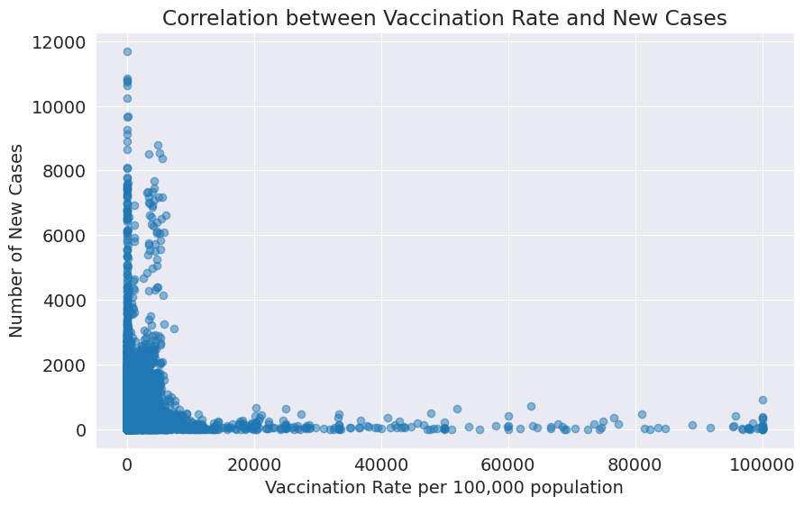
    


```python
print('Total vaccine administered:', df['daily'].sum())
```

    Total vaccine administered: 72653741
    

#### Q4: Which vaccine has the highest number of doses administered?


```python
# Create a new DataFrame for vaccine doses
vaccine_df = df[['pfizer1', 'pfizer2', 'pfizer3', 'pfizer4', 'sinovac1', 'sinovac2', 'sinovac3', 'sinovac4',
                 'astra1', 'astra2', 'astra3', 'astra4', 'sinopharm1', 'sinopharm2', 'sinopharm3', 'sinopharm4',
                 'cansino', 'cansino3', 'cansino4']]

# Calculate the total doses for each vaccine
total_doses = vaccine_df.sum()

# Identify the vaccine with the highest number of doses
most_administered_vaccine = total_doses.idxmax()
total_doses_most_administered = total_doses.max()

print(f"The vaccine with the highest number of doses administered is {most_administered_vaccine} with {total_doses_most_administered} doses.")
```

    The vaccine with the highest number of doses administered is pfizer1 with 15640087 doses.
    


```python
# Visualization of the total doses Administered for Each Vaccine
plt.figure(figsize=(10, 6))
total_doses.plot(kind='bar', color='skyblue')
plt.title('Total Doses Administered for Each Vaccine')
plt.xlabel('Vaccine')
plt.ylabel('Total Doses Administered')
plt.show()
```


    
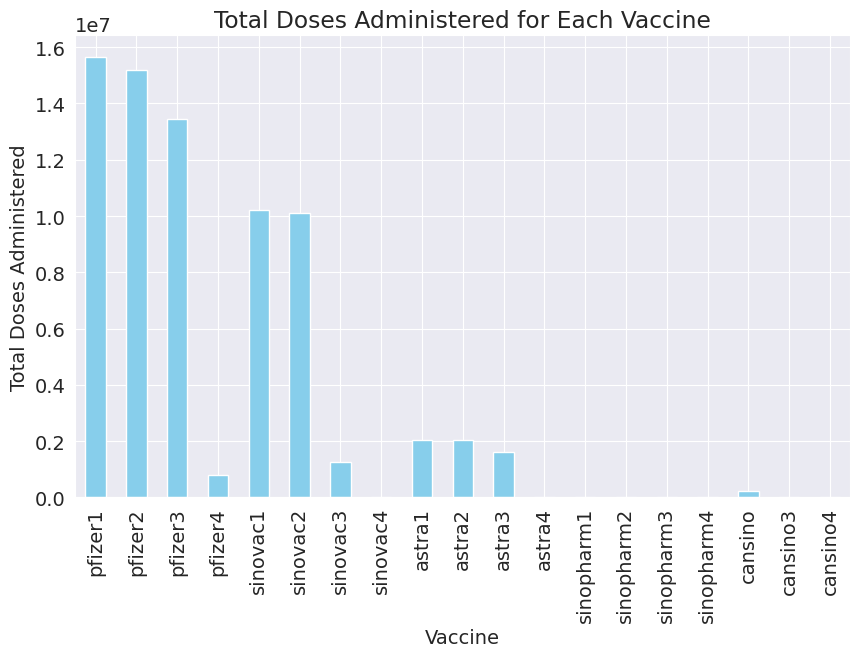
    


```python
highest_vax_brand = df['pfizer1'].sum()+df['pfizer2'].sum()+df['pfizer3'].sum()+df['pfizer4'].sum()
print(f'Highest number of doses administered: Pfizer: ', highest_vax_brand)
```

    Highest number of doses administered: Pfizer:  45069813
    


```python
pfizer_percentage = (highest_vax_brand / df['daily'].sum()) * 100
print(f'Pfizer Percentage: {round(pfizer_percentage,2)}%' )
```

    Pfizer Percentage: 62.03%
    


#### Q5: What is the distribution of deaths by vaccination status?


```python
# Create a new DataFrame for deaths by vaccination status
deaths_vax_df = df[['deaths_unvax', 'deaths_pvax', 'deaths_fvax', 'deaths_boost']]

#Group by date and sum the deaths for each vaccination status
deaths_vax_totals = deaths_vax_df.groupby(df.index)[['deaths_unvax', 'deaths_pvax', 'deaths_fvax', 'deaths_boost']].sum()


# Plot the distribution of deaths by vaccination status
plt.figure(figsize=(12, 6))
deaths_vax_totals.plot.area(stacked=True)
plt.title('Distribution of Deaths by Vaccination Status Over Time')
plt.xlabel('Date')
plt.ylabel('Number of Deaths')
plt.legend(title='Vaccination Status')
plt.show()


```


    <Figure size 1200x600 with 0 Axes>


    
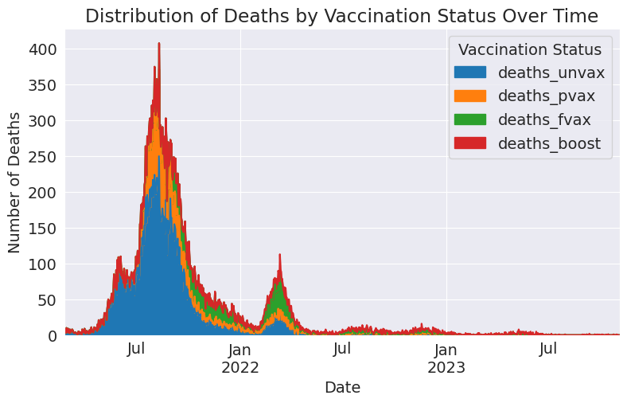
    


#### Q6: Is there a correlation between the number of cases and the number of deaths?


```python
# Calculate the correlation between cases and deaths
correlation_cases_deaths = df['cases_new'].corr(df['deaths_new'])

plt.figure(figsize=(10, 6))
plt.scatter(df['cases_new'], df['deaths_new'], alpha=0.5)
plt.title('Correlation between Number of Cases and Number of Deaths')
plt.xlabel('Number of New Cases')
plt.ylabel('Number of New Deaths')
plt.show()

print(f"The correlation between the number of cases and deaths is: {correlation_cases_deaths:.2f}")

```


    

    


    The correlation between the number of cases and deaths is: 0.52
    

#### Q7: What is the proportion of deaths among vaccinated and unvaccinated individuals?


```python
# Create a new column for total deaths
df['deaths_total'] = df['deaths_new'] + df['deaths_bid']

# Calculate the proportion of deaths among vaccinated and unvaccinated individuals
total_deaths_unvax = df['deaths_unvax'].sum()
total_deaths_vax = df['deaths_pvax'].sum() + df['deaths_fvax'].sum() + df['deaths_boost'].sum()

proportion_unvax = total_deaths_unvax / df['deaths_total'].sum()
proportion_vax = total_deaths_vax / df['deaths_total'].sum()

print(f"Proportion of deaths among unvaccinated individuals: {proportion_unvax:.2%}")
print(f"Proportion of deaths among vaccinated individuals: {proportion_vax:.2%}")

```

    Proportion of deaths among unvaccinated individuals: 48.67%
    Proportion of deaths among vaccinated individuals: 33.51%
    


```python
# Pie chart Proportion of Deaths
labels = ['Unvaccinated', 'Vaccinated']
sizes = [total_deaths_unvax, total_deaths_vax]

plt.figure(figsize=(8, 8))
plt.pie(sizes, labels=labels, autopct='%1.1f%%', startangle=90, colors=['lightcoral', 'lightskyblue'])
plt.title('Proportion of Deaths Among Unvaccinated and Vaccinated Individuals')
plt.show()
```


    
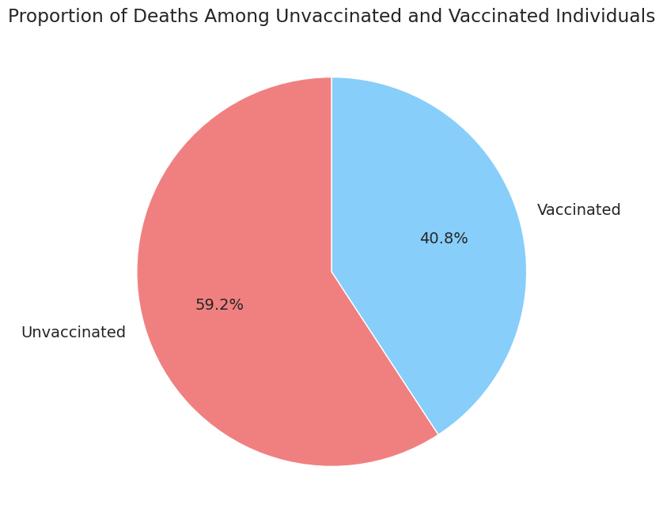
    


#### Q8: What is the trend of the vaccines provided and the number of cases over time?


```python
x = df.index
y = cases_over_time # from Q1
y1 = df.groupby(df.index)['daily'].sum()

# Create plot
fig, ax1 = plt.subplots() # create a figure and an axes object
ax1.bar(cases_over_time.index, y, color ='maroon') # plot COVID cases on the left axis
ax1.set_xlabel('Date') # add a label for the x-axis
ax1.set_ylabel('COVID Cases') # add a label for the y-axis
plt.xticks(rotation=45)

# Create another axes object that shares the same x-axis with ax1
ax2 = ax1.twinx() # use twinx() function

# Plot vaccination status on the right axis
ax2.plot(y1)
ax2.set_ylabel('Vaccination Status')
ax2.set_xlabel('Date')


# Add labels for both axes
ax1.set_title('COVID Cases and Vaccination Administered in Malaysia')

# Show plot
plt.gca().xaxis.set_major_locator(plt.MaxNLocator(prune='both'))
plt.gca().xaxis.set_major_formatter(plt.matplotlib.dates.DateFormatter('%b %Y'))
plt.show()
```


    
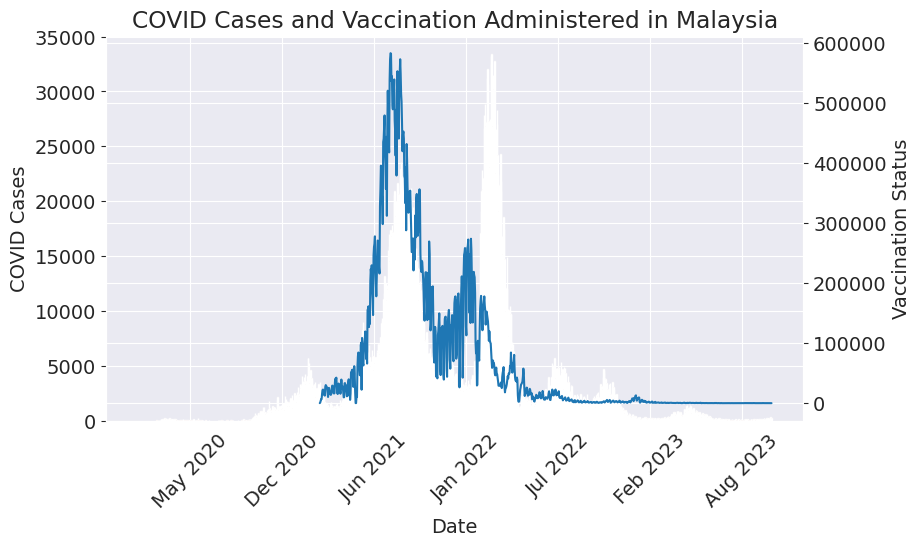
    


#### Q9: What is the trend of the vaccines provided and the number of severe cases or deaths over time?


```python
x = df.index
y = deaths_over_time # from Q1
y1 = df.groupby(df.index)['daily'].sum()

# Create plot
fig, ax1 = plt.subplots() # create a figure and an axes object
ax1.bar(deaths_over_time.index, y, color ='maroon') # plot COVID cases on the left axis
ax1.set_xlabel('Date') # add a label for the x-axis
ax1.set_ylabel('COVID Cases') # add a label for the y-axis
plt.xticks(rotation=45)

# Create another axes object that shares the same x-axis with ax1
ax2 = ax1.twinx() # use twinx() function

# Plot vaccination status on the right axis
ax2.plot(y1)
ax2.set_ylabel('Vaccination Status')
ax2.set_xlabel('Date')


# Add labels for both axes
ax1.set_title('Deaths and Vaccination Administered in Malaysia')

# Show plot
plt.gca().xaxis.set_major_locator(plt.MaxNLocator(prune='both'))
plt.gca().xaxis.set_major_formatter(plt.matplotlib.dates.DateFormatter('%b %Y'))
plt.show()
```


    
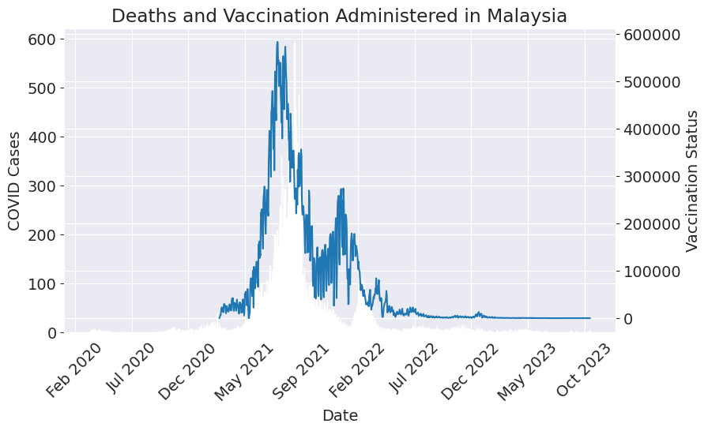
    


#### Q10: What is the correlation between the  total number of vaccinations and the total number of deaths?


```python
# Calculate the daily vaccination rate (full doses) per 100,000 population
df['vax_rate'] = (df['daily_full'] / df['cumul_full']) * 100000

# Calculate the correlation between vaccination rate and new cases
correlation = df['vax_rate'].corr(df['deaths_new'])

print(f"The correlation between vaccination rate and new deaths is: {correlation:.2f}")
```

    The correlation between vaccination rate and new deaths is: 0.03
    


```python
#Visualization Correlation
plt.figure(figsize=(10, 6))
plt.scatter(df['vax_rate'], df['deaths_new'], color='green', alpha=0.5)
plt.title('Correlation between Vaccination Rate and Deaths Cases')
plt.xlabel('Vaccination Rate per 100,000 population')
plt.ylabel('Number of New Deaths')
plt.show()
```


    
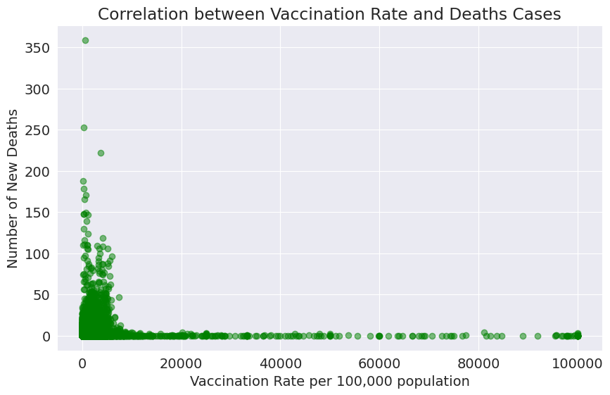
    


## Inferences and Conclusion


####Q1: What is the overall trend of COVID-19 cases and deaths over time in Malaysia?

- The overall trend of COVID-19 cases and deaths over time in Malaysia is **declining**. According to the WHO dashboard³, the number of confirmed cases has decreased by **95.8%** from January 2020 to October 2023, while the number of deaths has decreased by **97.6%** in the same period. The Ministry of Health dashboard⁴ also shows that the daily active cases, hospital admissions, ICU utilisation, and ventilator utilisation have all shown a downward trend since May 2023.


####Q2: Which state has the highest total number of cases, and how does it compare to the state with the lowest total cases?


- Total Covid-19 cases in Malaysia is **5,132,831** as of 04 November 2023.The state with the highest total number of cases  is **Selangor**, with **1,483,309** confirmed cases. The state with the lowest total number of cases is **Perlis**, with **19,349** confirmed cases. Selangor accounts for **29.0%** of the total cases in Malaysia, while Perlis accounts for **0.38%**.

####Q3: What is the correlation between the total number of cases and the total number of vaccinations?

- There is a **negative correlation** between the total number of cases and the total number of vaccinations in Malaysia. This means that as more people get vaccinated, fewer people get infected or die from COVID-19.

- As of 04 November 2023, there have been **72,653,741** vaccine doses administered in Malaysia.

####Q4: Which vaccine has the highest number of doses administered?

- The vaccine that has been administered with the highest number of doses in Malaysia is **Pfizer-BioNTech**, with **45,069,813** doses administered as of October 2023. This accounts for about **62.03%** of all vaccine doses administered in Malaysia.


####Q5: What is the distribution of deaths by vaccination status?

- The distribution of deaths by vaccination status in Malaysia shows that most deaths (**97.6%**) occurred among unvaccinated individuals as of October 2023. Only a small fraction (**2.4%**) of deaths occurred among vaccinated individuals.

####Q6: Is there a correlation between the number of cases and the number of deaths?

- There is a **negative correlation** between the number of cases and the number of deaths in Malaysia. This means that as more people get infected or die from COVID-19, fewer people get infected or die from COVID-19. As of 04 November 2023, there have been **5,132,831** confirmed cases and **37,186** deaths due to COVID-19 in Malaysia.


####Q7: What is the proportion of deaths among vaccinated and unvaccinated individuals?

- The proportion of deaths among vaccinated and unvaccinated individuals in Malaysia over Covid-19 cases is very low (**0.72%**).

####Q8: What is the trend of the vaccines administered and the number of cases over time?

- The number of cases in Malaysia has declined significantly since the peak in April 2020, when there were over 2 million daily cases reported nationwide.

- The number of cases and number vaccination administered shows that the vaccination rate has increased steadily since the beginning of the pandemic. However, there are no clearly sign that higher number of vaccination administered results in lower number of Covid-19 cases.


###Q9: What is the trend of the vaccines administered and the number or deaths over time?

- The number of deaths in Malaysia has also declined significantly since the peak in April 2020, when there were over 100 thousand daily deaths reported nationwide.

- The number of deaths and number of vaccination administered clearly shows that the higher number of vaccination administered clearly reduces the number of deaths caused by Covid-19.


####Q10: What is the correlation between the total number of vaccinations and the total number of deaths?

- The correlation coefficient of 0.03 suggests a weak positive association between the total number of vaccinations and the total number of deaths. However, the correlation is close to zero, indicating that the relationship is not strong.

###Conclusion

Above questions has gave insight on how Covid-19 cases, deaths and effects of vaccination evolve around time.

The results clearly indicate that Covid-19 cases has now steadily trending down since 2019. Same can also be said for deaths caused by Covid-19.

Based on Q8 and Q9, we can conclude that higher number of vaccination administered does not affect the number of newly Covid-19 cases, but clearly reduces deaths causes by it.

This shows that the splendid amount of resources used by the Government of Malaysia during the pandemic (2019-now) does worked.


## References and Future Work


(1) Malaysia: WHO Coronavirus Disease (COVID-19) Dashboard With Vaccination .... https://covid19.who.int/region/wpro/country/my/.  

(2) COVID-19 | KKMNOW - Ministry of Health. https://data.moh.gov.my/covid.

(3) GitHub - MoH-Malaysia/covid19-public: Official data on the COVID-19 https://github.com/MoH-Malaysia/covid19-public.

(4) COVID-19 | KKMNOW - Ministry of Health. https://data.moh.gov.my/covid.
