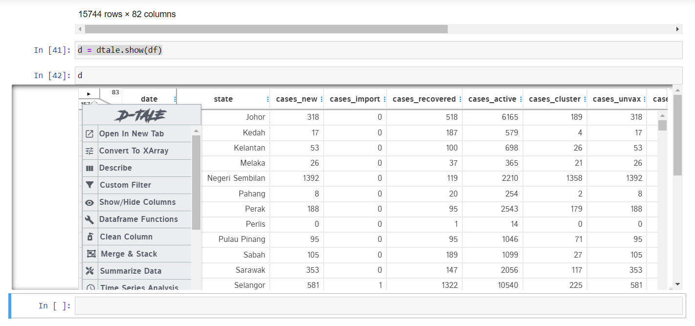
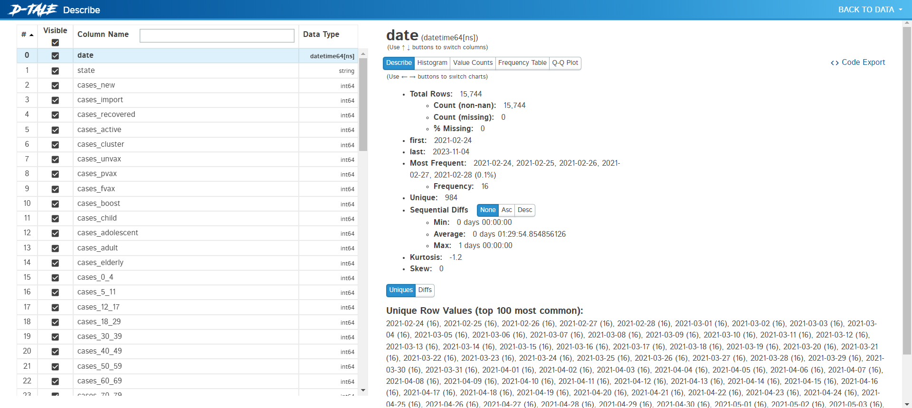
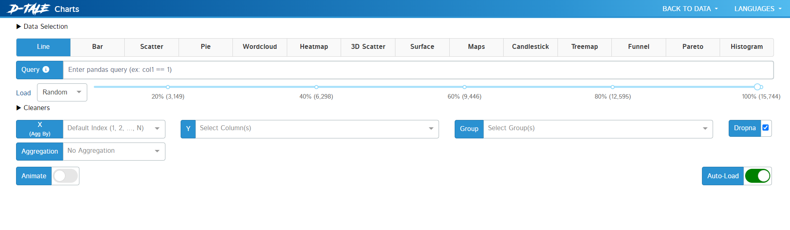
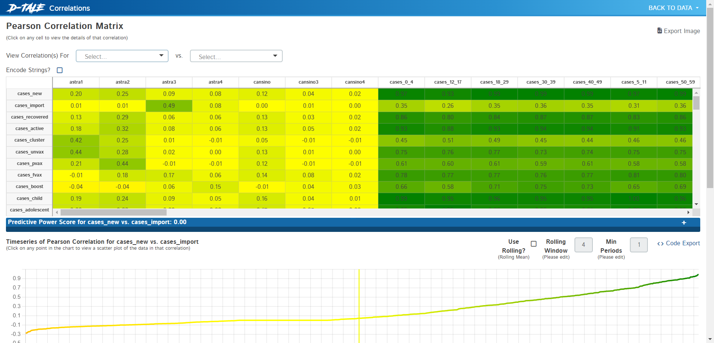
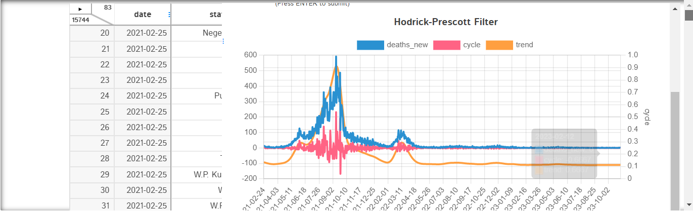

# Assignment 2 - Case Study 2b - D-Tale
<a href="https://lux-api.readthedocs.io/en/latest/#"
target="_parent"></a>

TODO - Write some introduction about your project here: describe the dataset, where you got it from, what you're trying to do with it, and which tools & techniques you're using. Please provide your group member name and their matrix number.

|    Name           |           Matric Number       |                      
|-------------------|-------------------------------|
|Muhammad Fikri Bin Sharunazim    | A21EC0075       |
|Muhammad Farhan Bin Ibrahim|        A21EC0072      |
|Muhammad Adam Fahmi Bin Mohd Taufiq |A21EC0061|
|Mikhail Bin Yassin |A21EC0053                      |

---
# Overview
## Malaysian COVID-19 Dataset

The **Malaysian COVID-19 dataset** provides comprehensive information related to the COVID-19 pandemic in Malaysia. It covers various aspects, including daily recorded cases, clusters, testing data, healthcare facility utilization, deaths, and vaccination statistics. Specifically, the dataset includes the following key components:

1. **Cases**: Daily recorded COVID-19 cases at both the country and state levels.
2. **Clusters**: Exhaustive list of announced clusters with relevant epidemiological data points.
3. **Tests**: Daily tests (note: not necessarily unique individuals) categorized by type at both country and state levels.
4. **Healthcare**: Information on patient flow to and from COVID-19 Quarantine and Treatment Centers (PKRC), hospitals, and ICU bed capacity and utilization.
5. **Deaths**: Daily deaths due to COVID-19 at both country and state levels.
6. **Vaccinations**: Daily and cumulative vaccination data, including dose type, brand, and coverage at country, state, district, and demographic levels.

## Data Source

The dataset is sourced from the **Ministry of Health Malaysia (MoH-Malaysia)**. It is maintained and updated by various entities, including CPRC, CPRC Hospital System, MKAK, and MySejahtera.

## Purpose and Goals

The primary objective of analyzing this dataset is to gain insights into the COVID-19 situation in Malaysia. Researchers, policymakers, and the public can use this data to monitor trends, assess the impact of interventions, and make informed decisions. Specific goals may include identifying patterns, predicting case trajectories, assessing vaccination coverage, and understanding healthcare resource utilization.

## Tools and Techniques

To explore the dataset, you can use the following tools and techniques:

- **Python Libraries**: Pandas, NumPy, and Matplotlib/Seaborn for data manipulation, exploration, and visualization.
- **Jupyter Notebooks**: To document analyses, visualize data, and share insights.
- **Statistical Methods**: Descriptive statistics, time series analysis, and regression modeling.
- **Geospatial Analysis**: If geographical data (such as state or district-level) is involved.

Additionally, machine learning techniques can be applied for predictive modeling or clustering if needed.

For more details, you can explore the official COVID-19 dataset repository maintained by MoH-Malaysia.

---

## Downloading the Dataset

**TODO** - add some explanation here
   

### Links of Dataset  
Cases by State: https://raw.githubusercontent.com/MoH-Malaysia/covid19-public/main/epidemic/cases_state.csv  
Death by State: https://raw.githubusercontent.com/MoH-Malaysia/covid19-public/main/epidemic/deaths_state.csv  
Vaccination by State: https://raw.githubusercontent.com/MoH-Malaysia/covid19-public/main/vaccination/vax_state.csv

> Instructions (delete this cell):
>
> - Load the dataset into a data frame using Pandas
> - Explore the number of rows & columns, ranges of values etc.
> - Handle missing, incorrect and invalid data
> - Perform any additional steps (parsing dates, creating additional columns, merging multiple dataset etc.) **bold text**

You can install the Python Package through PyPI


```python
!pip install dtale
```

    Requirement already satisfied: dtale in c:\users\user\anaconda3\lib\site-packages (3.7.0)
    Requirement already satisfied: dash-colorscales in c:\users\user\anaconda3\lib\site-packages (from dtale) (0.0.4)
    Requirement already satisfied: dash-daq in c:\users\user\anaconda3\lib\site-packages (from dtale) (0.5.0)
    Requirement already satisfied: Flask-Compress in c:\users\user\anaconda3\lib\site-packages (from dtale) (1.14)
    Requirement already satisfied: future>=0.14.0 in c:\users\user\anaconda3\lib\site-packages (from dtale) (0.18.3)
    Requirement already satisfied: kaleido in c:\users\user\anaconda3\lib\site-packages (from dtale) (0.2.1)
    Requirement already satisfied: missingno in c:\users\user\anaconda3\lib\site-packages (from dtale) (0.5.2)
    Requirement already satisfied: pandas in c:\users\user\anaconda3\lib\site-packages (from dtale) (1.5.3)
    Requirement already satisfied: squarify in c:\users\user\anaconda3\lib\site-packages (from dtale) (0.4.3)
    Requirement already satisfied: strsimpy in c:\users\user\anaconda3\lib\site-packages (from dtale) (0.2.1)
    Requirement already satisfied: six in c:\users\user\anaconda3\lib\site-packages (from dtale) (1.16.0)
    Requirement already satisfied: xlrd in c:\users\user\anaconda3\lib\site-packages (from dtale) (2.0.1)
    Requirement already satisfied: beautifulsoup4 in c:\users\user\anaconda3\lib\site-packages (from dtale) (4.12.2)
    Requirement already satisfied: certifi in c:\users\user\anaconda3\lib\site-packages (from dtale) (2023.7.22)
    Requirement already satisfied: flask-ngrok in c:\users\user\anaconda3\lib\site-packages (from dtale) (0.0.25)
    Requirement already satisfied: lz4 in c:\users\user\anaconda3\lib\site-packages (from dtale) (4.3.2)
    Requirement already satisfied: cycler in c:\users\user\anaconda3\lib\site-packages (from dtale) (0.11.0)
    Requirement already satisfied: dash-bootstrap-components<=1.3.1 in c:\users\user\anaconda3\lib\site-packages (from dtale) (1.3.1)
    Requirement already satisfied: networkx in c:\users\user\anaconda3\lib\site-packages (from dtale) (3.1)
    Requirement already satisfied: scikit-learn in c:\users\user\anaconda3\lib\site-packages (from dtale) (1.3.0)
    Requirement already satisfied: seaborn in c:\users\user\anaconda3\lib\site-packages (from dtale) (0.12.2)
    Requirement already satisfied: statsmodels in c:\users\user\anaconda3\lib\site-packages (from dtale) (0.14.0)
    Requirement already satisfied: numpy in c:\users\user\anaconda3\lib\site-packages (from dtale) (1.24.3)
    Requirement already satisfied: openpyxl!=3.2.0b1 in c:\users\user\anaconda3\lib\site-packages (from dtale) (3.0.10)
    Requirement already satisfied: xarray in c:\users\user\anaconda3\lib\site-packages (from dtale) (2023.6.0)
    Requirement already satisfied: dash in c:\users\user\anaconda3\lib\site-packages (from dtale) (2.14.1)
    Requirement already satisfied: et-xmlfile in c:\users\user\anaconda3\lib\site-packages (from dtale) (1.1.0)
    Requirement already satisfied: plotly in c:\users\user\anaconda3\lib\site-packages (from dtale) (5.9.0)
    Requirement already satisfied: Flask<2.3 in c:\users\user\anaconda3\lib\site-packages (from dtale) (2.2.2)
    Requirement already satisfied: itsdangerous in c:\users\user\anaconda3\lib\site-packages (from dtale) (2.0.1)
    Requirement already satisfied: requests in c:\users\user\anaconda3\lib\site-packages (from dtale) (2.31.0)
    Requirement already satisfied: werkzeug<2.3 in c:\users\user\anaconda3\lib\site-packages (from dtale) (2.2.3)
    Requirement already satisfied: matplotlib in c:\users\user\anaconda3\lib\site-packages (from dtale) (3.7.2)
    Requirement already satisfied: scipy in c:\users\user\anaconda3\lib\site-packages (from dtale) (1.11.1)
    Requirement already satisfied: dash-html-components==2.0.0 in c:\users\user\anaconda3\lib\site-packages (from dash->dtale) (2.0.0)
    Requirement already satisfied: dash-core-components==2.0.0 in c:\users\user\anaconda3\lib\site-packages (from dash->dtale) (2.0.0)
    Requirement already satisfied: dash-table==5.0.0 in c:\users\user\anaconda3\lib\site-packages (from dash->dtale) (5.0.0)
    Requirement already satisfied: typing-extensions>=4.1.1 in c:\users\user\anaconda3\lib\site-packages (from dash->dtale) (4.7.1)
    Requirement already satisfied: retrying in c:\users\user\anaconda3\lib\site-packages (from dash->dtale) (1.3.4)
    Requirement already satisfied: ansi2html in c:\users\user\anaconda3\lib\site-packages (from dash->dtale) (1.8.0)
    Requirement already satisfied: nest-asyncio in c:\users\user\anaconda3\lib\site-packages (from dash->dtale) (1.5.6)
    Requirement already satisfied: setuptools in c:\users\user\anaconda3\lib\site-packages (from dash->dtale) (68.0.0)
    Requirement already satisfied: importlib-metadata in c:\users\user\anaconda3\lib\site-packages (from dash->dtale) (6.0.0)
    Requirement already satisfied: Jinja2>=3.0 in c:\users\user\anaconda3\lib\site-packages (from Flask<2.3->dtale) (3.1.2)
    Requirement already satisfied: click>=8.0 in c:\users\user\anaconda3\lib\site-packages (from Flask<2.3->dtale) (8.0.4)
    Requirement already satisfied: tenacity>=6.2.0 in c:\users\user\anaconda3\lib\site-packages (from plotly->dtale) (8.2.2)
    Requirement already satisfied: MarkupSafe>=2.1.1 in c:\users\user\anaconda3\lib\site-packages (from werkzeug<2.3->dtale) (2.1.1)
    Requirement already satisfied: soupsieve>1.2 in c:\users\user\anaconda3\lib\site-packages (from beautifulsoup4->dtale) (2.4)
    Requirement already satisfied: brotli in c:\users\user\anaconda3\lib\site-packages (from Flask-Compress->dtale) (1.1.0)
    Requirement already satisfied: contourpy>=1.0.1 in c:\users\user\anaconda3\lib\site-packages (from matplotlib->dtale) (1.0.5)
    Requirement already satisfied: fonttools>=4.22.0 in c:\users\user\anaconda3\lib\site-packages (from matplotlib->dtale) (4.25.0)
    Requirement already satisfied: kiwisolver>=1.0.1 in c:\users\user\anaconda3\lib\site-packages (from matplotlib->dtale) (1.4.4)
    Requirement already satisfied: packaging>=20.0 in c:\users\user\anaconda3\lib\site-packages (from matplotlib->dtale) (23.1)
    Requirement already satisfied: pillow>=6.2.0 in c:\users\user\anaconda3\lib\site-packages (from matplotlib->dtale) (9.4.0)
    Requirement already satisfied: pyparsing<3.1,>=2.3.1 in c:\users\user\anaconda3\lib\site-packages (from matplotlib->dtale) (3.0.9)
    Requirement already satisfied: python-dateutil>=2.7 in c:\users\user\anaconda3\lib\site-packages (from matplotlib->dtale) (2.8.2)
    Requirement already satisfied: pytz>=2020.1 in c:\users\user\anaconda3\lib\site-packages (from pandas->dtale) (2023.3.post1)
    Requirement already satisfied: charset-normalizer<4,>=2 in c:\users\user\anaconda3\lib\site-packages (from requests->dtale) (2.0.4)
    Requirement already satisfied: idna<4,>=2.5 in c:\users\user\anaconda3\lib\site-packages (from requests->dtale) (3.4)
    Requirement already satisfied: urllib3<3,>=1.21.1 in c:\users\user\anaconda3\lib\site-packages (from requests->dtale) (1.26.16)
    Requirement already satisfied: joblib>=1.1.1 in c:\users\user\anaconda3\lib\site-packages (from scikit-learn->dtale) (1.1.1)
    Requirement already satisfied: threadpoolctl>=2.0.0 in c:\users\user\anaconda3\lib\site-packages (from scikit-learn->dtale) (2.2.0)
    Requirement already satisfied: patsy>=0.5.2 in c:\users\user\anaconda3\lib\site-packages (from statsmodels->dtale) (0.5.3)
    Requirement already satisfied: colorama in c:\users\user\anaconda3\lib\site-packages (from click>=8.0->Flask<2.3->dtale) (0.4.6)
    Requirement already satisfied: zipp>=0.5 in c:\users\user\anaconda3\lib\site-packages (from importlib-metadata->dash->dtale) (3.11.0)
    


```python
import dtale
import pandas as pd
```


```python
cases = pd.read_csv(' https://raw.githubusercontent.com/MoH-Malaysia/covid19-public/main/epidemic/cases_state.csv') #Cases
death = pd.read_csv('https://raw.githubusercontent.com/MoH-Malaysia/covid19-public/main/epidemic/deaths_state.csv') #Death
vax = pd.read_csv('https://raw.githubusercontent.com/MoH-Malaysia/covid19-public/main/vaccination/vax_state.csv')   #Vaccination
```


```python
cases
```


<div>
<style scoped>
    .dataframe tbody tr th:only-of-type {
        vertical-align: middle;
    }

    .dataframe tbody tr th {
        vertical-align: top;
    }

    .dataframe thead th {
        text-align: right;
    }
</style>
<table border="1" class="dataframe">
  <thead>
    <tr style="text-align: right;">
      <th></th>
      <th>date</th>
      <th>state</th>
      <th>cases_new</th>
      <th>cases_import</th>
      <th>cases_recovered</th>
      <th>cases_active</th>
      <th>cases_cluster</th>
      <th>cases_unvax</th>
      <th>cases_pvax</th>
      <th>cases_fvax</th>
      <th>...</th>
      <th>cases_0_4</th>
      <th>cases_5_11</th>
      <th>cases_12_17</th>
      <th>cases_18_29</th>
      <th>cases_30_39</th>
      <th>cases_40_49</th>
      <th>cases_50_59</th>
      <th>cases_60_69</th>
      <th>cases_70_79</th>
      <th>cases_80</th>
    </tr>
  </thead>
  <tbody>
    <tr>
      <th>0</th>
      <td>2020-01-25</td>
      <td>Johor</td>
      <td>4</td>
      <td>4</td>
      <td>0</td>
      <td>4</td>
      <td>0</td>
      <td>4</td>
      <td>0</td>
      <td>0</td>
      <td>...</td>
      <td>0</td>
      <td>0</td>
      <td>0</td>
      <td>0</td>
      <td>0</td>
      <td>1</td>
      <td>0</td>
      <td>0</td>
      <td>0</td>
      <td>0</td>
    </tr>
    <tr>
      <th>1</th>
      <td>2020-01-25</td>
      <td>Kedah</td>
      <td>0</td>
      <td>0</td>
      <td>0</td>
      <td>0</td>
      <td>0</td>
      <td>0</td>
      <td>0</td>
      <td>0</td>
      <td>...</td>
      <td>0</td>
      <td>0</td>
      <td>0</td>
      <td>0</td>
      <td>0</td>
      <td>0</td>
      <td>0</td>
      <td>0</td>
      <td>0</td>
      <td>0</td>
    </tr>
    <tr>
      <th>2</th>
      <td>2020-01-25</td>
      <td>Kelantan</td>
      <td>0</td>
      <td>0</td>
      <td>0</td>
      <td>0</td>
      <td>0</td>
      <td>0</td>
      <td>0</td>
      <td>0</td>
      <td>...</td>
      <td>0</td>
      <td>0</td>
      <td>0</td>
      <td>0</td>
      <td>0</td>
      <td>0</td>
      <td>0</td>
      <td>0</td>
      <td>0</td>
      <td>0</td>
    </tr>
    <tr>
      <th>3</th>
      <td>2020-01-25</td>
      <td>Melaka</td>
      <td>0</td>
      <td>0</td>
      <td>0</td>
      <td>0</td>
      <td>0</td>
      <td>0</td>
      <td>0</td>
      <td>0</td>
      <td>...</td>
      <td>0</td>
      <td>0</td>
      <td>0</td>
      <td>0</td>
      <td>0</td>
      <td>0</td>
      <td>0</td>
      <td>0</td>
      <td>0</td>
      <td>0</td>
    </tr>
    <tr>
      <th>4</th>
      <td>2020-01-25</td>
      <td>Negeri Sembilan</td>
      <td>0</td>
      <td>0</td>
      <td>0</td>
      <td>0</td>
      <td>0</td>
      <td>0</td>
      <td>0</td>
      <td>0</td>
      <td>...</td>
      <td>0</td>
      <td>0</td>
      <td>0</td>
      <td>0</td>
      <td>0</td>
      <td>0</td>
      <td>0</td>
      <td>0</td>
      <td>0</td>
      <td>0</td>
    </tr>
    <tr>
      <th>...</th>
      <td>...</td>
      <td>...</td>
      <td>...</td>
      <td>...</td>
      <td>...</td>
      <td>...</td>
      <td>...</td>
      <td>...</td>
      <td>...</td>
      <td>...</td>
      <td>...</td>
      <td>...</td>
      <td>...</td>
      <td>...</td>
      <td>...</td>
      <td>...</td>
      <td>...</td>
      <td>...</td>
      <td>...</td>
      <td>...</td>
      <td>...</td>
    </tr>
    <tr>
      <th>22171</th>
      <td>2023-11-10</td>
      <td>Selangor</td>
      <td>118</td>
      <td>0</td>
      <td>92</td>
      <td>823</td>
      <td>0</td>
      <td>14</td>
      <td>0</td>
      <td>23</td>
      <td>...</td>
      <td>1</td>
      <td>3</td>
      <td>4</td>
      <td>33</td>
      <td>30</td>
      <td>22</td>
      <td>11</td>
      <td>3</td>
      <td>3</td>
      <td>8</td>
    </tr>
    <tr>
      <th>22172</th>
      <td>2023-11-10</td>
      <td>Terengganu</td>
      <td>0</td>
      <td>0</td>
      <td>3</td>
      <td>332</td>
      <td>0</td>
      <td>0</td>
      <td>0</td>
      <td>0</td>
      <td>...</td>
      <td>0</td>
      <td>0</td>
      <td>0</td>
      <td>0</td>
      <td>0</td>
      <td>0</td>
      <td>0</td>
      <td>0</td>
      <td>0</td>
      <td>0</td>
    </tr>
    <tr>
      <th>22173</th>
      <td>2023-11-10</td>
      <td>W.P. Kuala Lumpur</td>
      <td>59</td>
      <td>0</td>
      <td>53</td>
      <td>1035</td>
      <td>0</td>
      <td>7</td>
      <td>0</td>
      <td>7</td>
      <td>...</td>
      <td>1</td>
      <td>0</td>
      <td>2</td>
      <td>12</td>
      <td>25</td>
      <td>9</td>
      <td>4</td>
      <td>2</td>
      <td>0</td>
      <td>4</td>
    </tr>
    <tr>
      <th>22174</th>
      <td>2023-11-10</td>
      <td>W.P. Labuan</td>
      <td>1</td>
      <td>0</td>
      <td>1</td>
      <td>33</td>
      <td>0</td>
      <td>1</td>
      <td>0</td>
      <td>0</td>
      <td>...</td>
      <td>0</td>
      <td>0</td>
      <td>0</td>
      <td>0</td>
      <td>0</td>
      <td>0</td>
      <td>0</td>
      <td>0</td>
      <td>1</td>
      <td>0</td>
    </tr>
    <tr>
      <th>22175</th>
      <td>2023-11-10</td>
      <td>W.P. Putrajaya</td>
      <td>1</td>
      <td>0</td>
      <td>5</td>
      <td>286</td>
      <td>0</td>
      <td>0</td>
      <td>0</td>
      <td>0</td>
      <td>...</td>
      <td>0</td>
      <td>0</td>
      <td>0</td>
      <td>1</td>
      <td>0</td>
      <td>0</td>
      <td>0</td>
      <td>0</td>
      <td>0</td>
      <td>0</td>
    </tr>
  </tbody>
</table>
<p>22176 rows × 25 columns</p>
</div>


```python
death
```


<div>
<style scoped>
    .dataframe tbody tr th:only-of-type {
        vertical-align: middle;
    }

    .dataframe tbody tr th {
        vertical-align: top;
    }

    .dataframe thead th {
        text-align: right;
    }
</style>
<table border="1" class="dataframe">
  <thead>
    <tr style="text-align: right;">
      <th></th>
      <th>date</th>
      <th>state</th>
      <th>deaths_new</th>
      <th>deaths_bid</th>
      <th>deaths_new_dod</th>
      <th>deaths_bid_dod</th>
      <th>deaths_unvax</th>
      <th>deaths_pvax</th>
      <th>deaths_fvax</th>
      <th>deaths_boost</th>
      <th>deaths_tat</th>
    </tr>
  </thead>
  <tbody>
    <tr>
      <th>0</th>
      <td>2020-03-17</td>
      <td>Johor</td>
      <td>1</td>
      <td>0</td>
      <td>1</td>
      <td>0</td>
      <td>1</td>
      <td>0</td>
      <td>0</td>
      <td>0</td>
      <td>0</td>
    </tr>
    <tr>
      <th>1</th>
      <td>2020-03-17</td>
      <td>Kedah</td>
      <td>0</td>
      <td>0</td>
      <td>0</td>
      <td>0</td>
      <td>0</td>
      <td>0</td>
      <td>0</td>
      <td>0</td>
      <td>0</td>
    </tr>
    <tr>
      <th>2</th>
      <td>2020-03-17</td>
      <td>Kelantan</td>
      <td>0</td>
      <td>0</td>
      <td>0</td>
      <td>0</td>
      <td>0</td>
      <td>0</td>
      <td>0</td>
      <td>0</td>
      <td>0</td>
    </tr>
    <tr>
      <th>3</th>
      <td>2020-03-17</td>
      <td>Melaka</td>
      <td>0</td>
      <td>0</td>
      <td>0</td>
      <td>0</td>
      <td>0</td>
      <td>0</td>
      <td>0</td>
      <td>0</td>
      <td>0</td>
    </tr>
    <tr>
      <th>4</th>
      <td>2020-03-17</td>
      <td>Negeri Sembilan</td>
      <td>0</td>
      <td>0</td>
      <td>0</td>
      <td>0</td>
      <td>0</td>
      <td>0</td>
      <td>0</td>
      <td>0</td>
      <td>0</td>
    </tr>
    <tr>
      <th>...</th>
      <td>...</td>
      <td>...</td>
      <td>...</td>
      <td>...</td>
      <td>...</td>
      <td>...</td>
      <td>...</td>
      <td>...</td>
      <td>...</td>
      <td>...</td>
      <td>...</td>
    </tr>
    <tr>
      <th>21355</th>
      <td>2023-11-11</td>
      <td>Selangor</td>
      <td>0</td>
      <td>0</td>
      <td>0</td>
      <td>0</td>
      <td>0</td>
      <td>0</td>
      <td>0</td>
      <td>0</td>
      <td>0</td>
    </tr>
    <tr>
      <th>21356</th>
      <td>2023-11-11</td>
      <td>Terengganu</td>
      <td>0</td>
      <td>0</td>
      <td>0</td>
      <td>0</td>
      <td>0</td>
      <td>0</td>
      <td>0</td>
      <td>0</td>
      <td>0</td>
    </tr>
    <tr>
      <th>21357</th>
      <td>2023-11-11</td>
      <td>W.P. Kuala Lumpur</td>
      <td>0</td>
      <td>0</td>
      <td>0</td>
      <td>0</td>
      <td>0</td>
      <td>0</td>
      <td>0</td>
      <td>0</td>
      <td>0</td>
    </tr>
    <tr>
      <th>21358</th>
      <td>2023-11-11</td>
      <td>W.P. Labuan</td>
      <td>0</td>
      <td>0</td>
      <td>0</td>
      <td>0</td>
      <td>0</td>
      <td>0</td>
      <td>0</td>
      <td>0</td>
      <td>0</td>
    </tr>
    <tr>
      <th>21359</th>
      <td>2023-11-11</td>
      <td>W.P. Putrajaya</td>
      <td>0</td>
      <td>0</td>
      <td>0</td>
      <td>0</td>
      <td>0</td>
      <td>0</td>
      <td>0</td>
      <td>0</td>
      <td>0</td>
    </tr>
  </tbody>
</table>
<p>21360 rows × 11 columns</p>
</div>


```python
vax
```


<div>
<style scoped>
    .dataframe tbody tr th:only-of-type {
        vertical-align: middle;
    }

    .dataframe tbody tr th {
        vertical-align: top;
    }

    .dataframe thead th {
        text-align: right;
    }
</style>
<table border="1" class="dataframe">
  <thead>
    <tr style="text-align: right;">
      <th></th>
      <th>date</th>
      <th>state</th>
      <th>daily_partial</th>
      <th>daily_full</th>
      <th>daily_booster</th>
      <th>daily_booster2</th>
      <th>daily</th>
      <th>daily_partial_adol</th>
      <th>daily_full_adol</th>
      <th>daily_booster_adol</th>
      <th>...</th>
      <th>sinopharm2</th>
      <th>sinopharm3</th>
      <th>sinopharm4</th>
      <th>cansino</th>
      <th>cansino3</th>
      <th>cansino4</th>
      <th>pending1</th>
      <th>pending2</th>
      <th>pending3</th>
      <th>pending4</th>
    </tr>
  </thead>
  <tbody>
    <tr>
      <th>0</th>
      <td>2021-02-24</td>
      <td>Johor</td>
      <td>2</td>
      <td>0</td>
      <td>0</td>
      <td>0</td>
      <td>2</td>
      <td>0</td>
      <td>0</td>
      <td>0</td>
      <td>...</td>
      <td>0</td>
      <td>0</td>
      <td>0</td>
      <td>0</td>
      <td>0</td>
      <td>0</td>
      <td>0</td>
      <td>0</td>
      <td>0</td>
      <td>0</td>
    </tr>
    <tr>
      <th>1</th>
      <td>2021-02-24</td>
      <td>Kedah</td>
      <td>0</td>
      <td>0</td>
      <td>0</td>
      <td>0</td>
      <td>0</td>
      <td>0</td>
      <td>0</td>
      <td>0</td>
      <td>...</td>
      <td>0</td>
      <td>0</td>
      <td>0</td>
      <td>0</td>
      <td>0</td>
      <td>0</td>
      <td>0</td>
      <td>0</td>
      <td>0</td>
      <td>0</td>
    </tr>
    <tr>
      <th>2</th>
      <td>2021-02-24</td>
      <td>Kelantan</td>
      <td>1</td>
      <td>0</td>
      <td>0</td>
      <td>0</td>
      <td>1</td>
      <td>0</td>
      <td>0</td>
      <td>0</td>
      <td>...</td>
      <td>0</td>
      <td>0</td>
      <td>0</td>
      <td>0</td>
      <td>0</td>
      <td>0</td>
      <td>0</td>
      <td>0</td>
      <td>0</td>
      <td>0</td>
    </tr>
    <tr>
      <th>3</th>
      <td>2021-02-24</td>
      <td>Melaka</td>
      <td>0</td>
      <td>0</td>
      <td>0</td>
      <td>0</td>
      <td>0</td>
      <td>0</td>
      <td>0</td>
      <td>0</td>
      <td>...</td>
      <td>0</td>
      <td>0</td>
      <td>0</td>
      <td>0</td>
      <td>0</td>
      <td>0</td>
      <td>0</td>
      <td>0</td>
      <td>0</td>
      <td>0</td>
    </tr>
    <tr>
      <th>4</th>
      <td>2021-02-24</td>
      <td>Negeri Sembilan</td>
      <td>0</td>
      <td>0</td>
      <td>0</td>
      <td>0</td>
      <td>0</td>
      <td>0</td>
      <td>0</td>
      <td>0</td>
      <td>...</td>
      <td>0</td>
      <td>0</td>
      <td>0</td>
      <td>0</td>
      <td>0</td>
      <td>0</td>
      <td>0</td>
      <td>0</td>
      <td>0</td>
      <td>0</td>
    </tr>
    <tr>
      <th>...</th>
      <td>...</td>
      <td>...</td>
      <td>...</td>
      <td>...</td>
      <td>...</td>
      <td>...</td>
      <td>...</td>
      <td>...</td>
      <td>...</td>
      <td>...</td>
      <td>...</td>
      <td>...</td>
      <td>...</td>
      <td>...</td>
      <td>...</td>
      <td>...</td>
      <td>...</td>
      <td>...</td>
      <td>...</td>
      <td>...</td>
      <td>...</td>
    </tr>
    <tr>
      <th>15835</th>
      <td>2023-11-10</td>
      <td>Selangor</td>
      <td>0</td>
      <td>0</td>
      <td>2</td>
      <td>0</td>
      <td>2</td>
      <td>0</td>
      <td>0</td>
      <td>0</td>
      <td>...</td>
      <td>0</td>
      <td>0</td>
      <td>0</td>
      <td>0</td>
      <td>0</td>
      <td>0</td>
      <td>0</td>
      <td>0</td>
      <td>0</td>
      <td>0</td>
    </tr>
    <tr>
      <th>15836</th>
      <td>2023-11-10</td>
      <td>Terengganu</td>
      <td>0</td>
      <td>0</td>
      <td>1</td>
      <td>0</td>
      <td>1</td>
      <td>0</td>
      <td>0</td>
      <td>0</td>
      <td>...</td>
      <td>0</td>
      <td>0</td>
      <td>0</td>
      <td>0</td>
      <td>0</td>
      <td>0</td>
      <td>0</td>
      <td>0</td>
      <td>0</td>
      <td>0</td>
    </tr>
    <tr>
      <th>15837</th>
      <td>2023-11-10</td>
      <td>W.P. Kuala Lumpur</td>
      <td>0</td>
      <td>0</td>
      <td>4</td>
      <td>4</td>
      <td>8</td>
      <td>0</td>
      <td>0</td>
      <td>0</td>
      <td>...</td>
      <td>0</td>
      <td>0</td>
      <td>0</td>
      <td>0</td>
      <td>0</td>
      <td>0</td>
      <td>0</td>
      <td>0</td>
      <td>0</td>
      <td>0</td>
    </tr>
    <tr>
      <th>15838</th>
      <td>2023-11-10</td>
      <td>W.P. Labuan</td>
      <td>0</td>
      <td>0</td>
      <td>0</td>
      <td>0</td>
      <td>0</td>
      <td>0</td>
      <td>0</td>
      <td>0</td>
      <td>...</td>
      <td>0</td>
      <td>0</td>
      <td>0</td>
      <td>0</td>
      <td>0</td>
      <td>0</td>
      <td>0</td>
      <td>0</td>
      <td>0</td>
      <td>0</td>
    </tr>
    <tr>
      <th>15839</th>
      <td>2023-11-10</td>
      <td>W.P. Putrajaya</td>
      <td>0</td>
      <td>0</td>
      <td>0</td>
      <td>0</td>
      <td>0</td>
      <td>0</td>
      <td>0</td>
      <td>0</td>
      <td>...</td>
      <td>0</td>
      <td>0</td>
      <td>0</td>
      <td>0</td>
      <td>0</td>
      <td>0</td>
      <td>0</td>
      <td>0</td>
      <td>0</td>
      <td>0</td>
    </tr>
  </tbody>
</table>
<p>15840 rows × 51 columns</p>
</div>


Inner Join

```python
df = cases.merge(death,on=['date','state']).merge(vax,on=['date','state'])
df_row, df_cols = df.shape
```


```python
print(f'Total Columns: {df_cols}')
```

    Total Columns: 83
    


```python
df.set_index('date', inplace=True)
```


```python
df.index = pd.to_datetime(df.index.get_level_values(0))
```


```python
df.info()
```

    <class 'pandas.core.frame.DataFrame'>
    DatetimeIndex: 15840 entries, 2021-02-24 to 2023-11-10
    Data columns (total 82 columns):
     #   Column                Non-Null Count  Dtype 
    ---  ------                --------------  ----- 
     0   state                 15840 non-null  object
     1   cases_new             15840 non-null  int64 
     2   cases_import          15840 non-null  int64 
     3   cases_recovered       15840 non-null  int64 
     4   cases_active          15840 non-null  int64 
     5   cases_cluster         15840 non-null  int64 
     6   cases_unvax           15840 non-null  int64 
     7   cases_pvax            15840 non-null  int64 
     8   cases_fvax            15840 non-null  int64 
     9   cases_boost           15840 non-null  int64 
     10  cases_child           15840 non-null  int64 
     11  cases_adolescent      15840 non-null  int64 
     12  cases_adult           15840 non-null  int64 
     13  cases_elderly         15840 non-null  int64 
     14  cases_0_4             15840 non-null  int64 
     15  cases_5_11            15840 non-null  int64 
     16  cases_12_17           15840 non-null  int64 
     17  cases_18_29           15840 non-null  int64 
     18  cases_30_39           15840 non-null  int64 
     19  cases_40_49           15840 non-null  int64 
     20  cases_50_59           15840 non-null  int64 
     21  cases_60_69           15840 non-null  int64 
     22  cases_70_79           15840 non-null  int64 
     23  cases_80              15840 non-null  int64 
     24  deaths_new            15840 non-null  int64 
     25  deaths_bid            15840 non-null  int64 
     26  deaths_new_dod        15840 non-null  int64 
     27  deaths_bid_dod        15840 non-null  int64 
     28  deaths_unvax          15840 non-null  int64 
     29  deaths_pvax           15840 non-null  int64 
     30  deaths_fvax           15840 non-null  int64 
     31  deaths_boost          15840 non-null  int64 
     32  deaths_tat            15840 non-null  int64 
     33  daily_partial         15840 non-null  int64 
     34  daily_full            15840 non-null  int64 
     35  daily_booster         15840 non-null  int64 
     36  daily_booster2        15840 non-null  int64 
     37  daily                 15840 non-null  int64 
     38  daily_partial_adol    15840 non-null  int64 
     39  daily_full_adol       15840 non-null  int64 
     40  daily_booster_adol    15840 non-null  int64 
     41  daily_booster2_adol   15840 non-null  int64 
     42  daily_partial_child   15840 non-null  int64 
     43  daily_full_child      15840 non-null  int64 
     44  daily_booster_child   15840 non-null  int64 
     45  daily_booster2_child  15840 non-null  int64 
     46  cumul_partial         15840 non-null  int64 
     47  cumul_full            15840 non-null  int64 
     48  cumul_booster         15840 non-null  int64 
     49  cumul_booster2        15840 non-null  int64 
     50  cumul                 15840 non-null  int64 
     51  cumul_partial_adol    15840 non-null  int64 
     52  cumul_full_adol       15840 non-null  int64 
     53  cumul_booster_adol    15840 non-null  int64 
     54  cumul_booster2_adol   15840 non-null  int64 
     55  cumul_partial_child   15840 non-null  int64 
     56  cumul_full_child      15840 non-null  int64 
     57  cumul_booster_child   15840 non-null  int64 
     58  cumul_booster2_child  15840 non-null  int64 
     59  pfizer1               15840 non-null  int64 
     60  pfizer2               15840 non-null  int64 
     61  pfizer3               15840 non-null  int64 
     62  pfizer4               15840 non-null  int64 
     63  sinovac1              15840 non-null  int64 
     64  sinovac2              15840 non-null  int64 
     65  sinovac3              15840 non-null  int64 
     66  sinovac4              15840 non-null  int64 
     67  astra1                15840 non-null  int64 
     68  astra2                15840 non-null  int64 
     69  astra3                15840 non-null  int64 
     70  astra4                15840 non-null  int64 
     71  sinopharm1            15840 non-null  int64 
     72  sinopharm2            15840 non-null  int64 
     73  sinopharm3            15840 non-null  int64 
     74  sinopharm4            15840 non-null  int64 
     75  cansino               15840 non-null  int64 
     76  cansino3              15840 non-null  int64 
     77  cansino4              15840 non-null  int64 
     78  pending1              15840 non-null  int64 
     79  pending2              15840 non-null  int64 
     80  pending3              15840 non-null  int64 
     81  pending4              15840 non-null  int64 
    dtypes: int64(81), object(1)
    memory usage: 10.0+ MB
    


```python
df
```


<div>
<style scoped>
    .dataframe tbody tr th:only-of-type {
        vertical-align: middle;
    }

    .dataframe tbody tr th {
        vertical-align: top;
    }

    .dataframe thead th {
        text-align: right;
    }
</style>
<table border="1" class="dataframe">
  <thead>
    <tr style="text-align: right;">
      <th></th>
      <th>state</th>
      <th>cases_new</th>
      <th>cases_import</th>
      <th>cases_recovered</th>
      <th>cases_active</th>
      <th>cases_cluster</th>
      <th>cases_unvax</th>
      <th>cases_pvax</th>
      <th>cases_fvax</th>
      <th>cases_boost</th>
      <th>...</th>
      <th>sinopharm2</th>
      <th>sinopharm3</th>
      <th>sinopharm4</th>
      <th>cansino</th>
      <th>cansino3</th>
      <th>cansino4</th>
      <th>pending1</th>
      <th>pending2</th>
      <th>pending3</th>
      <th>pending4</th>
    </tr>
    <tr>
      <th>date</th>
      <th></th>
      <th></th>
      <th></th>
      <th></th>
      <th></th>
      <th></th>
      <th></th>
      <th></th>
      <th></th>
      <th></th>
      <th></th>
      <th></th>
      <th></th>
      <th></th>
      <th></th>
      <th></th>
      <th></th>
      <th></th>
      <th></th>
      <th></th>
      <th></th>
    </tr>
  </thead>
  <tbody>
    <tr>
      <th>2021-02-24</th>
      <td>Johor</td>
      <td>318</td>
      <td>0</td>
      <td>518</td>
      <td>6165</td>
      <td>189</td>
      <td>318</td>
      <td>0</td>
      <td>0</td>
      <td>0</td>
      <td>...</td>
      <td>0</td>
      <td>0</td>
      <td>0</td>
      <td>0</td>
      <td>0</td>
      <td>0</td>
      <td>0</td>
      <td>0</td>
      <td>0</td>
      <td>0</td>
    </tr>
    <tr>
      <th>2021-02-24</th>
      <td>Kedah</td>
      <td>17</td>
      <td>0</td>
      <td>187</td>
      <td>579</td>
      <td>4</td>
      <td>17</td>
      <td>0</td>
      <td>0</td>
      <td>0</td>
      <td>...</td>
      <td>0</td>
      <td>0</td>
      <td>0</td>
      <td>0</td>
      <td>0</td>
      <td>0</td>
      <td>0</td>
      <td>0</td>
      <td>0</td>
      <td>0</td>
    </tr>
    <tr>
      <th>2021-02-24</th>
      <td>Kelantan</td>
      <td>53</td>
      <td>0</td>
      <td>100</td>
      <td>698</td>
      <td>26</td>
      <td>53</td>
      <td>0</td>
      <td>0</td>
      <td>0</td>
      <td>...</td>
      <td>0</td>
      <td>0</td>
      <td>0</td>
      <td>0</td>
      <td>0</td>
      <td>0</td>
      <td>0</td>
      <td>0</td>
      <td>0</td>
      <td>0</td>
    </tr>
    <tr>
      <th>2021-02-24</th>
      <td>Melaka</td>
      <td>26</td>
      <td>0</td>
      <td>37</td>
      <td>365</td>
      <td>21</td>
      <td>26</td>
      <td>0</td>
      <td>0</td>
      <td>0</td>
      <td>...</td>
      <td>0</td>
      <td>0</td>
      <td>0</td>
      <td>0</td>
      <td>0</td>
      <td>0</td>
      <td>0</td>
      <td>0</td>
      <td>0</td>
      <td>0</td>
    </tr>
    <tr>
      <th>2021-02-24</th>
      <td>Negeri Sembilan</td>
      <td>1392</td>
      <td>0</td>
      <td>119</td>
      <td>2210</td>
      <td>1358</td>
      <td>1392</td>
      <td>0</td>
      <td>0</td>
      <td>0</td>
      <td>...</td>
      <td>0</td>
      <td>0</td>
      <td>0</td>
      <td>0</td>
      <td>0</td>
      <td>0</td>
      <td>0</td>
      <td>0</td>
      <td>0</td>
      <td>0</td>
    </tr>
    <tr>
      <th>...</th>
      <td>...</td>
      <td>...</td>
      <td>...</td>
      <td>...</td>
      <td>...</td>
      <td>...</td>
      <td>...</td>
      <td>...</td>
      <td>...</td>
      <td>...</td>
      <td>...</td>
      <td>...</td>
      <td>...</td>
      <td>...</td>
      <td>...</td>
      <td>...</td>
      <td>...</td>
      <td>...</td>
      <td>...</td>
      <td>...</td>
      <td>...</td>
    </tr>
    <tr>
      <th>2023-11-10</th>
      <td>Selangor</td>
      <td>118</td>
      <td>0</td>
      <td>92</td>
      <td>823</td>
      <td>0</td>
      <td>14</td>
      <td>0</td>
      <td>23</td>
      <td>81</td>
      <td>...</td>
      <td>0</td>
      <td>0</td>
      <td>0</td>
      <td>0</td>
      <td>0</td>
      <td>0</td>
      <td>0</td>
      <td>0</td>
      <td>0</td>
      <td>0</td>
    </tr>
    <tr>
      <th>2023-11-10</th>
      <td>Terengganu</td>
      <td>0</td>
      <td>0</td>
      <td>3</td>
      <td>332</td>
      <td>0</td>
      <td>0</td>
      <td>0</td>
      <td>0</td>
      <td>0</td>
      <td>...</td>
      <td>0</td>
      <td>0</td>
      <td>0</td>
      <td>0</td>
      <td>0</td>
      <td>0</td>
      <td>0</td>
      <td>0</td>
      <td>0</td>
      <td>0</td>
    </tr>
    <tr>
      <th>2023-11-10</th>
      <td>W.P. Kuala Lumpur</td>
      <td>59</td>
      <td>0</td>
      <td>53</td>
      <td>1035</td>
      <td>0</td>
      <td>7</td>
      <td>0</td>
      <td>7</td>
      <td>45</td>
      <td>...</td>
      <td>0</td>
      <td>0</td>
      <td>0</td>
      <td>0</td>
      <td>0</td>
      <td>0</td>
      <td>0</td>
      <td>0</td>
      <td>0</td>
      <td>0</td>
    </tr>
    <tr>
      <th>2023-11-10</th>
      <td>W.P. Labuan</td>
      <td>1</td>
      <td>0</td>
      <td>1</td>
      <td>33</td>
      <td>0</td>
      <td>1</td>
      <td>0</td>
      <td>0</td>
      <td>0</td>
      <td>...</td>
      <td>0</td>
      <td>0</td>
      <td>0</td>
      <td>0</td>
      <td>0</td>
      <td>0</td>
      <td>0</td>
      <td>0</td>
      <td>0</td>
      <td>0</td>
    </tr>
    <tr>
      <th>2023-11-10</th>
      <td>W.P. Putrajaya</td>
      <td>1</td>
      <td>0</td>
      <td>5</td>
      <td>286</td>
      <td>0</td>
      <td>0</td>
      <td>0</td>
      <td>0</td>
      <td>1</td>
      <td>...</td>
      <td>0</td>
      <td>0</td>
      <td>0</td>
      <td>0</td>
      <td>0</td>
      <td>0</td>
      <td>0</td>
      <td>0</td>
      <td>0</td>
      <td>0</td>
    </tr>
  </tbody>
</table>
<p>15840 rows × 82 columns</p>
</div>


```python
d = dtale.show(df)
```


```python
d
```


<iframe
    width="100%"
    height="475"
    src="http://Admin:40000/dtale/iframe/1"
    frameborder="0"
    allowfullscreen

></iframe>


    




The image above shows the D-Tale menu to perform analysis.

Next, go to "Describe" to see the details for every columns.

Once you click on the "Describe", a new tab will open and shows the details for each column.



Next, to generate statistics and visualization, go to "Charts". 

Then, a new tab will appear and shows the menu of charts creation according to your preference.



For example, we want to see line chart for sum of 'cases_new' over time by month. So, we need to choose date(Monthly) for our x-axis and cases_new for our y-axis and choose sum for our aggregation. Then, the charts will be generated automatically.


Next, to see the correlations between all the columns, we can select "Correlation" in the menu. Once we click on the "Correlations", a new tab that counts the correlations will be generated automatically as shown in the image below.



If we want to see the trend of the 'death_new' over time, we can go to "Time Series Analysis".

Image below shows the generated graph of 'death_new' over time.



| Pros | Cons |
| --- | --- |
| Easy to use and does not require any coding skills. You can simply select the data you want to analyze and choose from different graphs and plots. | May not be compatible with some older versions of pandas or Python. You may need to update your packages or use a virtual environment to run D-tale. |
| Integrates well with ipython notebooks and python/ipython terminals, so you can run D-tale commands from within your code. | May not be able to handle very large or complex data sets efficiently. You may encounter performance issues or memory errors if you try to load too much data into D-tale. |
| Supports various pandas objects, such as DataFrame, Series, MultiIndex, DatetimeIndex, and RangeIndex. | May not offer enough customization options for advanced users. You may not be able to modify the appearance or behavior of the graphs and plots in D-tale. |
| Has a rich set of features, such as filtering, sorting, formatting, exporting, sharing, and more. | May not be able to display some types of data that are not supported by pandas, such as numpy arrays or custom objects. |


## Conclusion

D-Tale is a tool that allows us to create interactive dashboards and reports from our Malaysian COVID-19 dataset. D-Tale helps us to visualize the data in a clear and engaging way, highlighting the key trends, outliers, and correlations. It also enables us to customize the dashboard layout, add filters, and export the data for further analysis. However, D-Tale is not a substitute for other statistical methods, as it does not provide any in-depth explanation or interpretation of the data. Therefore, we should use D-Tale as a complement to our exploratory data analysis (EDA), rather than relying on it alone.

D-Tale is a useful tool for EDA, as it offers simplicity and interactivity, but users should be aware of its limitations and consider using it in conjunction with other analytical techniques for a more comprehensive understanding of our Malaysian COVID-19 dataset.

