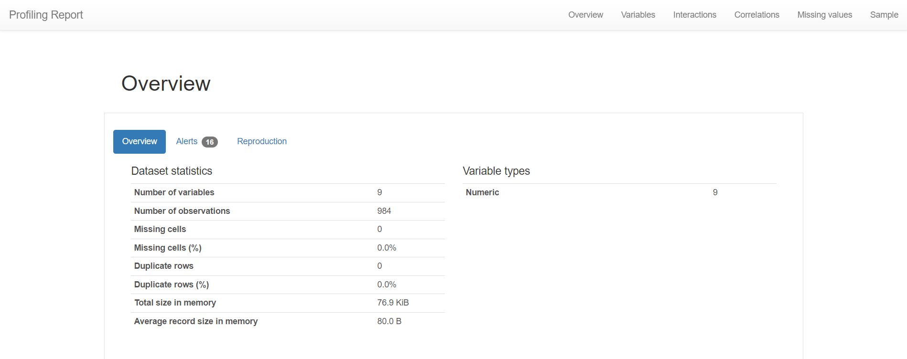
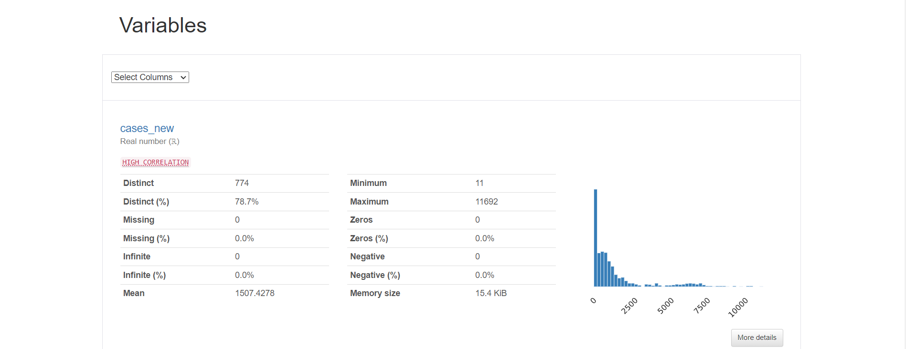
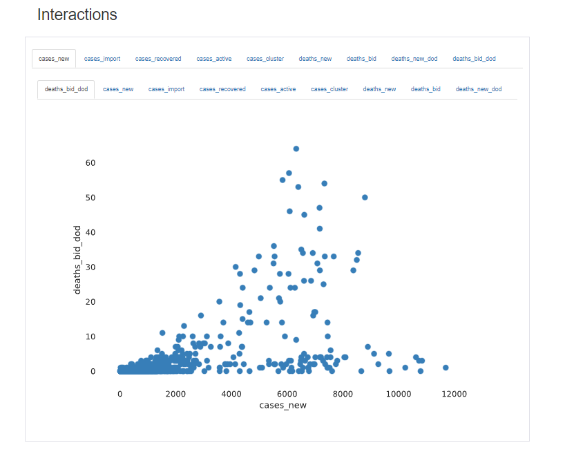
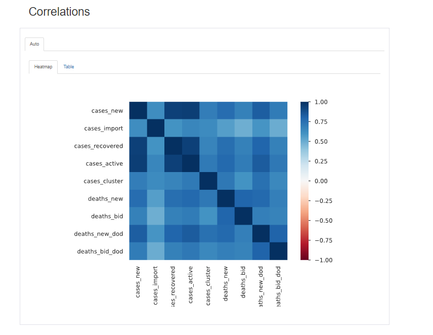
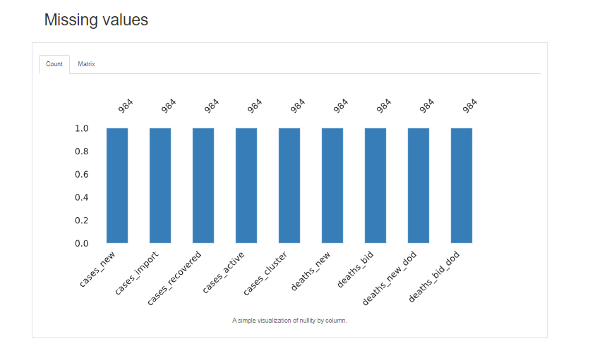
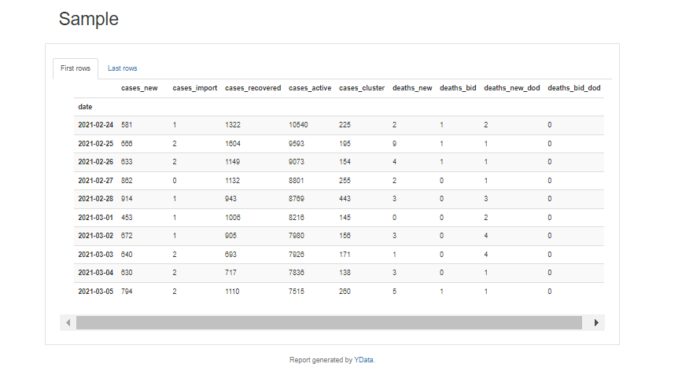

# Case study 2c <a href="https://www.utm.my" target="_parent"></a>

Pandas Profiling is a powerful tool used in data analysis with Python that generates a comprehensive report summarizing the characteristics of a dataset. It's an exploratory analysis tool that automates the process of gaining insights and understanding the structure and content of a DataFrame. Here's a brief explanation of Pandas Profiling:

|    Name           |           Matric Number       |                      
|-------------------|-------------------------------|
|Muhammad Fikri Bin Sharunazim    | A21EC0075       |
|Muhammad Farhan Bin Ibrahim|        A21EC0072      |
|Muhammad Adam Fahmi Bin Mohd Taufiq |A21EC0061|
|Mikhail Bin Yassin |A21EC0053                      |

---
# Overview
## Malaysian COVID-19 Dataset

The **Malaysian COVID-19 dataset** provides comprehensive information related to the COVID-19 pandemic in Malaysia. It covers various aspects, including daily recorded cases, clusters, testing data, healthcare facility utilization, deaths, and vaccination statistics. Specifically, the dataset includes the following key components:

1. **Cases**: Daily recorded COVID-19 cases at both the country and state levels.
2. **Clusters**: Exhaustive list of announced clusters with relevant epidemiological data points.
3. **Tests**: Daily tests (note: not necessarily unique individuals) categorized by type at both country and state levels.
4. **Healthcare**: Information on patient flow to and from COVID-19 Quarantine and Treatment Centers (PKRC), hospitals, and ICU bed capacity and utilization.
5. **Deaths**: Daily deaths due to COVID-19 at both country and state levels.
6. **Vaccinations**: Daily and cumulative vaccination data, including dose type, brand, and coverage at country, state, district, and demographic levels.

## Data Source

The dataset is sourced from the **Ministry of Health Malaysia (MoH-Malaysia)**. It is maintained and updated by various entities, including CPRC, CPRC Hospital System, MKAK, and MySejahtera.

For more details, you can explore the official COVID-19 dataset repository maintained by MoH-Malaysia.

---

### **Step 1: Install EDA Tool**

```
!pip install ydata-profiling
```
### **Step 2: Import libraries**

```
import numpy as np
import pandas as pd

from ydata_profiling import ProfileReport
from google.colab import files
```
### **Step 3: Import dataset into dataframe**
```
cases = pd.read_csv('https://raw.githubusercontent.com/MoH-Malaysia/covid19-public/main/epidemic/cases_state.csv') #Cases
death = pd.read_csv(' https://raw.githubusercontent.com/MoH-Malaysia/covid19-public/main/epidemic/deaths_state.csv') #Death
vax = pd.read_csv(' https://raw.githubusercontent.com/MoH-Malaysia/covid19-public/main/vaccination/vax_state.csv')   #Vaccination

df = cases.merge(death,on=['date','state']).merge(vax,on=['date','state'])
df_row, df_cols = df.shape
df['date'] = pd.to_datetime(df['date'])
df = df.set_index('date')
df.columns
```
### **Step 4: Choose necessary columns only**
##### For this case study, I specifically focusing on the state of "Selangor," with the "date" column serving as the index. I chose essential columns to address memory limitations, as the dataset's size was too large to execute efficiently within the available memory.

```
df_subset = df[df['state'] == 'Selangor'][['cases_new', 'cases_import', 'cases_recovered',
       'cases_active', 'cases_cluster','deaths_new','deaths_bid', 'deaths_new_dod',
       'deaths_bid_dod']]
df_subset.head()
```
### Step 5: **Creating a profiling report**
```
profile = ProfileReport(df_subset, title="Profiling Report", html={'style':{'full_width':True}})
```
### **Step 6: Display the Profile Report**
```
profile
```

### Output
The output from this case study, you can download the CaseStudy2c_ProfilingReport.html file above.
#### Profiling Report
Overview
<div align="center">
  
</div>

Variables
<div align="center">
  
</div>

Interactions
<div align="center">
  
</div>

Correlations
<div align="center">
  
</div>

Missing Values
<div align="center">
  
</div>

Sample
<div align="center">
  
</div>

### **Pros And Cons Of Pandas Profiling**
### **Pros**

**Quick Data Overview**: Pandas Profiling provides a quick and convenient way to get an overview of your dataset, including summary statistics, missing values, and distribution of data.

**Visualizations**: The profiling report includes visualizations such as histograms, scatter plots, and correlation matrices, which can be helpful for data exploration.

**Missing Values Analysis**: It automatically analyzes missing values and provides insights on the percentage and distribution of missing values in the dataset.

### **Cons**
**Limited for Big Data**: For very large datasets or big data, the library may not be the most efficient, and alternative approaches or tools may be needed.

**Limited Customization**: While it provides some customization options, users might find it limiting if they need highly customized reports or specific analyses.

**Static Analysis**: The profiling report is a one-time static analysis. It doesn't update dynamically as data changes, which might be a limitation for streaming or frequently updated datasets.

### Conclusion

*   As the number of active cases increases, so does the number of new cases. This suggests that the disease is spreading rapidly and that measures should be taken to control its spread.
*   There appears to be a positive correlation between the number of new cases and the number of deaths. As the number of new cases increases, so does the number of deaths.
*    As the number of active cases increases, the number of recovered cases also increases.


Various factors, such as vaccination status, demographic categories (including age groups such as adults, adolescents, and children), and the specific type of vaccination administered, may all play a role in contributing to the dataset.

The data profiling conducted using Pandas Profiling offers a swift and comprehensive overview of the dataset, presenting summary statistics, identifying missing values, and visualizing data distributions through histograms and correlation matrices. This facilitates efficient data exploration. The tool's automatic analysis of missing values provides valuable insights into their percentage and distribution, aiding decision-making on how to handle them. However, limitations include its potential inefficiency for very large datasets, necessitating alternative tools for optimal processing.

### References
https://github.com/ydataai/ydata-profiling

https://github.com/ydataai/ydata-profiling/blob/master/examples/usaairquality/usaairquality.ipynb
