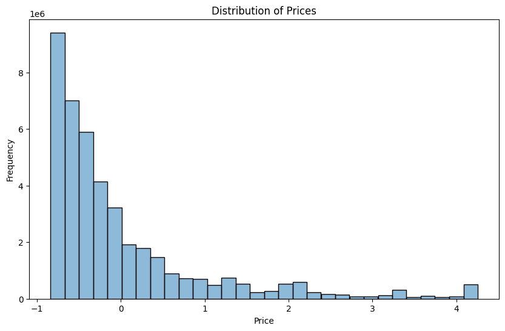
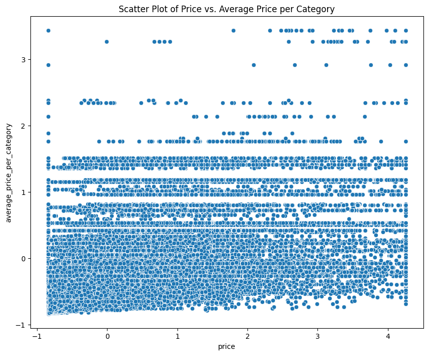
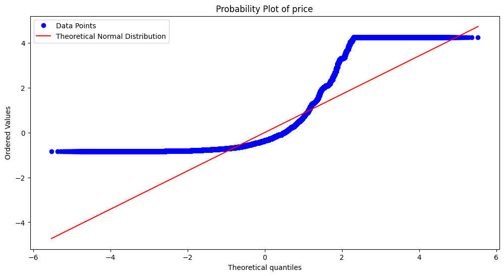
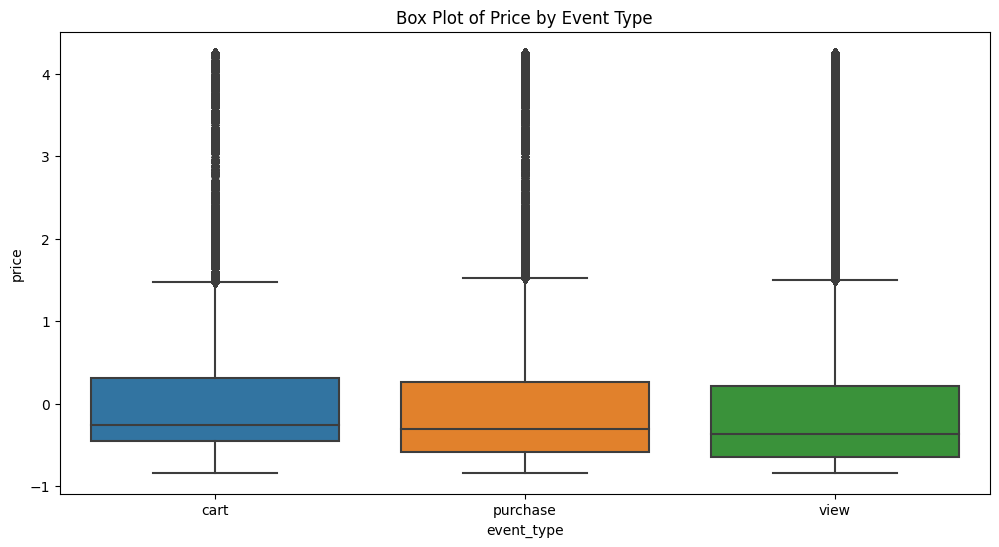
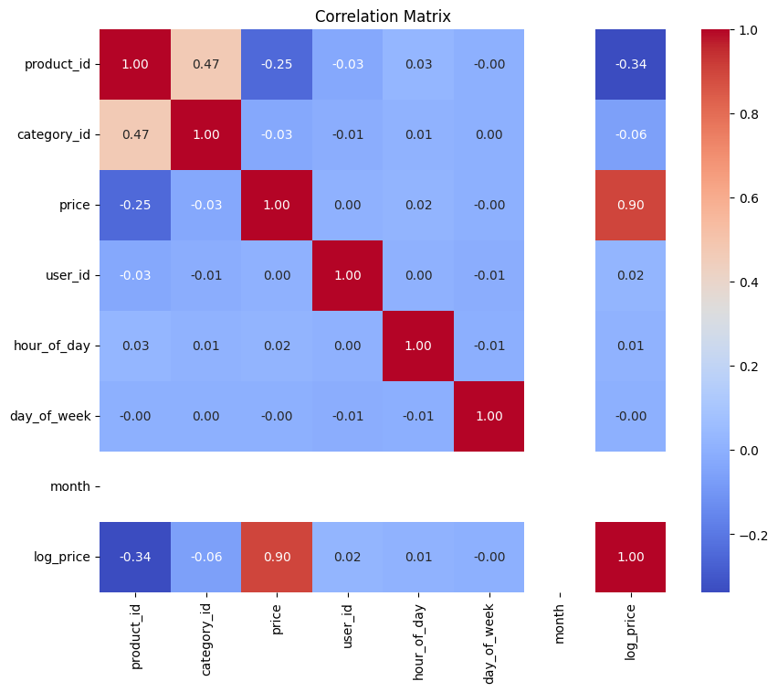
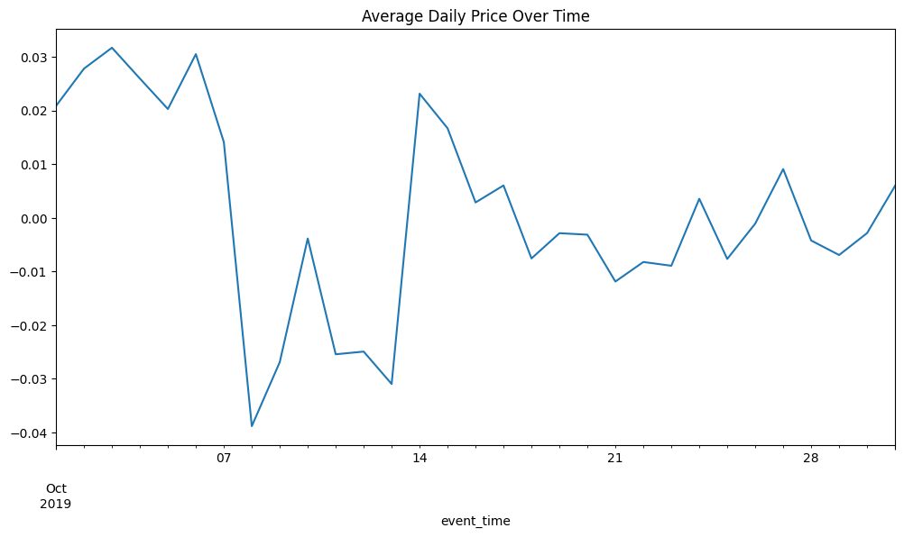

---
jupyter:
  colab:
  kernelspec:
    display_name: Python 3
    name: python3
  language_info:
    name: python
  nbformat: 4
  nbformat_minor: 0
---

::: {.cell .markdown id="1VX8W6cK-Ytj"}
# Feature Engineering on eCommerce behavior data from multi category store `<a href="https://www.utm.my" target="_parent">`{=html}``{=html}`</a>`{=html} {#feature-engineering-on-ecommerce-behavior-data-from-multi-category-store-}

## Group Members

  Name                                  Matric Number
  ------------------------------------- ---------------
  Muhammad Adam Fahmi Bin Mohd Taufiq   A21EC0061
  Muhammad Farhan Bin Ibrahim           A21EC0072
  Muhammad Fikri Bin Sharunazim         A21EC0075
  Mikhail Bin Yassin                    A21EC0053

------------------------------------------------------------------------

#Overview **eCommerce behavior data from multi category store**

This file contain behavior data for 7 months (from October 2019 to April
2020) from a large multi-category online store.

Each row in the file represents an event. All events are related to
products and users. Each event is like many-to-many relation between
products and users.

Data collected by Open CDP project. Feel free to use open source
customer data platform.

How to read it There are different types of events. See below.

\[ Semantics (or how to read it): User user_id during session
user_session added to shopping cart (property event_type is equal cart)
product product_id of brand brand of category category_code
(category_code) with price price at event_time \]

------------------------------------------------------------------------

**File structure:**

\'event_time\' = Time when event happened at (in UTC).

\'event_type\' = Only one kind of event: purchase.

\'product_id\' = ID of a product.

\'category_id\' = Product\'s category ID.

\'category_code\' = Product\'s category taxonomy (code name) if
possible. Usually present for meaningful categories, skipped for
accessories.

\'brand\' = Downcased string of brand name. Can be missed.

\'price\' = Float price of a product. Present.

\'user_id\' = Permanent user ID.

\'user_session\' = Temporary user\'s session ID. Same for each user\'s
session. Changes when the user returns from a long pause.

------------------------------------------------------------------------

**Event types** Events can be:

-   view - a user viewed a product
-   cart - a user added a product to shopping cart
-   remove_from_cart - a user removed a product from shopping cart
-   purchase - a user purchased a product

------------------------------------------------------------------------

**Note that**: Multiple purchases per session

A session can have multiple purchase events. It\'s ok, because it\'s a
single order.
:::

::: {.cell .markdown id="tjN5QXdFZPXu"}
## Import Dataset from kaggle
:::

::: {.cell .code execution_count="1" id="tMfsr7n_BUje"}
``` python
! pip install -q kaggle
```
:::

::: {.cell .code execution_count="2" colab="{\"base_uri\":\"https://localhost:8080/\",\"height\":90}" id="Fc5UGWZUA3aV" outputId="54181985-104c-42e6-8b87-14a658396647"}
``` python
from  google.colab import files
files.upload()
```

::: {.output .display_data}
```{=html}

     <input type="file" id="files-c49a96d9-5517-41d4-9f64-8435042863ae" name="files[]" multiple disabled
        style="border:none" />
     <output id="result-c49a96d9-5517-41d4-9f64-8435042863ae">
      Upload widget is only available when the cell has been executed in the
      current browser session. Please rerun this cell to enable.
      </output>
      <script>// Copyright 2017 Google LLC
//
// Licensed under the Apache License, Version 2.0 (the "License");
// you may not use this file except in compliance with the License.
// You may obtain a copy of the License at
//
//      http://www.apache.org/licenses/LICENSE-2.0
//
// Unless required by applicable law or agreed to in writing, software
// distributed under the License is distributed on an "AS IS" BASIS,
// WITHOUT WARRANTIES OR CONDITIONS OF ANY KIND, either express or implied.
// See the License for the specific language governing permissions and
// limitations under the License.

/**
 * @fileoverview Helpers for google.colab Python module.
 */
(function(scope) {
function span(text, styleAttributes = {}) {
  const element = document.createElement('span');
  element.textContent = text;
  for (const key of Object.keys(styleAttributes)) {
    element.style[key] = styleAttributes[key];
  }
  return element;
}

// Max number of bytes which will be uploaded at a time.
const MAX_PAYLOAD_SIZE = 100 * 1024;

function _uploadFiles(inputId, outputId) {
  const steps = uploadFilesStep(inputId, outputId);
  const outputElement = document.getElementById(outputId);
  // Cache steps on the outputElement to make it available for the next call
  // to uploadFilesContinue from Python.
  outputElement.steps = steps;

  return _uploadFilesContinue(outputId);
}

// This is roughly an async generator (not supported in the browser yet),
// where there are multiple asynchronous steps and the Python side is going
// to poll for completion of each step.
// This uses a Promise to block the python side on completion of each step,
// then passes the result of the previous step as the input to the next step.
function _uploadFilesContinue(outputId) {
  const outputElement = document.getElementById(outputId);
  const steps = outputElement.steps;

  const next = steps.next(outputElement.lastPromiseValue);
  return Promise.resolve(next.value.promise).then((value) => {
    // Cache the last promise value to make it available to the next
    // step of the generator.
    outputElement.lastPromiseValue = value;
    return next.value.response;
  });
}

/**
 * Generator function which is called between each async step of the upload
 * process.
 * @param {string} inputId Element ID of the input file picker element.
 * @param {string} outputId Element ID of the output display.
 * @return {!Iterable<!Object>} Iterable of next steps.
 */
function* uploadFilesStep(inputId, outputId) {
  const inputElement = document.getElementById(inputId);
  inputElement.disabled = false;

  const outputElement = document.getElementById(outputId);
  outputElement.innerHTML = '';

  const pickedPromise = new Promise((resolve) => {
    inputElement.addEventListener('change', (e) => {
      resolve(e.target.files);
    });
  });

  const cancel = document.createElement('button');
  inputElement.parentElement.appendChild(cancel);
  cancel.textContent = 'Cancel upload';
  const cancelPromise = new Promise((resolve) => {
    cancel.onclick = () => {
      resolve(null);
    };
  });

  // Wait for the user to pick the files.
  const files = yield {
    promise: Promise.race([pickedPromise, cancelPromise]),
    response: {
      action: 'starting',
    }
  };

  cancel.remove();

  // Disable the input element since further picks are not allowed.
  inputElement.disabled = true;

  if (!files) {
    return {
      response: {
        action: 'complete',
      }
    };
  }

  for (const file of files) {
    const li = document.createElement('li');
    li.append(span(file.name, {fontWeight: 'bold'}));
    li.append(span(
        `(${file.type || 'n/a'}) - ${file.size} bytes, ` +
        `last modified: ${
            file.lastModifiedDate ? file.lastModifiedDate.toLocaleDateString() :
                                    'n/a'} - `));
    const percent = span('0% done');
    li.appendChild(percent);

    outputElement.appendChild(li);

    const fileDataPromise = new Promise((resolve) => {
      const reader = new FileReader();
      reader.onload = (e) => {
        resolve(e.target.result);
      };
      reader.readAsArrayBuffer(file);
    });
    // Wait for the data to be ready.
    let fileData = yield {
      promise: fileDataPromise,
      response: {
        action: 'continue',
      }
    };

    // Use a chunked sending to avoid message size limits. See b/62115660.
    let position = 0;
    do {
      const length = Math.min(fileData.byteLength - position, MAX_PAYLOAD_SIZE);
      const chunk = new Uint8Array(fileData, position, length);
      position += length;

      const base64 = btoa(String.fromCharCode.apply(null, chunk));
      yield {
        response: {
          action: 'append',
          file: file.name,
          data: base64,
        },
      };

      let percentDone = fileData.byteLength === 0 ?
          100 :
          Math.round((position / fileData.byteLength) * 100);
      percent.textContent = `${percentDone}% done`;

    } while (position < fileData.byteLength);
  }

  // All done.
  yield {
    response: {
      action: 'complete',
    }
  };
}

scope.google = scope.google || {};
scope.google.colab = scope.google.colab || {};
scope.google.colab._files = {
  _uploadFiles,
  _uploadFilesContinue,
};
})(self);
</script> 
```
:::

::: {.output .stream .stdout}
    Saving kaggle.json to kaggle (1).json
:::

::: {.output .execute_result execution_count="2"}
    {'kaggle (1).json': b'{"username":"adamfahmiadamochie","key":"751d5dc469fe52ec46996241aed1e097"}'}
:::
:::

::: {.cell .code execution_count="3" colab="{\"base_uri\":\"https://localhost:8080/\"}" id="do7-BUcsKxoi" outputId="592f30b0-8631-4e47-e290-b46f094006ec"}
``` python
# Install Kaggle
!mkdir ~/.kaggle
!cp kaggle.json ~/.kaggle/
!chmod 600 ~/.kaggle/kaggle.json
!kaggle datasets download -d mkechinov/ecommerce-behavior-data-from-multi-category-store
! unzip ecommerce-behavior-data-from-multi-category-store.zip
```

::: {.output .stream .stdout}
    mkdir: cannot create directory ‘/root/.kaggle’: File exists
    Downloading ecommerce-behavior-data-from-multi-category-store.zip to /content
    100% 4.28G/4.29G [00:50<00:00, 178MB/s]
    100% 4.29G/4.29G [00:50<00:00, 91.2MB/s]
    Archive:  ecommerce-behavior-data-from-multi-category-store.zip
      inflating: 2019-Nov.csv            
    replace 2019-Oct.csv? [y]es, [n]o, [A]ll, [N]one, [r]ename: n
:::
:::

::: {.cell .markdown id="HB26IfBIZcCt"}
### Install Necessary Tools & Libraries {#install-necessary-tools--libraries}
:::

::: {.cell .code execution_count="4" id="Pyk2wO0W09mR"}
``` python
import numpy as np
import pandas as pd
import os
```
:::

::: {.cell .markdown id="OBYNMLbf1MXy"}
We only use the 2019 Oct data, it it to lessen the usage of RAM we
remove unnecessery data
:::

::: {.cell .code execution_count="5" id="8PlNMv7fGHiN"}
``` python
os.remove('2019-Nov.csv')
os.remove('ecommerce-behavior-data-from-multi-category-store.zip')
```
:::

::: {.cell .code execution_count="6" id="XQSieNH_9uFH"}
``` python
# Reading the data in chunks
data = pd.read_csv('2019-Oct.csv',usecols=["event_time", "event_type", "product_id", "category_id", "category_code", "brand", "price", "user_id"], chunksize=300000)

# Concatenating the chunks together
df = pd.concat(data)
```
:::

::: {.cell .code colab="{\"base_uri\":\"https://localhost:8080/\",\"height\":334}" id="PAoxmKD__ava" outputId="09df7780-6f40-4356-b15c-0aef4fc2a6f9"}
``` python
df.head(4)
```

::: {.output .execute_result execution_count="7"}
```{=html}

  <div id="df-c97e7076-eb14-46d5-9833-28bb3116900c" class="colab-df-container">
    <div>
<style scoped>
    .dataframe tbody tr th:only-of-type {
        vertical-align: middle;
    }

    .dataframe tbody tr th {
        vertical-align: top;
    }

    .dataframe thead th {
        text-align: right;
    }
</style>
<table border="1" class="dataframe">
  <thead>
    <tr style="text-align: right;">
      <th></th>
      <th>event_time</th>
      <th>event_type</th>
      <th>product_id</th>
      <th>category_id</th>
      <th>category_code</th>
      <th>brand</th>
      <th>price</th>
      <th>user_id</th>
    </tr>
  </thead>
  <tbody>
    <tr>
      <th>0</th>
      <td>2019-10-01 00:00:00 UTC</td>
      <td>view</td>
      <td>44600062</td>
      <td>2103807459595387724</td>
      <td>NaN</td>
      <td>shiseido</td>
      <td>35.79</td>
      <td>541312140</td>
    </tr>
    <tr>
      <th>1</th>
      <td>2019-10-01 00:00:00 UTC</td>
      <td>view</td>
      <td>3900821</td>
      <td>2053013552326770905</td>
      <td>appliances.environment.water_heater</td>
      <td>aqua</td>
      <td>33.20</td>
      <td>554748717</td>
    </tr>
    <tr>
      <th>2</th>
      <td>2019-10-01 00:00:01 UTC</td>
      <td>view</td>
      <td>17200506</td>
      <td>2053013559792632471</td>
      <td>furniture.living_room.sofa</td>
      <td>NaN</td>
      <td>543.10</td>
      <td>519107250</td>
    </tr>
    <tr>
      <th>3</th>
      <td>2019-10-01 00:00:01 UTC</td>
      <td>view</td>
      <td>1307067</td>
      <td>2053013558920217191</td>
      <td>computers.notebook</td>
      <td>lenovo</td>
      <td>251.74</td>
      <td>550050854</td>
    </tr>
  </tbody>
</table>
</div>
    <div class="colab-df-buttons">

  <div class="colab-df-container">
    <button class="colab-df-convert" onclick="convertToInteractive('df-c97e7076-eb14-46d5-9833-28bb3116900c')"
            title="Convert this dataframe to an interactive table."
            style="display:none;">

  <svg xmlns="http://www.w3.org/2000/svg" height="24px" viewBox="0 -960 960 960">
    <path d="M120-120v-720h720v720H120Zm60-500h600v-160H180v160Zm220 220h160v-160H400v160Zm0 220h160v-160H400v160ZM180-400h160v-160H180v160Zm440 0h160v-160H620v160ZM180-180h160v-160H180v160Zm440 0h160v-160H620v160Z"/>
  </svg>
    </button>

  <style>
    .colab-df-container {
      display:flex;
      gap: 12px;
    }

    .colab-df-convert {
      background-color: #E8F0FE;
      border: none;
      border-radius: 50%;
      cursor: pointer;
      display: none;
      fill: #1967D2;
      height: 32px;
      padding: 0 0 0 0;
      width: 32px;
    }

    .colab-df-convert:hover {
      background-color: #E2EBFA;
      box-shadow: 0px 1px 2px rgba(60, 64, 67, 0.3), 0px 1px 3px 1px rgba(60, 64, 67, 0.15);
      fill: #174EA6;
    }

    .colab-df-buttons div {
      margin-bottom: 4px;
    }

    [theme=dark] .colab-df-convert {
      background-color: #3B4455;
      fill: #D2E3FC;
    }

    [theme=dark] .colab-df-convert:hover {
      background-color: #434B5C;
      box-shadow: 0px 1px 3px 1px rgba(0, 0, 0, 0.15);
      filter: drop-shadow(0px 1px 2px rgba(0, 0, 0, 0.3));
      fill: #FFFFFF;
    }
  </style>

    <script>
      const buttonEl =
        document.querySelector('#df-c97e7076-eb14-46d5-9833-28bb3116900c button.colab-df-convert');
      buttonEl.style.display =
        google.colab.kernel.accessAllowed ? 'block' : 'none';

      async function convertToInteractive(key) {
        const element = document.querySelector('#df-c97e7076-eb14-46d5-9833-28bb3116900c');
        const dataTable =
          await google.colab.kernel.invokeFunction('convertToInteractive',
                                                    [key], {});
        if (!dataTable) return;

        const docLinkHtml = 'Like what you see? Visit the ' +
          '<a target="_blank" href=https://colab.research.google.com/notebooks/data_table.ipynb>data table notebook</a>'
          + ' to learn more about interactive tables.';
        element.innerHTML = '';
        dataTable['output_type'] = 'display_data';
        await google.colab.output.renderOutput(dataTable, element);
        const docLink = document.createElement('div');
        docLink.innerHTML = docLinkHtml;
        element.appendChild(docLink);
      }
    </script>
  </div>


<div id="df-313c8a01-8866-4c59-a6e4-b4cbb58a7737">
  <button class="colab-df-quickchart" onclick="quickchart('df-313c8a01-8866-4c59-a6e4-b4cbb58a7737')"
            title="Suggest charts"
            style="display:none;">

<svg xmlns="http://www.w3.org/2000/svg" height="24px"viewBox="0 0 24 24"
     width="24px">
    <g>
        <path d="M19 3H5c-1.1 0-2 .9-2 2v14c0 1.1.9 2 2 2h14c1.1 0 2-.9 2-2V5c0-1.1-.9-2-2-2zM9 17H7v-7h2v7zm4 0h-2V7h2v10zm4 0h-2v-4h2v4z"/>
    </g>
</svg>
  </button>

<style>
  .colab-df-quickchart {
      --bg-color: #E8F0FE;
      --fill-color: #1967D2;
      --hover-bg-color: #E2EBFA;
      --hover-fill-color: #174EA6;
      --disabled-fill-color: #AAA;
      --disabled-bg-color: #DDD;
  }

  [theme=dark] .colab-df-quickchart {
      --bg-color: #3B4455;
      --fill-color: #D2E3FC;
      --hover-bg-color: #434B5C;
      --hover-fill-color: #FFFFFF;
      --disabled-bg-color: #3B4455;
      --disabled-fill-color: #666;
  }

  .colab-df-quickchart {
    background-color: var(--bg-color);
    border: none;
    border-radius: 50%;
    cursor: pointer;
    display: none;
    fill: var(--fill-color);
    height: 32px;
    padding: 0;
    width: 32px;
  }

  .colab-df-quickchart:hover {
    background-color: var(--hover-bg-color);
    box-shadow: 0 1px 2px rgba(60, 64, 67, 0.3), 0 1px 3px 1px rgba(60, 64, 67, 0.15);
    fill: var(--button-hover-fill-color);
  }

  .colab-df-quickchart-complete:disabled,
  .colab-df-quickchart-complete:disabled:hover {
    background-color: var(--disabled-bg-color);
    fill: var(--disabled-fill-color);
    box-shadow: none;
  }

  .colab-df-spinner {
    border: 2px solid var(--fill-color);
    border-color: transparent;
    border-bottom-color: var(--fill-color);
    animation:
      spin 1s steps(1) infinite;
  }

  @keyframes spin {
    0% {
      border-color: transparent;
      border-bottom-color: var(--fill-color);
      border-left-color: var(--fill-color);
    }
    20% {
      border-color: transparent;
      border-left-color: var(--fill-color);
      border-top-color: var(--fill-color);
    }
    30% {
      border-color: transparent;
      border-left-color: var(--fill-color);
      border-top-color: var(--fill-color);
      border-right-color: var(--fill-color);
    }
    40% {
      border-color: transparent;
      border-right-color: var(--fill-color);
      border-top-color: var(--fill-color);
    }
    60% {
      border-color: transparent;
      border-right-color: var(--fill-color);
    }
    80% {
      border-color: transparent;
      border-right-color: var(--fill-color);
      border-bottom-color: var(--fill-color);
    }
    90% {
      border-color: transparent;
      border-bottom-color: var(--fill-color);
    }
  }
</style>

  <script>
    async function quickchart(key) {
      const quickchartButtonEl =
        document.querySelector('#' + key + ' button');
      quickchartButtonEl.disabled = true;  // To prevent multiple clicks.
      quickchartButtonEl.classList.add('colab-df-spinner');
      try {
        const charts = await google.colab.kernel.invokeFunction(
            'suggestCharts', [key], {});
      } catch (error) {
        console.error('Error during call to suggestCharts:', error);
      }
      quickchartButtonEl.classList.remove('colab-df-spinner');
      quickchartButtonEl.classList.add('colab-df-quickchart-complete');
    }
    (() => {
      let quickchartButtonEl =
        document.querySelector('#df-313c8a01-8866-4c59-a6e4-b4cbb58a7737 button');
      quickchartButtonEl.style.display =
        google.colab.kernel.accessAllowed ? 'block' : 'none';
    })();
  </script>
</div>
    </div>
  </div>
```
:::
:::

::: {.cell .markdown id="0CXKytZKQkFm"}
## Handling Missing Data
:::

::: {.cell .code colab="{\"base_uri\":\"https://localhost:8080/\"}" id="5lS7W_mZ__wB" outputId="c281808d-d1af-4b76-a9aa-d8b1ce571c63"}
``` python
df.info()
```

::: {.output .stream .stdout}
    <class 'pandas.core.frame.DataFrame'>
    RangeIndex: 42448764 entries, 0 to 42448763
    Data columns (total 8 columns):
     #   Column         Dtype  
    ---  ------         -----  
     0   event_time     object 
     1   event_type     object 
     2   product_id     int64  
     3   category_id    int64  
     4   category_code  object 
     5   brand          object 
     6   price          float64
     7   user_id        int64  
    dtypes: float64(1), int64(3), object(4)
    memory usage: 2.5+ GB
:::
:::

::: {.cell .code colab="{\"base_uri\":\"https://localhost:8080/\"}" id="gFsMgaCfABnv" outputId="101aa9e0-613e-45c8-9fb5-6f589d09fcae"}
``` python
# number of rows & columns
df.shape
```

::: {.output .execute_result execution_count="7"}
    (42448764, 8)
:::
:::

::: {.cell .code colab="{\"base_uri\":\"https://localhost:8080/\"}" id="s1b8u4aqAEzn" outputId="30eb48c9-70ec-4046-f01a-3d30db64a86f"}
``` python
# check for missing values
df.isna().sum()
```

::: {.output .execute_result execution_count="11"}
    event_time              0
    event_type              0
    product_id              0
    category_id             0
    category_code    13515609
    brand             6117080
    price                   0
    user_id                 0
    dtype: int64
:::
:::

::: {.cell .code colab="{\"base_uri\":\"https://localhost:8080/\"}" id="4E_HHCcJ_vE9" outputId="c3b7299a-f9f5-48eb-f8bf-858f1e835e5f"}
``` python
# Calculate memory usage for the original DataFrame
original_memory = df.memory_usage(deep=True).sum()

# Convert bytes to megabytes
original_memory_mb = original_memory / (1024 * 1024)  # 1 MB = 1024*1024 bytes

print(f"The memory usage is: {original_memory:.2f} MB")
```

::: {.output .stream .stdout}
    The memory usage is: 12560643793.00 MB
:::
:::

::: {.cell .markdown id="gPOnsseCSe0F"}
To reduce the size of our dataset we can try to change the datatype
:::

::: {.cell .code execution_count="7" id="29tfWR2mBYQY"}
``` python
# change the datatype 'product_id' from int64 to int32
df['product_id'] = df['product_id'].astype('int32')
```
:::

::: {.cell .code colab="{\"base_uri\":\"https://localhost:8080/\"}" id="nfuaqfUn_zxl" outputId="3bc7e1a8-11d2-4dd7-9ae2-55e13e7efbc5"}
``` python
# check 'product_id' column highest value
max_value = df['product_id'].max()
# check 'product_id' column lowest value
min_value = df['product_id'].min()

print(f"The highest value in 'product_id': {max_value}")
print(f"The lowest value in 'product_id': {min_value}")
```

::: {.output .stream .stdout}
    The highest value in 'product_id': 60500010
    The lowest value in 'product_id': 1000978
:::
:::

::: {.cell .code colab="{\"base_uri\":\"https://localhost:8080/\"}" id="YrRvUq3CU1HS" outputId="ed42cdcf-9ae3-4925-a109-bdc0621ee096"}
``` python
# check 'category_id' column highest value
max_value = df['category_id'].max()
# check 'product_id' column lowest value
min_value = df['category_id'].min()

print(f"The highest value in 'category_id': {max_value}")
print(f"The lowest value in 'category_id': {min_value}")
```

::: {.output .stream .stdout}
    The highest value in 'category_id': 2175419595093967522
    The lowest value in 'category_id': 2053013552226107603
:::
:::

::: {.cell .code colab="{\"base_uri\":\"https://localhost:8080/\"}" id="tRYvqFWiU3-b" outputId="dc200bfd-2815-490d-d1bf-14cfc058f8df"}
``` python
# check 'user_id' column highest value
max_value = df['user_id'].max()
# check 'user_id' column lowest value
min_value = df['user_id'].min()

print(f"The highest value in 'user_id': {max_value}")
print(f"The lowest value in 'user_id': {min_value}")
```

::: {.output .stream .stdout}
    The highest value in 'user_id': 566280860
    The lowest value in 'user_id': 33869381
:::
:::

::: {.cell .code execution_count="8" id="Y-r93lzHU-wA"}
``` python
# change the datatype 'user_id' from int64 to int32
df['user_id'] = df['user_id'].astype('int32')
```
:::

::: {.cell .code execution_count="9" id="Ul44Blo6ScWx"}
``` python
# change 'event_time' from object to datetime
df['event_time'] = pd.to_datetime(df['event_time'])
```
:::

::: {.cell .code colab="{\"base_uri\":\"https://localhost:8080/\"}" id="PPv5E65XUmE8" outputId="49a49667-f920-44aa-a101-40c90bd5ba30"}
``` python
# check 'price' highest value
highest_value = df['price'].max()

# check 'price' lowest value
lowest_value = df['price'].min()

print(f"The highest value in the price is: {highest_value}")
print(f"The lowest value in the price is: {lowest_value}")
```

::: {.output .stream .stdout}
    The highest value in the price is: 2574.07
    The lowest value in the price is: 0.0
:::
:::

::: {.cell .code execution_count="10" id="47Hr53n3Un_8"}
``` python
#change 'price' from float64 to float16
df['price'] = df['price'].astype('float16')
```
:::

::: {.cell .code colab="{\"base_uri\":\"https://localhost:8080/\"}" id="Mncf1VGmVFCd" outputId="2431e3e2-9644-43d1-be80-a046f801a43a"}
``` python
# check the unique value in dataset
value_counts = df['event_type'].value_counts()
print(value_counts)

unique_values = df['event_type'].unique()
print(unique_values)
```

::: {.output .stream .stdout}
    view        40779399
    cart          926516
    purchase      742849
    Name: event_type, dtype: int64
    ['view' 'purchase' 'cart']
:::
:::

::: {.cell .code execution_count="11" id="tRq3c3MBVVQi"}
``` python
# change 'event_type' from object to categorical
df['event_type'] = df['event_type'].astype('category')
```
:::

::: {.cell .code colab="{\"base_uri\":\"https://localhost:8080/\"}" id="zX9M0Tk3VYfU" outputId="f1357f5a-812d-4408-9359-05ec138d84da"}
``` python
# check the unique value in category_code
value_counts = df['category_code'].value_counts()
print(value_counts)

unique_values = df['category_code'].unique()
print(unique_values)
```

::: {.output .stream .stdout}
    electronics.smartphone          11507231
    electronics.clocks               1311033
    computers.notebook               1137623
    electronics.video.tv             1113750
    electronics.audio.headphone      1100188
                                      ...   
    construction.tools.soldering         632
    apparel.shorts                       632
    apparel.jacket                       436
    auto.accessories.anti_freeze         308
    country_yard.furniture.bench         190
    Name: category_code, Length: 126, dtype: int64
    [nan 'appliances.environment.water_heater' 'furniture.living_room.sofa'
     'computers.notebook' 'electronics.smartphone' 'computers.desktop'
     'apparel.shoes.keds' 'appliances.kitchen.microwave'
     'furniture.bedroom.bed' 'electronics.video.tv' 'appliances.kitchen.mixer'
     'electronics.audio.headphone' 'appliances.environment.air_heater'
     'apparel.shoes' 'appliances.environment.vacuum'
     'appliances.kitchen.refrigerators' 'appliances.kitchen.washer'
     'computers.peripherals.monitor' 'construction.tools.pump'
     'electronics.clocks' 'apparel.shoes.slipons'
     'furniture.living_room.chair' 'auto.accessories.compressor'
     'appliances.kitchen.meat_grinder' 'computers.components.videocards'
     'furniture.kitchen.table' 'construction.tools.drill' 'kids.toys'
     'electronics.telephone' 'furniture.bathroom.toilet'
     'auto.accessories.alarm' 'apparel.sock' 'auto.accessories.player'
     'appliances.kitchen.grill' 'electronics.tablet'
     'appliances.kitchen.dishwasher' 'appliances.personal.hair_cutter'
     'kids.skates' 'appliances.kitchen.coffee_machine'
     'appliances.environment.air_conditioner' 'electronics.audio.subwoofer'
     'appliances.kitchen.blender' 'appliances.sewing_machine' 'sport.trainer'
     'electronics.camera.video' 'construction.tools.welding'
     'auto.accessories.videoregister' 'appliances.kitchen.kettle'
     'furniture.living_room.cabinet' 'accessories.bag'
     'computers.peripherals.keyboard' 'construction.tools.saw'
     'medicine.tools.tonometer' 'computers.components.motherboard'
     'apparel.trousers' 'appliances.kitchen.oven'
     'electronics.audio.music_tools.piano' 'computers.peripherals.mouse'
     'construction.tools.generator' 'sport.bicycle'
     'computers.peripherals.printer' 'stationery.cartrige'
     'appliances.ironing_board' 'electronics.audio.acoustic'
     'furniture.kitchen.chair' 'accessories.umbrella'
     'electronics.camera.photo' 'computers.components.memory'
     'apparel.shoes.moccasins' 'kids.fmcg.diapers' 'computers.ebooks'
     'apparel.dress' 'accessories.wallet' 'furniture.bedroom.pillow'
     'computers.components.power_supply' 'construction.components.faucet'
     'electronics.audio.microphone' 'appliances.iron' 'kids.carriage'
     'computers.components.cpu' 'appliances.kitchen.toster'
     'appliances.kitchen.hob' 'sport.snowboard'
     'appliances.kitchen.steam_cooker' 'computers.components.hdd'
     'apparel.underwear' 'auto.accessories.radar' 'appliances.kitchen.hood'
     'electronics.video.projector' 'furniture.bathroom.bath'
     'apparel.shoes.sandals' 'construction.tools.light' 'kids.dolls'
     'country_yard.furniture.hammok' 'auto.accessories.winch'
     'furniture.bedroom.blanket' 'appliances.kitchen.coffee_grinder'
     'apparel.tshirt' 'computers.components.cooler' 'apparel.costume'
     'apparel.shirt' 'sport.tennis' 'auto.accessories.parktronic'
     'apparel.scarf' 'appliances.personal.scales' 'furniture.universal.light'
     'kids.swing' 'appliances.kitchen.juicer' 'apparel.shoes.espadrilles'
     'country_yard.cultivator' 'apparel.shoes.step_ins' 'apparel.jacket'
     'apparel.shoes.ballet_shoes' 'apparel.skirt' 'apparel.jeans' 'sport.ski'
     'construction.tools.painting' 'country_yard.lawn_mower'
     'country_yard.furniture.bench' 'appliances.personal.massager'
     'appliances.environment.fan' 'computers.peripherals.camera'
     'apparel.belt' 'apparel.shorts' 'construction.tools.soldering'
     'apparel.jumper' 'auto.accessories.anti_freeze']
:::
:::

::: {.cell .code execution_count="12" id="2BrppxjzVagK"}
``` python
# Target encoding: change 'category_code' from object to string
df['category_code'] = df['category_code'].astype('string')
```
:::

::: {.cell .code colab="{\"base_uri\":\"https://localhost:8080/\"}" id="Q0qVU5ItVfoy" outputId="f240fe2e-bc8e-4a19-bd58-b6557da43f03"}
``` python
# check the unique value in brand
value_counts = df['brand'].value_counts()
print(value_counts)

unique_values = df['brand'].unique()
print(unique_values)
```

::: {.output .stream .stdout}
    samsung         5282775
    apple           4122554
    xiaomi          3083763
    huawei          1111205
    lucente          655861
                     ...   
    nec                   1
    neocoregames          1
    incase                1
    portdesigns           1
    skindoctors           1
    Name: brand, Length: 3444, dtype: int64
    ['shiseido' 'aqua' nan ... 'ecolaboratorie' 'organicshop' 'skindoctors']
:::
:::

::: {.cell .code execution_count="13" id="ZQM7VzksVkjb"}
``` python
# Target encoding: change 'brand' from object to string
df['brand'] = df['brand'].astype('string')
```
:::

::: {.cell .code execution_count="14" colab="{\"base_uri\":\"https://localhost:8080/\"}" id="_EUr97I9VnaX" outputId="c3a48c62-ad20-431d-d6e5-4cb176eba94a"}
``` python
df.info()
```

::: {.output .stream .stdout}
    <class 'pandas.core.frame.DataFrame'>
    RangeIndex: 42448764 entries, 0 to 42448763
    Data columns (total 8 columns):
     #   Column         Dtype              
    ---  ------         -----              
     0   event_time     datetime64[ns, UTC]
     1   event_type     category           
     2   product_id     int32              
     3   category_id    int64              
     4   category_code  string             
     5   brand          string             
     6   price          float16            
     7   user_id        int32              
    dtypes: category(1), datetime64[ns, UTC](1), float16(1), int32(2), int64(1), string(2)
    memory usage: 1.7 GB
:::
:::

::: {.cell .markdown id="p2I96nCebnwZ"}
## EDA on eCommerce behavior data from multi category store: [Assignment 3](https://colab.research.google.com/drive/1loaIl9Xj3X6foiRG5GrJXuxLYf6shEZG?authuser=3&usp=drive_open)
:::

::: {.cell .markdown id="MXPoAYEjckwO"}
## Feature Selection

Some of the features selected based on initial analysis are:

\'event_time\', \'event_type\', \'product_id\', \'category_id\',
\'category_code\', \'brand\', \'price\', \'user_id\'
:::

::: {.cell .markdown id="uUzCx2AWfpeK"}
##Feature Preprocessing
:::

::: {.cell .code execution_count="15" id="UAIvfUN5cZCy"}
``` python
# Handle missing values
df['category_code'].fillna('Unknown', inplace=True)  # Fill missing category codes with 'Unknown'
df['brand'].fillna('Unknown', inplace=True)  # Fill missing brand names with 'Unknown'
```
:::

::: {.cell .markdown id="_YV9zEmVLmPP"}
For encoding categorical variables, we already change the
\'category_code\' and \'brand\' to string data type in data cleaning
:::

::: {.cell .code execution_count="16" id="2ywp2SGDLYkC"}
``` python
# Handling outliers
# Assuming you want to cap extreme prices
price_upper_limit = df['price'].quantile(0.99)
df['price'] = np.where(df['price'] > price_upper_limit, price_upper_limit, df['price'])
```
:::

::: {.cell .markdown id="paldSSUWgA5i"}
## Feature Transformation
:::

::: {.cell .code execution_count="17" id="gzCTPqLlf6Pr"}
``` python
# Standardize or normalize numerical features
from sklearn.preprocessing import StandardScaler

scaler = StandardScaler()
df[['price']] = scaler.fit_transform(df[['price']])
```
:::

::: {.cell .code execution_count="18" id="Q4_zVVgOgJRo"}
``` python
# Time-based Features
df['hour_of_day'] = df['event_time'].dt.hour
df['day_of_week'] = df['event_time'].dt.dayofweek
df['month'] = df['event_time'].dt.month
```
:::

::: {.cell .code execution_count="19" id="iQ66O5ltgKqm"}
``` python
# Applying Log transformation for skewed data
df['log_price'] = np.log1p(df['price'])
```
:::

::: {.cell .markdown id="u4GYFQ_5gHgx"}
## Feature Creation
:::

::: {.cell .code execution_count="20" id="ekTNMw-UNeaz"}
``` python
# Aggregated features
df['average_price_per_category'] = df.groupby('category_id')['price'].transform('mean')
df['average_price_per_brand'] = df.groupby('brand')['price'].transform('mean')
```
:::

::: {.cell .markdown id="HoOoy1nDLF1u"}
**The Interaction features below creates two new features:**

\'view_to_purchase_ratio\' and \'cart_to_purchase_ratio\'. These
features represent the ratio of purchases to interactions for \'view\'
and \'cart\' events, respectively. Additionally, two aggregated features
are created, representing the average price per category and average
price per brand.
:::

::: {.cell .code id="Vhy92mQ-NyHX"}
``` python
# Interaction features
df['view_to_purchase_ratio'] = df[df['event_type'] == 'view']['session_purchase_count'] / df[df['event_type'] == 'view']['session_interaction_count']
df['cart_to_purchase_ratio'] = df[df['event_type'] == 'cart']['session_purchase_count'] / df[df['event_type'] == 'cart']['session_interaction_count']
```
:::

::: {.cell .markdown id="hGhJb7vULm_x"}
## Visualization
:::

::: {.cell .code colab="{\"base_uri\":\"https://localhost:8080/\",\"height\":475}" id="IGM1oad5LphP" outputId="cf891997-40ee-4bcd-efc7-f12cd1694e38"}
``` python
import matplotlib.pyplot as plt
import seaborn as sns

# Visualize the distribution of skewed feature: prices
plt.figure(figsize=(10, 6))
sns.histplot(df['price'], bins=30, kde=True)
plt.title('Distribution of Prices')
plt.xlabel('Price')
plt.ylabel('Frequency')
plt.show()
```

::: {.output .display_data}

:::
:::

::: {.cell .code execution_count="25" colab="{\"base_uri\":\"https://localhost:8080/\",\"height\":711}" id="5SAolppJWdWP" outputId="94e469a5-98b1-49cc-a047-9ce78620737f"}
``` python
plt.figure(figsize=(10, 8))
sns.scatterplot(x='price', y='average_price_per_category', data=df)
plt.title('Scatter Plot of Price vs. Average Price per Category')
plt.show()
```

::: {.output .display_data}

:::
:::

::: {.cell .code execution_count="22" colab="{\"base_uri\":\"https://localhost:8080/\",\"height\":475}" id="zPIpUM3TOSg4" outputId="6dfba374-b5d9-46e7-8be6-df54f5a337d2"}
``` python
from scipy.stats import probplot
import matplotlib.pyplot as plt
import seaborn as sns

# Probability plot (Q-Q plot)
# Skewed data visualization
skewed_feature = 'price'
plt.figure(figsize=(12, 6))
probplot(df['price'], plot=plt)
plt.title(f'Probability Plot of price')
plt.legend(['Data Points', 'Theoretical Normal Distribution'], loc='best')
plt.show()
```

::: {.output .display_data}

:::
:::

::: {.cell .code colab="{\"base_uri\":\"https://localhost:8080/\",\"height\":399}" id="z94Q6tCCUotZ" outputId="993d14e5-64b8-4a59-f40d-6cb3d3ada750"}
``` python
plt.figure(figsize=(12, 6))
sns.boxplot(x='event_type', y='price', data=df)
plt.title('Box Plot of Price by Event Type')
plt.show()
```

::: {.output .display_data}

:::
:::

::: {.cell .code colab="{\"base_uri\":\"https://localhost:8080/\",\"height\":815}" id="ovLU8yV-Zth-" outputId="92a36fb6-8fec-4cf0-a678-87caba02a95f"}
``` python
correlation_matrix = df.corr()
plt.figure(figsize=(10, 8))
sns.heatmap(correlation_matrix, annot=True, cmap='coolwarm', fmt=".2f")
plt.title('Correlation Matrix')
plt.show()
```

::: {.output .stream .stderr}
    <ipython-input-21-f96464a2691e>:1: FutureWarning: The default value of numeric_only in DataFrame.corr is deprecated. In a future version, it will default to False. Select only valid columns or specify the value of numeric_only to silence this warning.
      correlation_matrix = df.corr()
:::

::: {.output .display_data}

:::
:::

::: {.cell .code colab="{\"base_uri\":\"https://localhost:8080/\",\"height\":514}" id="I8jg8GLUU3K1" outputId="320a583a-6ca7-4450-aaf0-a597b2d5b7ae"}
``` python
plt.figure(figsize=(12, 6))
df.set_index('event_time')['price'].resample('D').mean().plot()
plt.title('Average Daily Price Over Time')
plt.show()
```

::: {.output .display_data}

:::
:::

::: {.cell .markdown id="KJtm1lrsICMg"}
## Conclusion

In conclusion, the feature engineering process aimed to enhance the
eCommerce behavior dataset for subsequent machine learning tasks.
Relevant features, including \'event_time,\' \'event_type,\'
\'product_id,\' \'category_id,\' \'category_code,\' \'brand,\'
\'price,\' and \'user_id,\' were selected. Missing values in the
\'brand\' column were filled with \'Unknown,\' and categorical variables
were encoded. Outliers in the \'price\' column were addressed by capping
extreme values, and time-based features were extracted to capture
temporal patterns. Skewed data in the \'price\' column underwent a log
transformation.

Interaction features and aggregated features were introduced to provide
insights into user engagement and mean prices within categories and
brands, respectively.

These decisions were driven by a combination of domain knowledge, common
feature engineering practices, and a tailored understanding of the
eCommerce behavior data, with the goal of creating a more informative
and robust feature set for subsequent analyses and model building.
Further iterations may be required based on model performance and
additional insights gained during the analysis of the transformed
dataset.
:::
